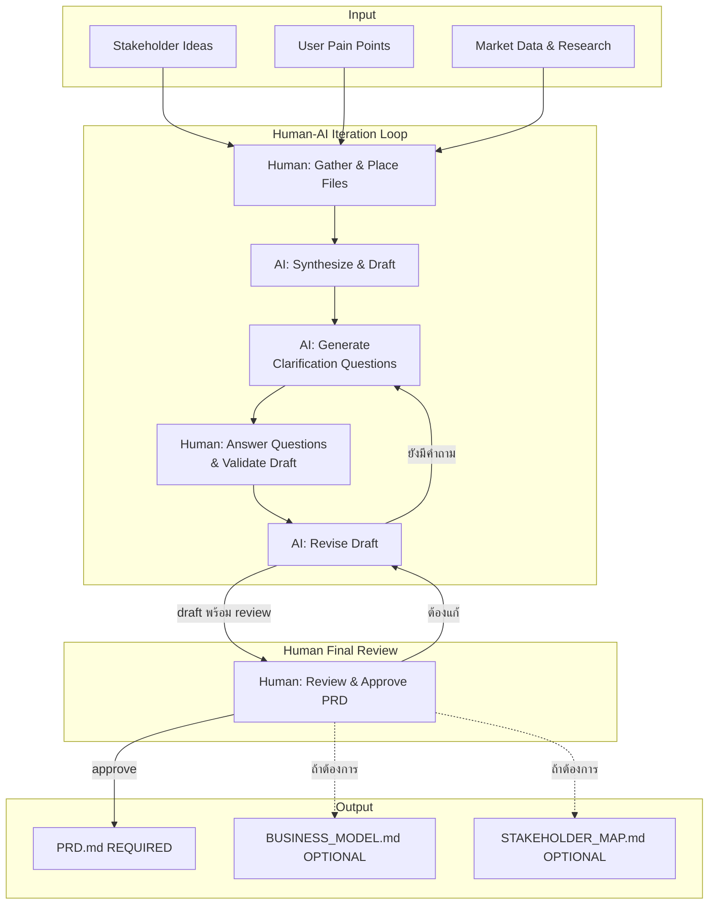
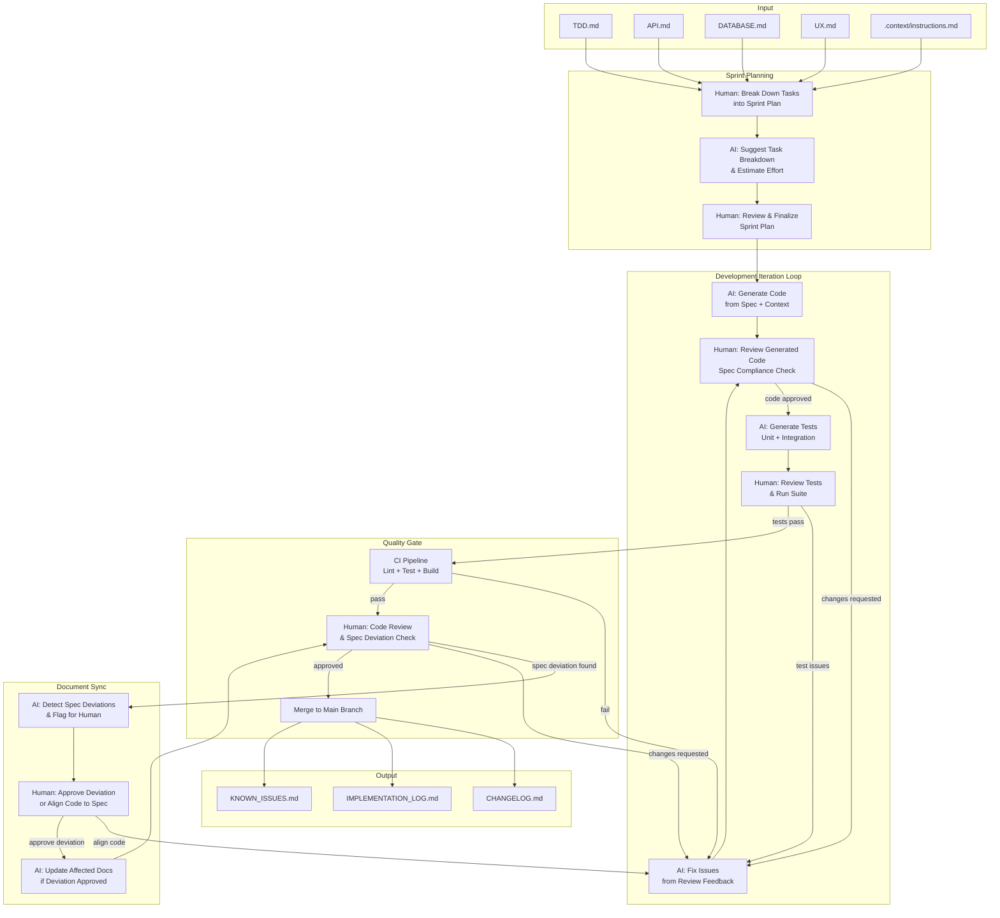
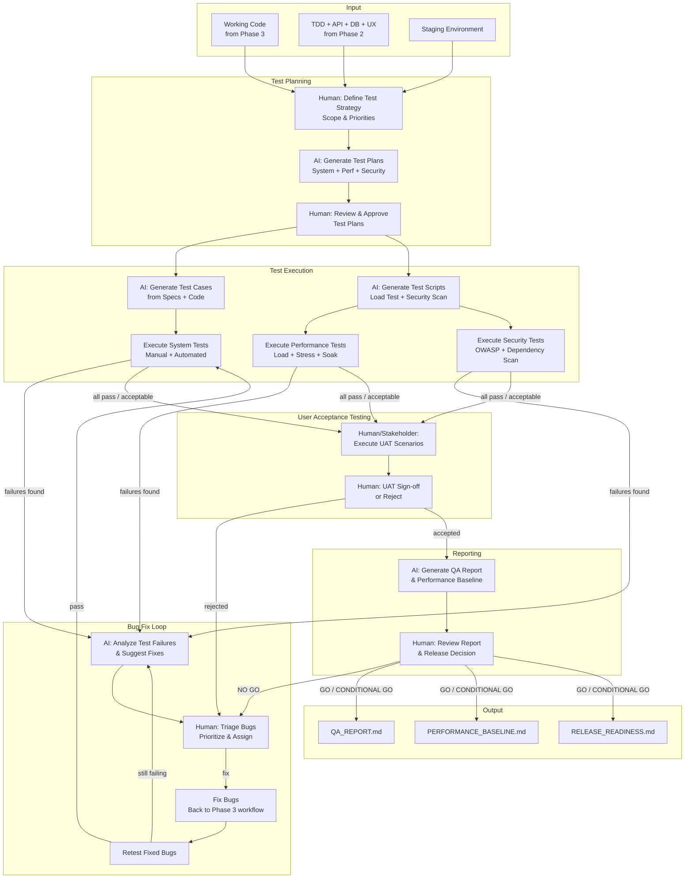
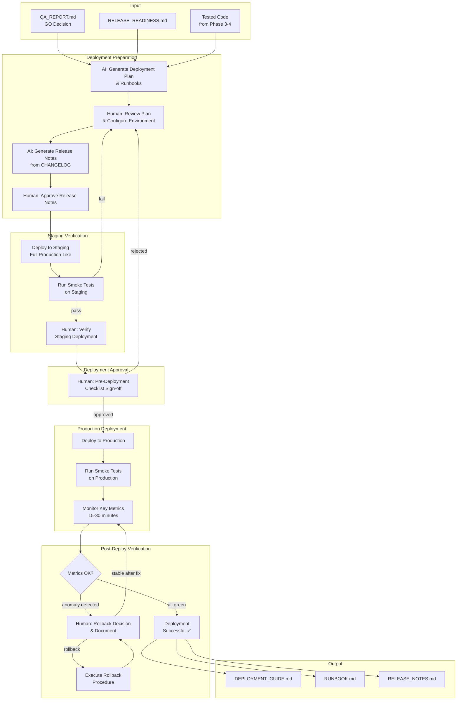
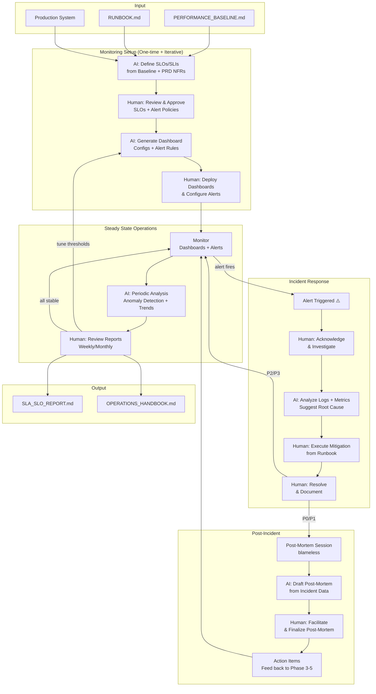
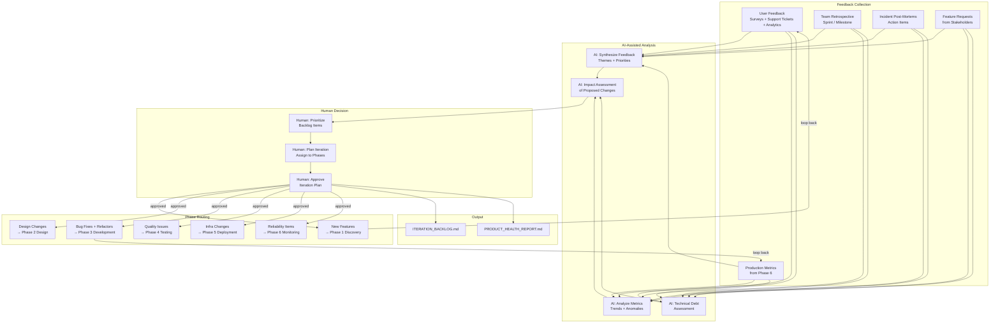
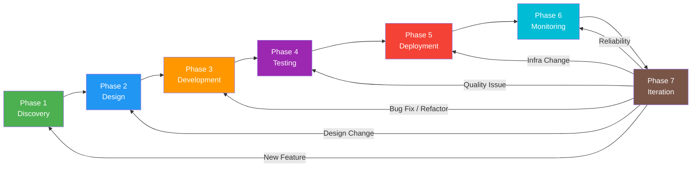

```mermaid
flowchart TD
    subgraph Input
        PRD[PRD.md\nfrom Phase 1]
        BM[BUSINESS_MODEL.md\nfrom Phase 1]
        INST[.context/instructions.md]
    end

    subgraph Session["Architecture Design Session"]
        A1[AI: Generate Architecture\nOptions 3+ patterns]
        H1[Human: Review Options\n& Select Pattern]
        A2[AI: Generate Detailed\nDesign for Selected]
        H2[Human: Write ADR\n& Approve]
    end

    subgraph TrackA["Track A — Technical Design"]
        S1[Data Spike\nERD Draft]
        S2[API Spike\nOpenAPI Draft]
        S3[Integration Spike\nThird-party Research]
        S4[Performance Spike\nCapacity Planning]
        S5[Security Review\nSTRIDE Analysis]
    end

    subgraph TrackB["Track B — UX Design"]
        U1[AI: Generate\nUser Flows + Sequence Diagrams]
        U2[AI: Generate\nLow-fi Wireframes]
        U3[Human: Review\n& Annotate]
    end

    subgraph Loop["Clarification Loop"]
        Q[AI: Generate\nClarification Questions]
        H3[Human: Answer\n& Decide]
    end

    subgraph DesignReview["Design Review — ทั้งทีม"]
        A3[AI: Generate Hard\nQuestions ล่วงหน้า]
        H4[Human: Review TDD + UX Draft\nResolve Action Items]
    end

    subgraph Output
        O1[TDD.md]
        O2[API.md]
        O3[DATABASE.md]
        O4[UX.md]
    end

    PRD --> A1
    BM --> A1
    INST --> A1
    A1 --> H1
    H1 --> A2
    A2 --> H2
    H2 --> S1 & S2 & S3 & S4 & S5
    H2 --> U1 & U2
    U1 & U2 --> U3
    S1 & S2 & S3 & S4 & S5 --> Q
    U3 --> Q
    Q --> H3
    H3 -->|ยังมีคำถาม| Q
    H3 -->|พร้อม review| A3
    A3 --> H4
    H4 -->|ต้องแก้| Q
    H4 -->|approve| O1 & O2 & O3 & O4
```

# AI-Native SDLC Framework 🚀

> **Version:** 2.0 | **Last Updated:** 2026-02-25
>
> เอกสารนี้คือแนวทางปฏิบัติในการพัฒนาซอฟต์แวร์ร่วมกับ AI

---

## 🎯 Objective

สร้างมาตรฐานการทำงานร่วมกันระหว่างมนุษย์และ AI Agent เพื่อลด Lead Time และเพิ่ม Quality โดยมี human decision อยู่ในจุดที่สำคัญเสมอ

---

## Phase 1: Discovery

> **เป้าหมาย:** แปลง Idea, Raw Data และ External Knowledge ให้เป็น PRD ที่ผ่าน human review แล้ว

---

### 📁 Directory Structure

```
project-root/
│
├── .context/
│   └── instructions.md               # ดูโครงสร้างใน Section: instructions.md Format
│
├── README.md
│
└── phases/
    └── 01-discovery/
        │
        ├── 01-user-inputs/           # Human วางไฟล์ที่นี่
        │   ├── proposals/                # ดูโครงสร้างใน Section: Proposal File Format
        │   │   └── ideation-001.md
        │   ├── interviews/
        │   │   ├── interview-001.md  # ดูโครงสร้างใน Section: Interview File Format
        │   │   └── interview-001.mp3 (ใส่ใน .gitignore)
        │   ├── notes/
        │   └── references/
        │       ├── articles/
        │       ├── research-papers/
        │       └── online-feedback/  # ดูโครงสร้างใน Section: Online Feedback Format
        │
        ├── 02-ai-artifacts/          # AI output — ห้ามแก้ด้วยมือ
        │   ├── synthesis.md
        │   ├── personas_draft.md
        │   ├── clarification_questions.md
        │   └── analysis_report.md
        │
        └── 03-final-output/          # ผ่าน human review แล้วเท่านั้น
            ├── PRD.md                # REQUIRED
            ├── BUSINESS_MODEL.md     # OPTIONAL
            └── STAKEHOLDER_MAP.md    # OPTIONAL
```

---

### 📄 File Format Standards

#### instructions.md Format

```markdown
# Project Instructions

## Project Context
- Project Name: [ชื่อ]
- Domain: [เช่น E-commerce, Healthcare]
- Stage: [Discovery | Design | Development | Testing]

## Coding Standards (สำหรับ Phase 3 เป็นต้นไป)
- Language: [TypeScript / Python / etc]
- Framework: [ชื่อ + version]
- Testing: [Jest / Pytest / etc]

## Constraints (ห้ามละเมิด)
- [เช่น ห้ามใช้ library X]
- [เช่น ต้องผ่าน PDPA compliance]

## Domain Glossary
| Term | Definition |
|------|------------|
| [Term] | [ความหมายในบริบทของ project นี้] |

## Current Phase Goals
[อธิบายว่าตอนนี้กำลังทำอะไร และ AI ควรช่วยอะไร]
```

#### Interview File Format

```markdown
---
id: interview-001
date: YYYY-MM-DD
interviewee_role: [เช่น Organizer, End User, Stakeholder]
interviewer: [ชื่อ]
duration_minutes: 45
tags: [pain-points, workflow, pricing]
---

## Key Quotes
> "[คำพูดที่น่าสนใจ คัดลอกมาตรงๆ]"

## Observed Behaviors
- [สิ่งที่เขาทำจริง ไม่ใช่สิ่งที่บอกว่าทำ]

## Pain Points ที่พบ
- [Pain point 1]

## Surprises
- [อะไรที่ไม่คาดคิด หรือขัดกับ assumption เดิม]

## Raw Notes
[บันทึกแบบ freeform ระหว่าง interview]
```

#### Online Feedback File Format

```markdown
---
id: feedback-001
source: [เช่น Reddit, Pantip, App Store]
url: [URL ถ้ามี]
date_collected: YYYY-MM-DD
sentiment: positive | negative | neutral | mixed
tags: [pricing, ux, reliability]
---

## Summary
[สรุป 2-3 ประโยค]

## Key Findings
- [Finding 1]

## Raw Content
[วางข้อความต้นฉบับหรือ screenshot path ไว้ที่นี่]
```

#### Proposal File Format

```markdown
---
id: ideation-001
title: [ชื่อโปรเจกต์/Service]
author: [ชื่อ PO หรือ Dev]
date: YYYY-MM-DD
status: draft | reviewed | approved
tags: [feature, infrastructure, research]
---

## 🎯 Vision / Opportunity
[อธิบายว่าจะทำอะไรและทำไมต้องทำ — 2-3 ประโยค]

## 📊 Problem Statement
- [Pain point ที่พบ]
- [Impact ต่อธุรกิจหรือผู้ใช้]

## 👥 Target Users
- [Primary user group]
- [Secondary user group]

## 💡 Proposed Solution (Initial)
[ไอเดียเริ่มต้นว่าจะแก้ปัญหาอย่างไร]

## ⚠️ Constraints & Assumptions
- [Constraint เช่น ต้องใช้ tech stack เดิม]
- [Assumption]

## 📈 Expected Outcomes
- [Outcome ที่วัดผลได้]

## ⏱️ Rough Timeline
- Research: [X days]
- Development: [X days]

## 🚨 Risks & Open Questions
- [Risk] / [คำถามที่ต้องหาคำตอบ]
```

> **หมายเหตุ:** ดู template เต็มได้ที่ `proposals/PROPOSALS-TEMPLATE.md`

---

### 🔄 Workflow



---

### 🧑‍💻 User Tasks

**1. Initial Project/Service Ideas** *(Optional - สำหรับ PO/Dev)*
เขียนไอเดียเริ่มต้นของ Services หรือ Project ในรูปแบบที่เป็นทางการ โดยใช้ Proposal File Format หรือดู template เต็มที่ `proposals/PROPOSALS-TEMPLATE.md`

**2. Stakeholder Interviews**
สัมภาษณ์ผู้บริหาร/ลูกค้าเพื่อดึง Vision, Goals และ Constraints บันทึกตาม Interview File Format

**3. User Discovery**
สัมภาษณ์หรือสังเกตผู้ใช้จริงเพื่อระบุ Pain Points และ User Journey บันทึกตาม Interview File Format

**4. Secondary Research**
- รวบรวมงานวิจัย/บทความ → `references/articles/` หรือ `references/research-papers/`
- เก็บ online feedback → บันทึกตาม Online Feedback Format → `references/online-feedback/`
- รวบรวมข้อมูล competitor (optional) → `references/articles/`

**5. Answer Clarification Questions**
ตอบคำถามทุกข้อที่ marked `Priority: High` ใน `02-ai-artifacts/clarification_questions.md` ก่อน AI จะ revise draft

**6. Final Review & Approval**
ตรวจสอบ PRD draft ว่าครบถ้วนและตรงกับ intent จริงๆ ก่อน approve ให้ move ไป `03-final-output/`

> ⚠️ **ห้าม move ไฟล์ใดไปยัง `03-final-output/` โดยไม่ผ่าน human review**

---

### 📤 User Output

> สิ่งที่ human ต้องสร้างและวางใน `01-user-inputs/` เพื่อให้ AI ทำงานได้

| Output | Location | เงื่อนไข |
|--------|----------|---------|
| Interview notes | `interviews/interview-00X.md` | ทำก่อน AI เริ่ม synthesis |
| Initial Project/Service Ideas | `proposals/ideation-00X.md` หรือ `proposals/proposal-00X.md` | Optional — เขียนเมื่อต้องการ |
| Research articles / papers | `references/articles/` หรือ `references/research-papers/` | วางก่อน AI เริ่ม synthesis |
| Online feedback files | `references/online-feedback/feedback-00X.md` | วางก่อน AI เริ่ม synthesis |
| Answered clarification questions | `02-ai-artifacts/clarification_questions.md` (annotated) | ต้องตอบ High priority ทั้งหมดก่อน AI revise |
| Approval decision | บันทึกใน PRD หรือ review note | ต้องมีก่อน move ไป `03-final-output/` |

---

### 🤖 AI Tasks

**1. Synthesis & Analysis**
- Extract Key Insights จากทุกไฟล์ใน `01-user-inputs/`
- ระบุ Pain Points หลักและสร้าง User Persona drafts
- เปรียบเทียบ Problem Statement กับ Market Trends จาก references

**2. Technical Discovery** *(ถ้ามีระบบเดิม)*
- วิเคราะห์ code หรือเอกสารระบบเก่าเพื่อระบุ Business Logic และ Technical Constraints เบื้องต้น

**3. Drafting**
- เขียน Problem Statement และ Vision Statement ฉบับร่าง
- แปลง high-level ideas เป็น User Stories
- จัดลำดับ features ด้วย MoSCoW

**4. Generate Clarification Questions**
- List คำถามทุกข้อที่ยังไม่มีคำตอบใน `clarification_questions.md`
- ระบุ Priority (High/Medium/Low) และเหตุผลที่ต้องการคำตอบ
- **ไม่ finalize draft จนกว่า High priority questions จะได้รับคำตอบ**

**5. Planning Support**
- คาดการณ์ timeline เบื้องต้นจาก scope ใน PRD
- ระบุ risks และ bottlenecks ที่คาดการณ์

**6. Revision Loop**
- รับคำตอบจาก human และ revise draft
- แจ้งชัดเจนว่า revision ครั้งนี้เปลี่ยนอะไรบ้าง

**7. Business Modeling** *(Optional)*
- สร้าง Lean Canvas หรือ Business Model Canvas ฉบับร่าง
- วิเคราะห์ Cost vs Revenue เบื้องต้น

**8. Stakeholder Mapping** *(Optional)*
- จัดทำ RACI Matrix
- ระบุ Hidden Expectations จากบันทึก interview

> ⚠️ **AI ต้องไม่ตัดสินใจแทน human ในเรื่อง:** scope, business model, stakeholder priority, และ launch timeline

---

### 📥 AI Output

| File | Location | Description |
|------|----------|-------------|
| `synthesis.md` | `02-ai-artifacts/` | สรุป insights จากทุก inputs |
| `personas_draft.md` | `02-ai-artifacts/` | User Persona ฉบับร่าง |
| `clarification_questions.md` | `02-ai-artifacts/` | คำถามที่ต้องการคำตอบ พร้อม Priority |
| `analysis_report.md` | `02-ai-artifacts/` | Risk, Bottleneck, Timeline draft |

---

### 🏁 Final Output

| File | Status | เงื่อนไข |
|------|--------|---------|
| `PRD.md` | REQUIRED | ผ่าน human review แล้วเท่านั้น |
| `BUSINESS_MODEL.md` | OPTIONAL | สร้างเมื่อต้องการวิเคราะห์ business model |
| `STAKEHOLDER_MAP.md` | OPTIONAL | สร้างเมื่อมี stakeholders ที่ซับซ้อน |

---

### ✅ Phase 1 Exit Criteria

- [ ] High priority clarification questions ทั้งหมดได้รับคำตอบแล้ว
- [ ] `PRD.md` ผ่าน review และ approved โดย stakeholder หลักแล้ว
- [ ] PRD มี Success Metrics ที่วัดผลได้จริง
- [ ] PRD ระบุ Scope และ Non-scope ชัดเจน
- [ ] PRD ระบุ Assumptions และ Constraints ครบ
- [ ] ทีมทุกคน align กับ PRD version นี้แล้ว

**→ เมื่อผ่านทุกข้อ พร้อม proceed ไป Phase 2: System Design**

---

## Phase 2: System Design

> **เป้าหมาย:** แปลง PRD ที่ approved แล้วให้เป็น Technical Specifications และ UX Design ที่พร้อม implementation โดย AI ช่วย generate options และ human ตัดสินใจเลือกทางที่เหมาะสม

> Phase 2 มี 2 tracks ที่ทำคู่ขนานกัน:
> - **Track A — Technical Design:** Architecture, Data Model, API, Security, Performance
> - **Track B — UX Design:** Wireframes, User Flows, Sequence Diagrams

> **Input ที่ต้องมีก่อนเริ่ม:** `PRD.md` ที่ approved แล้วจาก Phase 1

---

### 📁 Directory Structure

```
phases/
└── 02-system-design/
    │
    ├── 01-human-decisions/              # Human decisions — source of truth
    │   ├── architecture-decisions/
    │   │   └── adr-001-[topic].md       # ดูโครงสร้างใน Section: ADR Format
    │   ├── tech-stack/
    │   │   └── tech-stack-decision.md   # ดูโครงสร้างใน Section: Stack Decision Format
    │   └── design-reviews/
    │       └── review-001-[topic].md    # ดูโครงสร้างใน Section: Design Review Format
    │
    ├── 02-ai-artifacts/                 # AI output — ห้ามแก้ด้วยมือ
    │   │
    │   │   # Track A — Technical Design
    │   ├── architecture-options/
    │   │   ├── option-001-monolith.md
    │   │   ├── option-002-microservices.md
    │   │   └── option-003-serverless.md
    │   ├── diagrams/
    │   │   ├── c4-context.mmd
    │   │   ├── c4-container.mmd
    │   │   ├── erd-diagram.mmd
    │   │   └── sequence-diagrams/
    │   │       └── seq-001-[flow].mmd
    │   ├── api-specs-draft/
    │   │   └── openapi-draft.yaml
    │   ├── db-schemas-draft/
    │   │   └── schema-draft.prisma
    │   ├── security-review.md
    │   ├── performance-plan.md
    │   ├── trade-off-analysis.md
    │   │
    │   │   # Track B — UX Design
    │   ├── ux-wireframes/
    │   │   └── wireframe-001-[screen].md
    │   ├── user-flows/
    │   │   └── flow-001-[scenario].mmd
    │   │
    │   └── clarification-questions.md  # ทั้ง 2 tracks
    │
    └── 03-final-output/                 # ผ่าน Design Review แล้วเท่านั้น
        ├── TDD.md                       # REQUIRED
        ├── API.md                       # REQUIRED
        ├── DATABASE.md                  # REQUIRED
        └── UX.md                        # REQUIRED
```

---

### 📄 File Format Standards

#### ADR (Architecture Decision Record) Format

```markdown
---
id: adr-001
title: [Decision Title]
date: YYYY-MM-DD
status: Proposed | Accepted | Deprecated | Superseded
decided_by: [ชื่อ/Role]
---

## Context
[อธิบายสถานการณ์และปัญหาที่ต้องตัดสินใจ]

## Decision
[คำตัดสินใจ พร้อมเหตุผลสั้นๆ]

## Alternatives Considered
| Option | Pros | Cons | Why Not Chosen |
|--------|------|------|----------------|
| [Option A] | [...] | [...] | [...] |
| [Option B] | [...] | [...] | [...] |

## Consequences
- **Positive:** [ผลดีที่จะได้รับ]
- **Negative:** [ผลเสียหรือข้อจำกัดที่ต้องยอมรับ]
- **Risks:** [ความเสี่ยงที่อาจเกิดขึ้น]

## Related ADRs
- [Link to related ADRs ถ้ามี]
```

#### Stack Decision Format

```markdown
---
id: tech-stack-001
date: YYYY-MM-DD
decided_by: [ชื่อ/Role]
---

## Options Considered
| Option | Pros | Cons | Team Familiarity | Score |
|--------|------|------|------------------|-------|
| [Option A] | [...] | [...] | High/Med/Low | X/10 |
| [Option B] | [...] | [...] | High/Med/Low | X/10 |

## Decision
[สิ่งที่เลือก]

## Rationale
[เหตุผล — รวมถึง team skill, scale requirement, cost, long-term maintainability]
```

#### Design Review Format

```markdown
---
id: review-001
date: YYYY-MM-DD
topic: [หัวข้อที่ review]
attendees: [รายชื่อ]
---

## Summary
[สรุปสิ่งที่คุยกัน 3-5 ประโยค]

## Issues Found
| Issue | Severity | Owner | Resolution |
|-------|----------|-------|------------|
| [...] | High/Med/Low | [...] | [...] |

## Decisions Made
- [Decision 1]

## Action Items
- [ ] [Action] — Owner: [ชื่อ] — Due: YYYY-MM-DD
```

#### TDD Section Draft Format

```markdown
---
id: tdd-section-[name]
type: architecture | data-model | api | security | performance | integration
status: draft | reviewed | approved
last_updated: YYYY-MM-DD
author: human | ai-assisted
reviewed_by: [ชื่อ]
---

## Context
[ทำไม section นี้ถึงมีอยู่ และเชื่อมกับ PRD section ไหน]

## Decision
[สิ่งที่ตัดสินใจ]

## Rationale
[เหตุผล — options ที่พิจารณาและ trade-offs]

## Diagram / Spec
[Mermaid diagram หรือ code block]

## Open Questions
- [คำถามที่ยังไม่ได้ตอบ พร้อม Priority]
```

#### Wireframe File Format

```markdown
---
id: wireframe-001
screen: [ชื่อหน้า เช่น organizer-dashboard, event-listing]
user_story_ref: JS-001
status: draft | reviewed | approved
reviewed_by: [ชื่อ]
figma_link: [URL — กรอกเมื่อ designer นำไป implement]
---

## Screen Purpose
[หน้านี้ทำอะไร user เจอมันเมื่อไหร่]

## Key Elements
- [Element 1: เช่น Header with event title]
- [Element 2: เช่น CTA button — primary action]

## Layout (ASCII / Description)
[วาด layout แบบ rough หรืออธิบาย grid]

## Interaction Notes
- [เช่น กด CTA → navigate to registration form]
- [เช่น Empty state: แสดง illustration + "No events yet"]

## Open Questions
- [เช่น ถ้า organizer ยังไม่มีงาน แสดงอะไร?]
```

#### User Flow / Sequence Diagram Format

```markdown
---
id: flow-001
type: user-flow | sequence-diagram
scenario: [เช่น organizer-creates-event, viewer-registers]
user_story_ref: JS-001
status: draft | reviewed | approved
---

## Scenario Description
[อธิบาย scenario นี้ในภาษาธรรมดา]

## Diagram
```mermaid
[flowchart หรือ sequenceDiagram]
```

## Happy Path Steps
1. [Step 1]
2. [Step 2]

## Edge Cases Covered
- [Edge case 1]
- [Edge case 2]

---

### 🔄 Workflow



---

### 🧑‍💻 User Tasks

**1. Context Preparation**
ก่อนเริ่ม Phase 2 ต้องมี `PRD.md` approved, `.context/instructions.md` อัปเดตด้วย coding standards และ constraints ของ project

**2. Architecture Design Session**
นั่งทำงานร่วมกับ AI เพื่อ review options และตัดสินใจเลือก pattern โดยพิจารณา Cost, Scalability, Team Expertise, Time-to-Market

> ⚠️ **Architecture decision เป็น human decision เสมอ** — AI propose, human decides

**3. Stack Selection**
Review stack recommendations จาก AI และ validate กับ existing infrastructure, team capabilities, long-term maintainability

**4. Answer Clarification Questions**
ตอบคำถาม High priority ทุกข้อจาก spikes โดยเฉพาะคำถาม business เช่น "หนึ่ง organizer มีหลาย venue ได้ไหม?" ซึ่งส่งผลต่อ ERD โดยตรง

**5. Validate Security Decisions**
Review STRIDE analysis และ sign-off authentication flow และ data classification

> ⚠️ **Security sign-off ต้องเป็น human เสมอ** — ความรับผิดชอบอยู่ที่คน ไม่ใช่ AI

**6. UX Review & Annotation** *(Track B)*
Review wireframes และ user flows ที่ AI generate:
- User flow ครบทุก happy path และ edge case ที่ระบุใน PRD ไหม
- Wireframe สะท้อน mental model ของ user ไหม (อ้างอิงจาก Phase 1 interviews)
- มี screen หรือ state ที่ยังขาดอยู่ไหม

> ⚠️ **Wireframe ที่ approved แล้วเท่านั้นถึงส่งต่อให้ Designer ทำ high-fidelity ใน Figma**

**7. Design Review Session**
นำ TDD draft และ UX draft มาเปิดให้ทีม review ร่วมกัน เป้าหมายคือหา assumption ที่ผิดและ edge cases บันทึกผลใน `design-reviews/`

---

### 📤 User Output

> สิ่งที่ human ต้องสร้างและวางใน `01-human-decisions/` ก่อนที่ AI จะทำงานต่อได้

**Track A — Technical Design**

| Output | Location | เงื่อนไข |
|--------|----------|---------|
| Tech Stack Decision | `tech-stack/tech-stack-decision.md` | ต้องทำก่อน Architecture Session |
| Architecture Decision Records | `architecture-decisions/adr-00X-[topic].md` | สร้างทุกครั้งที่มี major decision |
| Answered clarification questions | `02-ai-artifacts/clarification-questions.md` (annotated) | ต้องตอบ High priority ทั้งหมดก่อน AI revise |
| Security Sign-off | บันทึกใน ADR หรือ design review | ต้องมีก่อน finalize TDD |

**Track B — UX Design**

| Output | Location | เงื่อนไข |
|--------|----------|---------|
| Annotated Wireframes | `02-ai-artifacts/ux-wireframes/` (แก้ status + comments) | ต้อง review ก่อนส่ง Designer |
| Annotated User Flows | `02-ai-artifacts/user-flows/` (แก้ status + comments) | ต้อง review ก่อน implement |
| UX Decisions | บันทึกใน Design Review format | ทุก UX decision ที่มีผลต่อ implementation |

**ร่วม**

| Output | Location | เงื่อนไข |
|--------|----------|---------|
| Design Review Notes | `design-reviews/review-00X-[topic].md` | บันทึกหลังทุก review session |
| Updated instructions.md | `.context/instructions.md` | อัปเดต Stage และ Current Phase Goals |

---

### 🤖 AI Tasks

**1. Architecture Pattern Generation**

```
Prompt pattern:
"นี่คือ PRD [แนบ PRD.md] และ constraints [แนบ instructions.md]
ช่วย generate architecture options อย่างน้อย 3 แบบ
แต่ละแบบให้มี: C4 Context diagram (Mermaid), component breakdown,
pros/cons, approximate cost, scalability characteristics
และ list assumptions ที่ใช้ในการ propose"
```

**2. Trade-off Analysis**
เปรียบเทียบ options ทั้งหมดใน `trade-off-analysis.md` ครอบคลุม development speed, operational complexity, cost structure, team scaling, technology lock-in

**3. Detailed Design** *(หลัง human เลือก pattern)*

```
Prompt pattern:
"Human เลือก [pattern] เพราะ [เหตุผลจาก ADR]
ช่วย generate C4 Container diagram, component interactions,
data flow, และ integration patterns
ระบุ assumptions และ questions ที่ต้องการ business decision"
```

**4. Data Spike — ERD Draft**

```
Prompt pattern:
"จาก PRD นี้ [แนบ PRD.md] และ architecture ที่เลือก [แนบ ADR]
ช่วย propose ERD ในรูป Mermaid พร้อม relationships, cardinality, fields
ครอบคลุม edge cases เช่น soft delete, audit trail, multi-tenancy
และ list คำถามที่ต้องการ business decision ก่อน finalize"
```

**5. API Spike — OpenAPI Draft**

```
Prompt pattern:
"จาก User Stories เหล่านี้ [แนบ section จาก PRD]
ช่วยเขียน OpenAPI 3.0 spec พร้อม request/response schema,
error codes, และ authentication method
ระบุ assumptions และ questions ที่ยังต้องการคำตอบ"
```

**6. Integration Spike — Third-party Research**

```
Prompt pattern:
"เราจะ integrate กับ [ชื่อ service]
ช่วยสรุป authentication flow, rate limits,
gotchas ที่นักพัฒนามักเจอ, recommended patterns,
และ fallback strategy ถ้า service ล่ม"
```

**7. Performance Spike — Capacity Planning**

```
Prompt pattern:
"จาก requirements นี้ [แนบ NFR section จาก PRD]
ช่วยคำนวณ infrastructure requirement, propose capacity plan,
และระบุ bottlenecks ที่คาดการณ์เมื่อ scale"
```

**8. Security Review — STRIDE Analysis**

```
Prompt pattern:
"นี่คือ architecture [แนบ C4 diagrams]
ช่วย run STRIDE threat modeling และ list ภัยคุกคามที่เป็นไปได้
พร้อม mitigation สำหรับแต่ละอย่าง
ระบุ data fields ที่อาจ trigger PDPA/GDPR
และ recommend authentication/authorization approach"
```

**9. Generate Hard Questions for Design Review**

```
Prompt pattern:
"นี่คือ TDD draft [แนบ draft ทั้งหมด]
เล่นบทเป็น senior engineer ที่ skeptical
ตั้งคำถามที่ยากที่สุด 10 ข้อที่ควรถามใน design review
เน้น scalability, security, edge cases, และ assumptions ที่ยังไม่ validate"
```

**10. Generate Clarification Questions**
List คำถามทุกข้อที่ยังไม่มีคำตอบใน `clarification-questions.md` พร้อม Priority และ impact ถ้าไม่ได้คำตอบ

**11. UX Spike — User Flows & Sequence Diagrams** *(Track B)*

```
Prompt pattern:
"จาก User Stories เหล่านี้ [แนบ section จาก PRD]
และ interview insights [แนบ synthesis.md จาก Phase 1]
ช่วย generate:
1. User flow diagram (Mermaid flowchart) สำหรับแต่ละ story
2. Sequence diagram แสดง interaction ระหว่าง user กับ system
ครอบคลุม happy path และ edge cases ที่สำคัญ
ระบุ states ที่ต้องการ UI เพิ่มเติม"
```

**12. UX Spike — Low-fidelity Wireframes** *(Track B)*

```
Prompt pattern:
"จาก user flows [แนบ flow diagrams]
และ PRD section UI/UX [แนบ section]
ช่วย generate low-fidelity wireframe สำหรับแต่ละ screen
โดยระบุ: key elements, layout structure, primary CTA,
empty states, error states
และ list คำถามที่ต้องการ business decision ก่อน designer นำไป implement"
```

> ⚠️ **AI ต้องไม่:**
> - เลือก architecture pattern ให้ — human ตัดสินใจ
> - Finalize API contract โดยไม่ผ่าน human review
> - เปลี่ยน schema ที่ human approved แล้ว
> - Ignore security/compliance requirements จาก PRD
> - ตัดสินใจเรื่อง cost-sensitive choices แทน human
> - Generate high-fidelity UI — AI ทำได้แค่ low-fidelity wireframe
>
> ⚠️ **AI ควร:**
> - เสนออย่างน้อย 3 options เสมอ
> - อธิบาย trade-offs อย่างชัดเจน
> - Flag potential risks ที่อาจมองข้าม
> - Suggest best practices จาก industry standards
> - ใช้ข้อมูลจาก Phase 1 interviews เป็น basis ของ wireframes เสมอ

---

### 📥 AI Output

**Track A — Technical Design**

| File | Location | Description |
|------|----------|-------------|
| `option-00X-*.md` | `02-ai-artifacts/architecture-options/` | Architecture options (3+ files) |
| `trade-off-analysis.md` | `02-ai-artifacts/` | Comparative analysis ทุก options |
| `c4-context.mmd` | `02-ai-artifacts/diagrams/` | C4 Context diagram |
| `c4-container.mmd` | `02-ai-artifacts/diagrams/` | C4 Container diagram |
| `erd-diagram.mmd` | `02-ai-artifacts/diagrams/` | Entity-Relationship diagram |
| `seq-001-*.mmd` | `02-ai-artifacts/diagrams/sequence-diagrams/` | Sequence diagrams |
| `openapi-draft.yaml` | `02-ai-artifacts/api-specs-draft/` | OpenAPI 3.0 spec draft |
| `schema-draft.prisma` | `02-ai-artifacts/db-schemas-draft/` | Database schema draft |
| `security-review.md` | `02-ai-artifacts/` | STRIDE analysis + mitigation |
| `performance-plan.md` | `02-ai-artifacts/` | Capacity planning + infrastructure |

**Track B — UX Design**

| File | Location | Description |
|------|----------|-------------|
| `flow-001-*.mmd` | `02-ai-artifacts/user-flows/` | User flow diagrams (Mermaid) |
| `wireframe-001-*.md` | `02-ai-artifacts/ux-wireframes/` | Low-fidelity wireframes + notes |

**Shared**

| File | Location | Description |
|------|----------|-------------|
| `clarification-questions.md` | `02-ai-artifacts/` | คำถามทั้ง 2 tracks รวมกัน |

---

### 🏁 Final Output

| File | Status | เงื่อนไข |
|------|--------|---------|
| `TDD.md` | REQUIRED | ผ่าน Design Review แล้วเท่านั้น |
| `API.md` | REQUIRED | ผ่าน review จาก frontend + backend แล้ว |
| `DATABASE.md` | REQUIRED | ผ่าน review และ validated กับ business logic แล้ว |
| `UX.md` | REQUIRED | ผ่าน UX Review แล้ว พร้อม Figma link |

**TDD.md ต้องประกอบด้วย:**

```yaml
required_sections:
  - System Overview (Architecture pattern + C4 Context)
  - Component Architecture (C4 Container + Component table)
  - Data Architecture (ERD + Storage strategy)
  - API Design Principles (link to API.md)
  - Security Architecture (Auth flow + RBAC/ABAC + PII handling)
  - Scalability & Performance (Scaling strategy + Performance targets)
  - Deployment Architecture
  - Design Trade-offs & ADR References

ai_readable_requirements:
  - Diagrams ต้องอยู่ในรูป Mermaid
  - Data models ต้องมี TypeScript interface หรือ JSON Schema
  - Constraints ต้องระบุชัดเจนในรูป bullet points
  - ทุก decision ต้องมี rationale และ link ไปยัง ADR
```

**UX.md ต้องประกอบด้วย:**

```yaml
required_sections:
  - Screen Inventory (รายการ screens ทั้งหมดพร้อม user_story_ref)
  - User Flow Summary (link ไปยัง flow diagram files)
  - Wireframe Index (link ไปยัง Figma และ wireframe files)
  - Interaction Patterns (conventions ที่ใช้ทั้ง product)
  - Empty States & Error States (ทุก screen)
  - Open UX Questions (ที่ยังต้องตัดสินใจ)

ai_readable_requirements:
  - แต่ละ screen ต้องมี user_story_ref
  - Interaction patterns ต้องเขียนเป็น if/then format
  - ทุก edge case ต้องระบุ expected behavior
```

---

### ✅ Phase 2 Exit Criteria

**Track A — Technical Design**
- [ ] ทุก architecture decision สำคัญมี ADR และผ่าน review แล้ว
- [ ] `TDD.md` ครบทุก required sections
- [ ] `API.md` ได้รับ sign-off จากทั้ง frontend และ backend
- [ ] `DATABASE.md` รองรับ functional requirements ทั้งหมดใน PRD
- [ ] Security review ผ่าน human validation แล้ว

**Track B — UX Design**
- [ ] User flows ครอบคลุมทุก user story ใน PRD
- [ ] Wireframes ครบทุก screen รวมถึง empty states และ error states
- [ ] `UX.md` ผ่าน UX Review แล้ว
- [ ] Designer รับ wireframes ไป implement ใน Figma แล้ว (หรือมี plan ชัดเจน)

**ร่วม**
- [ ] High priority clarification questions ทั้งหมดได้รับคำตอบแล้ว
- [ ] Design Review session เสร็จสิ้น และ action items ทั้งหมด resolved
- [ ] Dev team และ Designer ทุกคน align แล้ว
- [ ] AI agents สามารถอ่าน TDD + UX.md และเริ่ม implement ได้โดยไม่ต้องถามเพิ่ม

**→ เมื่อผ่านทุกข้อ พร้อม proceed ไป Phase 3: Development**

---

## Phase 3: Development

> **เป้าหมาย:** แปลง Technical Specifications (TDD, API, DATABASE, UX) เป็น Working Code ที่ผ่าน automated tests และ code review แล้ว โดย AI ช่วย generate code จาก specs และ human ทำหน้าที่ review, approve, และ integrate

> **Input ที่ต้องมีก่อนเริ่ม:** `TDD.md`, `API.md`, `DATABASE.md`, `UX.md` ที่ approved จาก Phase 2

---

### 📁 Directory Structure

```
phases/
└── 03-development/
    │
    ├── 01-human-decisions/
    │   ├── task-breakdown/
    │   │   └── sprint-001.md              # ดูโครงสร้างใน Section: Sprint Plan Format
    │   ├── code-reviews/
    │   │   └── cr-001-[feature].md        # ดูโครงสร้างใน Section: Code Review Format
    │   └── deviation-records/
    │       └── dev-001-[topic].md         # ดูโครงสร้างใน Section: Deviation Record Format
    │
    ├── 02-ai-artifacts/                   # AI output — ห้ามนำไปใช้โดยไม่ผ่าน review
    │   ├── generated-code/
    │   │   ├── feature-001-[name]/
    │   │   │   ├── implementation.md      # AI อธิบาย design decisions ของ code ที่ generate
    │   │   │   └── code-files/            # Generated source files
    │   │   └── feature-002-[name]/
    │   ├── generated-tests/
    │   │   ├── unit/
    │   │   ├── integration/
    │   │   └── e2e/
    │   ├── refactoring-proposals/
    │   │   └── refactor-001-[topic].md
    │   ├── code-analysis/
    │   │   └── analysis-001-[topic].md
    │   └── clarification-questions.md
    │
    └── 03-final-output/                   # Code ที่ merge เข้า main branch แล้ว
        ├── CHANGELOG.md                   # REQUIRED — Conventional Commits สรุปจาก PRs
        ├── IMPLEMENTATION_LOG.md          # REQUIRED — บันทึกสิ่งที่ทำเสร็จแล้ว + ที่ยังค้าง
        └── KNOWN_ISSUES.md               # REQUIRED — ปัญหาที่รู้แต่ยังไม่แก้ พร้อมเหตุผล
```

> **หมายเหตุ:** Source code จริงอยู่ใน service directories (เช่น `auth-service/`, `frontend/`) ไม่ได้อยู่ใน `phases/` — โฟลเดอร์นี้เก็บเฉพาะ development process artifacts

---

### 📄 File Format Standards

#### Sprint Plan Format

```markdown
---
id: sprint-001
start_date: YYYY-MM-DD
end_date: YYYY-MM-DD
goal: [Sprint Goal — 1 ประโยคที่ชัดเจน]
status: planning | active | completed | cancelled
---

## Sprint Goal
[อธิบายเป้าหมายหลักของ sprint นี้ — ต้องวัดผลได้]

## Task Breakdown

| Task ID | Description | Story Ref | Assignee | Estimated Hours | Status |
|---------|-------------|-----------|----------|-----------------|--------|
| T-001 | [Task description] | US-001 | human / ai-assisted | 4h | todo / in-progress / review / done |

## Dependencies
- [Task X ต้องเสร็จก่อน Task Y]

## Risks
- [Risk ที่อาจกระทบ sprint นี้]

## Definition of Done
- [ ] Code ผ่าน code review แล้ว
- [ ] Unit tests ผ่าน 100%
- [ ] Integration tests ผ่าน
- [ ] No critical/high severity bugs
- [ ] Documentation updated (ถ้ากระทบ API/DB/TDD)
```

#### Code Review Format

```markdown
---
id: cr-001
date: YYYY-MM-DD
feature: [ชื่อ feature / PR reference]
reviewer: [ชื่อ reviewer]
author: [human / ai-assisted]
pr_link: [URL ไปยัง PR]
status: approved | changes-requested | rejected
---

## Summary
[สรุปสิ่งที่ PR นี้ทำ 2-3 ประโยค]

## Review Checklist
- [ ] Code สอดคล้องกับ TDD.md architecture
- [ ] API contract ตรงกับ API.md
- [ ] Database operations ตรงกับ DATABASE.md
- [ ] Error handling ครบทุก edge case
- [ ] Tests ครอบคลุม happy path + error cases
- [ ] No hardcoded secrets หรือ credentials
- [ ] Logging เพียงพอสำหรับ debugging (ไม่ log PII)
- [ ] Performance — ไม่มี N+1 queries หรือ unbounded loops

## Issues Found
| # | Severity | Location | Description | Resolution |
|---|----------|----------|-------------|------------|
| 1 | Critical / High / Medium / Low | [file:line] | [ปัญหาที่พบ] | [วิธีแก้] |

## Spec Deviation Check
[ระบุว่า code เบี่ยงเบนจาก spec หรือไม่ — ถ้าเบี่ยงเบนต้องมี Deviation Record]

## Decision
- **Status:** [approved / changes-requested / rejected]
- **Reason:** [เหตุผลสั้นๆ]
```

#### Deviation Record Format

```markdown
---
id: dev-001
date: YYYY-MM-DD
spec_ref: [เช่น TDD.md#section-3, API.md#endpoint-5]
decided_by: [ชื่อ/Role]
status: approved | pending | rejected
---

## Original Spec
[อ้างอิง spec เดิมว่ากำหนดไว้อย่างไร]

## Actual Implementation
[อธิบายว่า implement ต่างจาก spec อย่างไร]

## Reason for Deviation
[เหตุผลทางเทคนิคหรือ business ที่ทำให้ต้องเบี่ยงเบน]

## Impact Analysis
- **Affected Documents:** [list เอกสารที่ต้อง update]
- **Affected Services:** [list services ที่กระทบ]
- **Risk:** [ความเสี่ยงจากการเปลี่ยนแปลง]

## Action Items
- [ ] Update [document] ให้ตรงกับ implementation — Owner: [ชื่อ] — Due: YYYY-MM-DD
```

#### Implementation Log Format (IMPLEMENTATION_LOG.md)

```markdown
# Implementation Log

> **Last Updated:** YYYY-MM-DD | **Sprint:** sprint-001

## Completed Features

| Feature | PR/Commit | Date | Notes |
|---------|-----------|------|-------|
| [Feature name] | [PR link] | YYYY-MM-DD | [หมายเหตุสั้นๆ] |

## In Progress

| Feature | Assignee | Blocker | ETA |
|---------|----------|---------|-----|
| [Feature name] | [ชื่อ] | [ถ้ามี blocker] | YYYY-MM-DD |

## Pending / Backlog

| Feature | Priority | Dependency | Notes |
|---------|----------|------------|-------|
| [Feature name] | P0/P1/P2 | [ต้องรอ feature อื่น?] | — |

## Spec Deviations
| ID | Spec Ref | Summary | Status |
|----|----------|---------|--------|
| dev-001 | TDD.md#section-3 | [สรุปสั้นๆ] | approved / pending |
```

---

### 🔄 Workflow



---

### 🧠 Core Principles

#### 1. Spec-Driven Development

> ทุกบรรทัดของ code ต้องอ้างอิงกลับไปยัง spec ที่ approved แล้ว

| Spec Document | Governs | Example |
|---------------|---------|---------|
| `TDD.md` | Architecture pattern, component boundaries, design constraints | Service 間 communication ต้องเป็น async event ตาม TDD Section 3 |
| `API.md` | Endpoint signatures, request/response schemas, error codes | `POST /v1/schedules` ต้อง return `201` ตาม API.md Section 5.2.1 |
| `DATABASE.md` | Table schemas, indexes, constraints, migration strategy | `user_schedule_entry` ใช้ hard delete ตาม DATABASE.md Section 4.1 |
| `UX.md` | Screen inventory, interaction patterns, empty/error states | Login flow ต้องแสดง error toast ตาม UX.md Section 4.2 |

**กฎเหล็ก:** ถ้า implementation ต้องเบี่ยงเบนจาก spec → ต้องสร้าง Deviation Record → human approve → update spec documents ให้ตรงกัน

#### 2. AI-Assisted, Human-Governed

```
AI generates → Human reviews → Human approves → Code merges
```

- AI **ไม่มีสิทธิ์** merge code เข้า main branch โดยไม่ผ่าน human review
- AI **ไม่มีสิทธิ์** เปลี่ยน spec documents โดยไม่ผ่าน human approval
- AI **ไม่มีสิทธิ์** ตัดสินใจ skip tests หรือ bypass quality gates

#### 3. Feature Branch Strategy

```
main (protected)
├── develop (integration)
│   ├── feature/US-001-user-login
│   ├── feature/US-002-schedule-entry
│   ├── fix/BUG-001-timezone-offset
│   └── refactor/TECH-001-connection-pool
```

| Branch Type | Naming Convention | Merge Target | Requires |
|-------------|-------------------|--------------|----------|
| `feature/*` | `feature/US-{id}-{short-desc}` | `develop` | PR + Code Review |
| `fix/*` | `fix/BUG-{id}-{short-desc}` | `develop` | PR + Code Review |
| `refactor/*` | `refactor/TECH-{id}-{short-desc}` | `develop` | PR + Code Review |
| `hotfix/*` | `hotfix/HOT-{id}-{short-desc}` | `main` + `develop` | PR + 2 Reviewers |

#### 4. Commit Convention

```
<type>(<scope>): <description>

[optional body]

[optional footer — Refs: US-001, Closes: BUG-001]
```

| Type | When to Use |
|------|-------------|
| `feat` | New feature ที่ user-facing |
| `fix` | Bug fix |
| `refactor` | Code restructuring ที่ไม่เปลี่ยน behavior |
| `test` | เพิ่มหรือแก้ tests |
| `docs` | Documentation changes |
| `chore` | Build, CI, tooling changes |
| `perf` | Performance improvement |
| `style` | Code formatting (no logic change) |

---

### 🧑‍💻 User Tasks

**1. Sprint Planning**
Break down features จาก TDD/API/DATABASE/UX เป็น tasks ที่ actionable — แต่ละ task ควรใช้เวลาไม่เกิน 1 วัน โดยจัดลำดับตาม dependencies

**2. Context Preparation for AI**
ก่อนให้ AI generate code แต่ละ feature ต้องเตรียม:
- Relevant sections จาก TDD, API, DATABASE ที่เกี่ยวข้อง
- `.context/instructions.md` ที่อัปเดตแล้ว (coding standards, constraints)
- Existing code ที่ AI ต้องอ่านเพื่อให้ consistent (ถ้ามี)

> ⚠️ **ยิ่งให้ context ดี AI ยิ่ง generate code ที่ถูกต้อง** — อย่าให้ AI เดา

**3. Code Review**
Review code ที่ AI generate โดยเน้น:
- **Spec Compliance:** ตรงกับ API.md, DATABASE.md, TDD.md หรือไม่
- **Security:** ไม่มี hardcoded secrets, SQL injection, XSS
- **Performance:** ไม่มี N+1 queries, unbounded loops, missing indexes
- **Edge Cases:** Handle error cases ครบตามที่ spec กำหนด
- **Readability:** Code อ่านเข้าใจง่าย, naming สื่อความหมาย

> ⚠️ **ห้ามเชื่อ AI-generated code แบบ100%** — ต้อง review ทุกบรรทัดเสมือนเป็น code จาก junior developer

**4. Spec Deviation Decision**
เมื่อ AI หรือ human พบว่า implementation ต้องเบี่ยงเบนจาก spec:
- ตัดสินใจว่าจะ align code กลับไปตาม spec หรือ approve deviation
- ถ้า approve → สร้าง Deviation Record → สั่ง AI update ทุก affected documents

> ⚠️ **Deviation Decision เป็น human decision เสมอ** — AI แค่ flag และ propose

**5. Integration Testing**
หลัง merge feature เข้า `develop` → run integration tests ข้าม services — ถ้า fail → สร้าง bug ticket

**6. Codebase Health Check (ทุก sprint)**
Review codebase ร่วมกับ AI:
- Technical debt ที่สะสม
- Code coverage trends
- Dependency vulnerabilities
- Performance regression

---

### 📤 User Output

| Output | Location | เงื่อนไข |
|--------|----------|---------|
| Sprint Plan | `01-human-decisions/task-breakdown/sprint-00X.md` | สร้างก่อนเริ่มแต่ละ sprint |
| Code Review Records | `01-human-decisions/code-reviews/cr-00X-[feature].md` | บันทึกทุก PR ที่ review |
| Deviation Records | `01-human-decisions/deviation-records/dev-00X-[topic].md` | สร้างเมื่อ deviate จาก spec |
| Updated instructions.md | `.context/instructions.md` | อัปเดต Stage = Development |
| PR Approvals | Git platform (GitHub/GitLab) | ทุก PR ต้องมี human approval |

---

### 🤖 AI Tasks

**1. Task Breakdown Assistance**

```
Prompt pattern:
"นี่คือ spec documents [แนบ TDD.md, API.md, DATABASE.md, UX.md]
ช่วย break down เป็น development tasks
แต่ละ task ให้มี: description, story reference, estimated hours,
dependencies, และ acceptance criteria
จัดลำดับตาม dependency graph"
```

**2. Code Generation from Spec**

```
Prompt pattern:
"นี่คือ specifications ที่เกี่ยวข้อง:
- TDD.md Section [X]: [แนบ section]
- API.md Endpoint [Y]: [แนบ endpoint spec]
- DATABASE.md Table [Z]: [แนบ table spec]
- Existing code context: [แนบ relevant files]
- Coding standards: [แนบ instructions.md]

ช่วย implement [feature description]
ต้อง:
1. สอดคล้องกับ architecture ใน TDD.md
2. API contract ตรงกับ API.md ทุกตัวอักษร
3. Database operations ตรงกับ DATABASE.md
4. Error handling ครบทุก error code ที่ spec กำหนด
5. อธิบาย design decisions ที่เลือกในรูป comments

ถ้ามีจุดที่ต้องเบี่ยงเบนจาก spec ให้ FLAG ชัดเจน
พร้อมเหตุผลและ alternatives"
```

**3. Test Generation**

```
Prompt pattern:
"นี่คือ code ที่ implement แล้ว [แนบ source files]
และ spec ที่เกี่ยวข้อง [แนบ API.md, DATABASE.md sections]

ช่วย generate tests:
1. Unit tests — test แต่ละ function/method แยกกัน, mock dependencies
2. Integration tests — test ข้าม layers (API → Service → DB)
3. Edge case tests — ครอบคลุม error codes ทุกตัวใน API.md

ใช้ test framework: [ชื่อ framework จาก instructions.md]
Naming convention: test_[method]_[scenario]_[expected_result]
แต่ละ test ต้องมี comment อ้างอิง spec section"
```

**4. Code Analysis & Refactoring Proposals**

```
Prompt pattern:
"นี่คือ codebase ปัจจุบัน [แนบ relevant files]
ช่วยวิเคราะห์:
1. Code smells หรือ anti-patterns
2. Performance bottlenecks
3. Security vulnerabilities
4. Technical debt ที่ควรจัดการ

แต่ละข้อให้มี: severity, location, proposed fix, estimated effort
อย่าแก้เอง — propose เป็น refactoring plan เท่านั้น"
```

**5. Spec Deviation Detection**

```
Prompt pattern:
"นี่คือ code ที่ implement แล้ว [แนบ source files]
และ spec documents [แนบ TDD.md, API.md, DATABASE.md]

ช่วยเปรียบเทียบว่า implementation สอดคล้องกับ spec หรือไม่
ถ้าพบ deviation ให้ list:
1. ตำแหน่งใน code ที่เบี่ยงเบน
2. Spec section ที่ถูกอ้างอิง
3. สิ่งที่ spec กำหนด vs สิ่งที่ code ทำจริง
4. ข้อเสนอ: align code กับ spec หรือ update spec"
```

**6. Documentation Sync**

```
Prompt pattern:
"Deviation Record นี้ได้รับ approval แล้ว [แนบ dev-00X.md]
ช่วย update เอกสารทั้งหมดที่ affected:
- [list affected documents]

ให้ update แบบ minimal change — แก้เฉพาะจุดที่เบี่ยงเบน ไม่ rewrite ทั้งหมด
แสดง diff ก่อน apply เสมอ"
```

**7. CHANGELOG Generation**

```
Prompt pattern:
"นี่คือ list ของ PRs/commits ที่ merge ใน sprint นี้ [แนบ PR list]
ช่วย generate CHANGELOG entry ในรูปแบบ Keep a Changelog
จัดกลุ่มเป็น: Added, Changed, Fixed, Deprecated, Removed, Security"
```

**8. Generate Clarification Questions**
List คำถามทางเทคนิคที่พบระหว่าง implementation ใน `clarification-questions.md` พร้อม Priority และ impact

> ⚠️ **AI ต้องไม่:**
> - Merge code เข้า main/develop โดยไม่ผ่าน human review
> - เปลี่ยน spec documents โดยไม่มี approved Deviation Record
> - Skip tests หรือ mark tests เป็น skip โดยไม่มีเหตุผลที่ human approve
> - Generate code ที่ hardcode secrets, passwords, หรือ API keys
> - Implement features ที่อยู่นอก scope ของ sprint plan ปัจจุบัน
> - ลบ tests ที่มีอยู่โดยไม่ได้รับอนุญาต
>
> ⚠️ **AI ควร:**
> - อ้างอิง spec section ทุกครั้งที่ generate code (เช่น `// Ref: API.md#5.2.1`)
> - Flag ทุก deviation ที่พบทันที — ไม่ปล่อยผ่าน
> - Generate tests ควบคู่กับ code เสมอ
> - Explain trade-offs เมื่อมีหลายวิธี implement
> - ใช้ coding standards จาก `instructions.md` อย่างเคร่งครัด

---

### 📥 AI Output

| File | Location | Description |
|------|----------|-------------|
| Implementation files | `02-ai-artifacts/generated-code/feature-00X/` | Code + design decision notes |
| Test files | `02-ai-artifacts/generated-tests/` | Unit, Integration, E2E tests |
| Refactoring proposals | `02-ai-artifacts/refactoring-proposals/` | Analysis + proposed changes |
| Code analysis | `02-ai-artifacts/code-analysis/` | Quality, performance, security analysis |
| Clarification questions | `02-ai-artifacts/clarification-questions.md` | Technical questions with priority |

---

### 🏁 Final Output

| File | Status | เงื่อนไข |
|------|--------|---------|
| `CHANGELOG.md` | REQUIRED | Updated ทุก sprint — ใช้ Keep a Changelog format |
| `IMPLEMENTATION_LOG.md` | REQUIRED | บันทึกสถานะทุก feature: done / in-progress / pending |
| `KNOWN_ISSUES.md` | REQUIRED | ปัญหาที่รู้แต่ตัดสินใจยังไม่แก้ พร้อมเหตุผล |

**CHANGELOG.md ต้องประกอบด้วย:**

```yaml
format: Keep a Changelog (https://keepachangelog.com/)
categories:
  - Added      # New features
  - Changed    # Changes in existing functionality
  - Fixed      # Bug fixes
  - Deprecated # Features to be removed in future
  - Removed    # Removed features
  - Security   # Vulnerability fixes
grouping: By version/sprint
```

---

### ✅ Phase 3 Exit Criteria

**Code Quality**
- [ ] ทุก feature ใน sprint plan มี status = done
- [ ] Code coverage ≥ 80% (unit tests)
- [ ] CI pipeline pass สำหรับทุก service (lint + test + build)
- [ ] ไม่มี critical/high severity bugs ที่ยังเปิดอยู่
- [ ] ทุก PR ผ่าน code review และ spec compliance check

**Spec Alignment**
- [ ] ทุก Spec Deviation ได้รับ approval และ documents updated แล้ว
- [ ] Implementation สอดคล้องกับ API.md — verified ด้วย contract tests หรือ manual check
- [ ] Database schema ตรงกับ DATABASE.md — verified ด้วย Alembic migrations

**Documentation**
- [ ] `CHANGELOG.md` ครบทุก feature ที่ merge แล้ว
- [ ] `IMPLEMENTATION_LOG.md` updated — features ทั้งหมดมี status ชัดเจน
- [ ] `KNOWN_ISSUES.md` มี list ปัญหาที่รู้ (ถ้ามี) พร้อมเหตุผลที่ยังไม่แก้
- [ ] Deviation Records ทั้งหมดมี status = approved หรือ resolved

**Integration**
- [ ] Services ทั้งหมดสื่อสารกันได้ผ่าน integration tests
- [ ] Database migrations run successfully ตั้งแต่ต้น (clean state)
- [ ] Application สามารถ start ได้ด้วย `docker compose up` (หรือเทียบเท่า)

**→ เมื่อผ่านทุกข้อ พร้อม proceed ไป Phase 4: Testing & QA**

---

## Phase 4: Testing & QA

> **เป้าหมาย:** ตรวจสอบคุณภาพของระบบอย่างเป็นระบบ ทั้ง Functional, Non-Functional, Security, และ Acceptance Testing — เพื่อให้มั่นใจว่าระบบพร้อม deploy ก่อนส่งต่อ Phase 5

> Phase 4 ไม่ได้หมายความว่า "เพิ่งเริ่มเขียน test" — Unit/Integration tests ถูกเขียนไปแล้วใน Phase 3
> Phase นี้เน้น **System Testing, UAT, Performance Testing, Security Testing** ที่ต้องทำบนระบบที่ integrate แล้ว

> **Input ที่ต้องมีก่อนเริ่ม:** Phase 3 Exit Criteria ผ่านหมดแล้ว, Application รัน end-to-end ได้

---

### 📁 Directory Structure

```
phases/
└── 04-testing/
    │
    ├── 01-human-decisions/
    │   ├── test-strategy.md               # ดูโครงสร้างใน Section: Test Strategy Format
    │   ├── uat-sign-off/
    │   │   └── uat-001-[feature].md       # ดูโครงสร้างใน Section: UAT Sign-off Format
    │   └── bug-triage/
    │       └── triage-001.md              # ดูโครงสร้างใน Section: Bug Triage Format
    │
    ├── 02-ai-artifacts/                   # AI output
    │   ├── test-plans/
    │   │   ├── system-test-plan.md
    │   │   ├── performance-test-plan.md
    │   │   └── security-test-plan.md
    │   ├── test-cases/
    │   │   ├── tc-functional/
    │   │   │   └── tc-001-[scenario].md
    │   │   ├── tc-performance/
    │   │   │   └── tc-perf-001-[scenario].md
    │   │   └── tc-security/
    │   │       └── tc-sec-001-[scenario].md
    │   ├── test-scripts/
    │   │   ├── load-test/                 # เช่น k6, Locust scripts
    │   │   └── security-scan/             # เช่น OWASP ZAP configs
    │   ├── test-reports/
    │   │   ├── system-test-report.md
    │   │   ├── performance-test-report.md
    │   │   └── security-test-report.md
    │   └── clarification-questions.md
    │
    └── 03-final-output/                   # ผ่าน QA sign-off แล้วเท่านั้น
        ├── QA_REPORT.md                   # REQUIRED — สรุปผล testing ทั้งหมด
        ├── PERFORMANCE_BASELINE.md        # REQUIRED — Baseline metrics สำหรับ monitoring
        └── RELEASE_READINESS.md           # REQUIRED — Checklist ว่าพร้อม deploy หรือยัง
```

---

### 📄 File Format Standards

#### Test Strategy Format

```markdown
---
id: test-strategy-v1
date: YYYY-MM-DD
decided_by: [ชื่อ/Role]
status: draft | approved
---

## Test Scope

### In Scope
- [Feature / Service ที่ต้อง test]

### Out of Scope
- [สิ่งที่ตั้งใจไม่ test ใน phase นี้ พร้อมเหตุผล]

## Test Pyramid

| Level | Tool | Responsibility | Coverage Target |
|-------|------|----------------|-----------------|
| Unit | [เช่น Pytest, Jest] | Developer (Phase 3) | ≥ 80% |
| Integration | [เช่น Pytest + TestClient] | Developer (Phase 3) | Critical paths |
| System / E2E | [เช่น Playwright, Cypress] | QA (Phase 4) | All user stories |
| Performance | [เช่น k6, Locust] | QA (Phase 4) | NFR targets |
| Security | [เช่น OWASP ZAP, Trivy] | QA + Security (Phase 4) | OWASP Top 10 |

## Test Environments

| Environment | Purpose | Data | URL |
|-------------|---------|------|-----|
| Local | Developer testing | Mock/Seed | localhost |
| Staging | System testing, UAT | Anonymized copy | staging.example.com |
| Production | Smoke tests only | Real | app.example.com |

## Entry Criteria (เงื่อนไขเริ่ม Phase 4)
- [ ] Phase 3 Exit Criteria ผ่านหมด
- [ ] Staging environment พร้อม
- [ ] Test data prepared

## Exit Criteria (เงื่อนไขจบ Phase 4)
- [ ] ดู Phase 4 Exit Criteria ด้านล่าง

## Risk-Based Testing Priority
| Area | Risk Level | Reasoning | Test Depth |
|------|-----------|-----------|------------|
| [เช่น Authentication] | High | Data breach impact | Exhaustive |
| [เช่น Profile page] | Low | Cosmetic only | Happy path |
```

#### Test Case Format

```markdown
---
id: tc-001
title: [ชื่อ test case]
feature: [Feature / User Story ref]
priority: P0-Critical | P1-High | P2-Medium | P3-Low
type: functional | performance | security | usability
preconditions: [สิ่งที่ต้องมีก่อนเริ่ม test]
status: not-run | pass | fail | blocked | skipped
tested_by: [ชื่อ]
tested_on: YYYY-MM-DD
---

## Steps
| Step | Action | Expected Result | Actual Result | Status |
|------|--------|-----------------|---------------|--------|
| 1 | [สิ่งที่ทำ] | [ผลที่คาดหวัง] | [ผลจริง — กรอกตอน execute] | ✅/❌ |
| 2 | ... | ... | ... | ... |

## Test Data
[ข้อมูลที่ใช้ test — อ้างอิง seed/fixture files]

## Notes
[หมายเหตุเพิ่มเติม — screenshots, error logs]

## Bug Reference
[ถ้า fail → link ไปยัง bug ticket]
```

#### UAT Sign-off Format

```markdown
---
id: uat-001
feature: [Feature name / User Story ref]
date: YYYY-MM-DD
tester: [ชื่อ stakeholder / PO]
status: accepted | rejected | conditional
---

## Tested Scenarios
| Scenario | Result | Notes |
|----------|--------|-------|
| [Happy path scenario] | ✅ Pass / ❌ Fail | [หมายเหตุ] |
| [Edge case scenario] | ✅ Pass / ❌ Fail | [หมายเหตุ] |

## Acceptance Decision
- **Status:** [accepted / rejected / conditional]
- **Conditions:** [เงื่อนไขที่ต้องแก้ก่อน approve — ถ้า conditional]
- **Sign-off:** [ชื่อ] — YYYY-MM-DD
```

#### Bug Triage Format

```markdown
---
id: triage-001
date: YYYY-MM-DD
attendees: [รายชื่อ]
---

## Bug Summary

| Bug ID | Title | Severity | Priority | Status | Decision |
|--------|-------|----------|----------|--------|----------|
| BUG-001 | [Title] | Critical/High/Medium/Low | P0/P1/P2/P3 | Open/Fixed/Wontfix/Deferred | [Fix now / Defer to Phase X / Won't fix — เหตุผล] |

## Severity Definitions
| Severity | Definition | SLA |
|----------|------------|-----|
| Critical | System unusable, data loss, security breach | Fix within 4 hours |
| High | Major feature broken, no workaround | Fix within 24 hours |
| Medium | Feature degraded, workaround exists | Fix within sprint |
| Low | Cosmetic, minor inconvenience | Fix when capacity allows |

## Deferred Bugs Rationale
[อธิบายเหตุผลสำหรับ bugs ที่ตัดสินใจ defer — ต้องมี human approval]
```

#### QA Report Format (QA_REPORT.md)

```markdown
# QA Report

> **Version:** X.X.X | **Date:** YYYY-MM-DD | **Environment:** Staging

## Executive Summary
[สรุป 3-5 ประโยค: test ทั้งหมดกี่ case, ผ่านกี่ case, fail กี่ case, ความเสี่ยงที่เหลือ]

## Test Execution Summary

| Test Level | Total | Pass | Fail | Blocked | Skip | Pass Rate |
|-----------|-------|------|------|---------|------|-----------|
| System/E2E | - | - | - | - | - | -% |
| Performance | - | - | - | - | - | -% |
| Security | - | - | - | - | - | -% |
| UAT | - | - | - | - | - | -% |
| **Total** | - | - | - | - | - | **-%** |

## Critical/High Bugs

| Bug ID | Title | Severity | Status | Notes |
|--------|-------|----------|--------|-------|
| BUG-XXX | [...] | Critical/High | Open/Fixed | [...] |

## Performance Results
[สรุป key metrics vs targets จาก PRD/TDD NFR]

## Security Results
[สรุป vulnerabilities found + remediation status]

## Known Issues Going to Production
[List issues ที่รู้แต่ตัดสินใจ ship — ต้องมี human approval + เหตุผล]

## Recommendation
- [ ] **GO** — พร้อม deploy
- [ ] **CONDITIONAL GO** — deploy ได้ถ้า [เงื่อนไข]
- [ ] **NO GO** — ไม่พร้อม เพราะ [เหตุผล]

## Sign-off
| Role | Name | Decision | Date |
|------|------|----------|------|
| QA Lead | - | GO / NO GO | - |
| Tech Lead | - | GO / NO GO | - |
| PO | - | GO / NO GO | - |
```

---

### 🔄 Workflow



---

### 🧑‍💻 User Tasks

**1. Define Test Strategy**
ตัดสินใจ scope, priorities, environments, และ tools ที่ใช้ — เน้น risk-based approach (test หนักในจุดที่เสี่ยงสูง)

**2. Review Test Plans**
Review test plans ที่ AI generate ว่าครอบคลุม requirements ทั้งหมดใน PRD หรือไม่ — เสริม test cases ที่ AI อาจมองข้าม

**3. Execute UAT**
ให้ stakeholder / PO ทดสอบระบบจริงบน staging — ใช้ scenarios จาก PRD User Stories เป็น basis

> ⚠️ **UAT sign-off ต้องเป็น human (stakeholder/PO) เสมอ** — AI ช่วย prepare scenarios แต่ไม่ sign-off แทน

**4. Bug Triage**
ประเมินความรุนแรงและตัดสินใจ: fix now / defer / won't fix — document เหตุผลทุกครั้ง

> ⚠️ **การตัดสินใจ ship ด้วย known bugs เป็น human decision เสมอ** — ต้องมีเหตุผลและ sign-off

**5. Release Decision**
Review QA Report และตัดสินใจ GO / CONDITIONAL GO / NO GO — ต้องมี sign-off จาก QA Lead, Tech Lead, และ PO

**6. Performance Baseline Approval**
Review performance test results และ approve เป็น baseline สำหรับ monitoring ใน Phase 6

---

### 📤 User Output

| Output | Location | เงื่อนไข |
|--------|----------|---------|
| Test Strategy | `01-human-decisions/test-strategy.md` | Approve ก่อนเริ่ม test execution |
| UAT Sign-off Records | `01-human-decisions/uat-sign-off/uat-00X-[feature].md` | ทุก feature ต้องผ่าน UAT |
| Bug Triage Records | `01-human-decisions/bug-triage/triage-00X.md` | บันทึกทุก triage session |
| Release Decision | บันทึกใน `RELEASE_READINESS.md` | GO/NO GO + sign-off |

---

### 🤖 AI Tasks

**1. Test Plan Generation**

```
Prompt pattern:
"นี่คือ specs [แนบ PRD.md, API.md, DATABASE.md, UX.md]
และ implementation [แนบ source code / IMPLEMENTATION_LOG.md]
และ test strategy [แนบ test-strategy.md]

ช่วย generate test plan สำหรับ [system/performance/security]:
1. Test objectives — สิ่งที่ต้องพิสูจน์
2. Test cases — ครอบคลุม happy path + edge cases
3. Test data requirements
4. Pass/fail criteria
5. Dependencies และ assumptions"
```

**2. Test Case Generation**

```
Prompt pattern:
"จาก test plan นี้ [แนบ plan]
และ API spec [แนบ API.md sections]

ช่วย generate detailed test cases:
แต่ละ case ต้องมี: steps, expected result, test data, priority
จัดกลุ่มตาม feature / user story
ครอบคลุม: positive, negative, boundary, edge cases"
```

**3. Load Test Script Generation**

```
Prompt pattern:
"นี่คือ API endpoints [แนบ API.md]
และ performance targets จาก TDD [แนบ NFR section]
ช่วย generate load test scripts สำหรับ [k6/Locust]:
1. Baseline test — normal load
2. Stress test — 2x-5x peak load
3. Soak test — sustained load 1 hour
4. Spike test — sudden burst
ระบุ metrics ที่ต้อง collect: p50, p95, p99, error rate, throughput"
```

**4. Security Test Configuration**

```
Prompt pattern:
"นี่คือ architecture [แนบ TDD.md security section]
และ API endpoints [แนบ API.md]

ช่วย generate security test configuration:
1. OWASP ZAP scan configuration
2. Dependency vulnerability scan (Trivy/Snyk config)
3. Authentication/Authorization test cases
4. Input validation test cases (SQL injection, XSS, etc.)
5. STRIDE-based test scenarios"
```

**5. Test Failure Analysis**

```
Prompt pattern:
"Test case [tc-XXX] failed ด้วย result นี้ [แนบ actual result + error logs]
Expected result คือ [แนบ expected result]
Code ที่เกี่ยวข้อง [แนบ relevant source files]

ช่วยวิเคราะห์:
1. Root cause ที่น่าจะเป็นไปได้
2. Proposed fix
3. Test case อื่นที่อาจได้รับผลกระทบ
4. ต้อง update spec ด้วยหรือไม่"
```

**6. QA Report Generation**

```
Prompt pattern:
"นี่คือผลลัพธ์ทั้งหมด:
- System test results [แนบ]
- Performance test results [แนบ]
- Security scan results [แนบ]
- UAT sign-offs [แนบ]
- Bug triage records [แนบ]

ช่วย generate QA_REPORT.md ตาม format ที่กำหนด
สรุป pass rate, outstanding bugs, performance vs targets,
security findings, และ recommendation (GO/CONDITIONAL GO/NO GO)"
```

**7. Performance Baseline Documentation**

```
Prompt pattern:
"นี่คือ performance test results [แนบ]
และ NFR targets จาก TDD [แนบ]

ช่วย generate PERFORMANCE_BASELINE.md:
- Key metrics per endpoint (p50, p95, p99, throughput)
- Database query latencies
- Resource utilization (CPU, memory, connections)
- Baseline thresholds สำหรับ alerting ใน Phase 6
- Recommendations สำหรับ optimization ถ้ามี"
```

> ⚠️ **AI ต้องไม่:**
> - Sign-off UAT แทน stakeholder
> - ตัดสินใจ ship ด้วย known bugs โดยไม่มี human approval
> - Mark bugs เป็น won't fix โดยไม่ผ่าน triage
> - Skip security tests
> - Fabricate test results — ต้องรายงานผลจริงเสมอ
>
> ⚠️ **AI ควร:**
> - Generate test cases ที่ครอบคลุม edge cases จาก spec
> - วิเคราะห์ root cause ของ failures อย่างละเอียด
> - Suggest regression test cases เมื่อมี bug fix
> - Flag performance degradation เมื่อเทียบกับ targets

---

### 📥 AI Output

| File | Location | Description |
|------|----------|-------------|
| Test Plans | `02-ai-artifacts/test-plans/` | System, Performance, Security plans |
| Test Cases | `02-ai-artifacts/test-cases/` | Detailed test cases by type |
| Test Scripts | `02-ai-artifacts/test-scripts/` | Load test + security scan scripts |
| Test Reports | `02-ai-artifacts/test-reports/` | Execution results + analysis |
| Clarification questions | `02-ai-artifacts/clarification-questions.md` | Testing-related questions |

---

### 🏁 Final Output

| File | Status | เงื่อนไข |
|------|--------|---------|
| `QA_REPORT.md` | REQUIRED | สรุปผล testing ทั้งหมด + recommendation |
| `PERFORMANCE_BASELINE.md` | REQUIRED | Baseline metrics เตรียมสำหรับ Phase 6 monitoring |
| `RELEASE_READINESS.md` | REQUIRED | GO/NO GO checklist + sign-off ทั้ง 3 roles |

---

### ✅ Phase 4 Exit Criteria

**Functional Quality**
- [ ] System/E2E tests ผ่านทุก critical path (P0/P1 test cases = 100% pass)
- [ ] P2 test cases pass rate ≥ 95%
- [ ] ไม่มี Critical/High severity bugs ที่ยังไม่ fixed หรือ triaged
- [ ] Regression tests ผ่านหลัง bug fixes ทั้งหมด

**Performance**
- [ ] Response time ≤ targets ที่กำหนดใน TDD (p95)
- [ ] System stable ภายใต้ expected peak load
- [ ] `PERFORMANCE_BASELINE.md` documented และ approved

**Security**
- [ ] ไม่มี Critical/High severity vulnerabilities
- [ ] OWASP Top 10 scanned — findings remediated หรือ mitigated
- [ ] Dependency vulnerability scan pass (no critical CVEs)
- [ ] Authentication/Authorization tests pass

**Acceptance**
- [ ] UAT sign-off จาก stakeholder/PO ครอบคลุมทุก critical feature
- [ ] `QA_REPORT.md` recommendation = GO หรือ CONDITIONAL GO
- [ ] `RELEASE_READINESS.md` ได้รับ sign-off จาก QA Lead, Tech Lead, PO
- [ ] Known issues ทั้งหมดมี documented rationale + owner

**→ เมื่อผ่านทุกข้อ พร้อม proceed ไป Phase 5: Deployment & Release**

---

## Phase 5: Deployment & Release

> **เป้าหมาย:** Deploy application ไปยัง production environment อย่างปลอดภัย มีแผน rollback ที่ทดสอบแล้ว และมี runbook สำหรับ operations — ทุก deployment ต้องผ่าน human approval

> **Input ที่ต้องมีก่อนเริ่ม:** `RELEASE_READINESS.md` ที่ได้รับ GO/CONDITIONAL GO จาก Phase 4

---

### 📁 Directory Structure

```
phases/
└── 05-deployment/
    │
    ├── 01-human-decisions/
    │   ├── deployment-approvals/
    │   │   └── deploy-001-v[X.Y.Z].md    # ดูโครงสร้างใน Section: Deployment Approval Format
    │   ├── rollback-decisions/
    │   │   └── rollback-001.md            # ดูโครงสร้างใน Section: Rollback Decision Format
    │   └── environment-configs/
    │       └── env-config-decisions.md     # Human-approved env configurations
    │
    ├── 02-ai-artifacts/                   # AI output
    │   ├── deployment-plans/
    │   │   └── deploy-plan-v[X.Y.Z].md   # Step-by-step deployment plan
    │   ├── runbooks/
    │   │   ├── runbook-deploy.md
    │   │   ├── runbook-rollback.md
    │   │   ├── runbook-database-migration.md
    │   │   └── runbook-hotfix.md
    │   ├── infrastructure/
    │   │   ├── docker-compose.prod.yaml   # Production compose (draft)
    │   │   ├── ci-cd-pipeline.md          # CI/CD pipeline documentation
    │   │   └── infrastructure-checklist.md
    │   └── release-notes-draft.md
    │
    └── 03-final-output/                   # ผ่าน deployment sign-off แล้ว
        ├── DEPLOYMENT_GUIDE.md            # REQUIRED — วิธี deploy ฉบับสมบูรณ์
        ├── RUNBOOK.md                     # REQUIRED — Operations runbook
        └── RELEASE_NOTES.md              # REQUIRED — Release notes สำหรับ stakeholders
```

---

### 📄 File Format Standards

#### Deployment Approval Format

```markdown
---
id: deploy-001
version: vX.Y.Z
date: YYYY-MM-DD
requested_by: [ชื่อ]
approved_by: [ชื่อ]
status: pending | approved | rejected | rolled-back
---

## Release Summary
[สรุป features, fixes, changes ใน release นี้ — 3-5 ประโยค]

## Pre-Deployment Checklist
- [ ] Phase 4 Exit Criteria ผ่านหมด
- [ ] RELEASE_READINESS.md = GO
- [ ] Database migration tested on staging
- [ ] Rollback plan reviewed and tested
- [ ] Environment variables / secrets configured
- [ ] Monitoring dashboards ready (Phase 6 preparation)
- [ ] External dependencies notified (ถ้ามี third-party integration)
- [ ] Communication plan ready (status page, stakeholder notice)

## Deployment Window
- **Start:** YYYY-MM-DD HH:MM UTC
- **End:** YYYY-MM-DD HH:MM UTC
- **Maintenance Window:** [ถ้าต้อง downtime]

## Deploy Sequence
[อ้างอิง deploy-plan-v[X.Y.Z].md — high-level sequence ที่นี่]
1. [Step 1]
2. [Step 2]
3. ...

## Rollback Trigger
[เงื่อนไขที่จะ trigger rollback — เช่น error rate > 5%, p95 > 2s]

## Approval
| Role | Name | Decision | Date |
|------|------|----------|------|
| Tech Lead | - | Approve/Reject | - |
| Ops/DevOps | - | Approve/Reject | - |
| PO | - | Approve/Reject | - |
```

#### Rollback Decision Format

```markdown
---
id: rollback-001
date: YYYY-MM-DD
trigger: [อะไรที่ทำให้ต้อง rollback]
decided_by: [ชื่อ]
status: completed | in-progress | aborted
---

## Incident Timeline
| Time (UTC) | Event |
|------------|-------|
| HH:MM | [เหตุการณ์ที่เกิด] |

## Root Cause (Preliminary)
[วิเคราะห์เบื้องต้นว่าทำไมต้อง rollback]

## Rollback Steps Executed
1. [Step 1 — result]
2. [Step 2 — result]

## Impact
- **Duration:** [downtime/degradation นานเท่าไร]
- **Users Affected:** [จำนวนหรือ % ของ users]
- **Data Impact:** [มี data loss/corruption หรือไม่]

## Follow-up Actions
- [ ] [Action — Owner — Due Date]
- [ ] Post-mortem scheduled for [date]
```

#### Deployment Guide Format (DEPLOYMENT_GUIDE.md)

```markdown
# Deployment Guide

> **Last Updated:** YYYY-MM-DD | **Version:** vX.Y.Z

## Prerequisites
[Infrastructure, tools, permissions ที่ต้องมี]

## Environment Setup
[วิธี configure environment — variables, secrets, connections]

## Deployment Steps

### First-Time Deployment
1. [Step-by-step จากศูนย์]

### Regular Deployment (Update)
1. [Step-by-step สำหรับ update version]

### Database Migration
1. [Step-by-step สำหรับ run migrations]

## Rollback Procedure
1. [Step-by-step สำหรับ rollback]

## Health Check
[วิธี verify ว่า deployment สำเร็จ]

## Troubleshooting
| Symptom | Possible Cause | Resolution |
|---------|---------------|------------|
| [...] | [...] | [...] |
```

---

### 🔄 Workflow



---

### 🧠 Deployment Strategies

| Strategy | When to Use | Downtime | Risk | Complexity |
|----------|-------------|----------|------|------------|
| **Rolling Update** | Standard releases, stateless services | Zero | Low | Low |
| **Blue-Green** | Major releases, need instant rollback | Zero | Low | Medium |
| **Canary** | High-risk changes, gradual rollout | Zero | Lowest | High |
| **Recreate** | Stateful services, breaking DB changes | Brief | High | Low |
| **Feature Flags** | Decouple deploy from release | Zero | Low | Medium |

> **Decision:** เลือก strategy ตาม risk level ของ release — document ใน Deployment Approval

---

### 🧑‍💻 User Tasks

**1. Environment Configuration**
Configure production environment: secrets, environment variables, external service credentials — ห้าม commit secrets เข้า Git

> ⚠️ **Secrets management เป็น human responsibility** — AI ช่วย generate templates แต่ห้ามเห็น actual values

**2. Review Deployment Plan & Runbooks**
Review step-by-step plan ที่ AI generate — validate ว่าครบทุก step, มี rollback ทุกจุด, timing สมเหตุสมผล

**3. Staging Verification**
Deploy ไป staging ก่อน production เสมอ — verify ว่าทุกอย่างทำงานเหมือนใน test environment

**4. Deployment Approval**
Sign-off Pre-Deployment Checklist — ต้องครบ 3 roles: Tech Lead, Ops/DevOps, PO

> ⚠️ **Production deployment ต้องมี human approval เสมอ** — ไม่มี auto-deploy ไป production โดยไม่มีคนอนุมัติ

**5. Monitor Post-Deployment**
หลัง deploy ต้อง monitor key metrics อย่างน้อย 15-30 นาที:
- Error rate ไม่ spike
- Response time ปกติ
- No critical alerts
- Key business flows ทำงาน (smoke test)

**6. Rollback Decision**
ถ้าเกิดปัญหา → ตัดสินใจ rollback ทันที — อย่ารอจน impact ลุกลาม

> ⚠️ **Rollback decision เป็น human decision** — ดีกว่า "deploy แล้วดูก่อน" เสมอ

**7. Release Communication**
แจ้ง stakeholders เมื่อ release สำเร็จ — ส่ง Release Notes

---

### 📤 User Output

| Output | Location | เงื่อนไข |
|--------|----------|---------|
| Deployment Approvals | `01-human-decisions/deployment-approvals/deploy-00X.md` | ก่อนทุก production deployment |
| Rollback Decisions | `01-human-decisions/rollback-decisions/rollback-00X.md` | เมื่อเกิด rollback |
| Env Config Decisions | `01-human-decisions/environment-configs/` | Document config choices (ไม่ใช่ actual secrets) |

---

### 🤖 AI Tasks

**1. Deployment Plan Generation**

```
Prompt pattern:
"นี่คือ:
- Architecture [แนบ TDD.md deployment section]
- Services ที่ต้อง deploy [list จาก IMPLEMENTATION_LOG.md]
- Database migrations [แนบ migration files / DATABASE.md changes]
- Infrastructure config [แนบ docker-compose / deployment configs]

ช่วย generate step-by-step deployment plan:
1. Pre-deployment checks
2. Backup procedures
3. Migration execution
4. Service deployment sequence (dependency order)
5. Post-deployment verification
6. Rollback procedure สำหรับแต่ละ step
ระบุ estimated time ต่อ step"
```

**2. Runbook Generation**

```
Prompt pattern:
"นี่คือ architecture [แนบ TDD.md]
และ deployment plan [แนบ plan]

ช่วย generate operational runbooks:
1. Standard Deployment Runbook
2. Rollback Runbook
3. Database Migration Runbook
4. Hotfix Runbook

แต่ละ runbook ต้องมี:
- Step-by-step commands ที่ copy-paste ได้
- Verification command หลังแต่ละ step
- Troubleshooting section
- Escalation path"
```

**3. Release Notes Generation**

```
Prompt pattern:
"นี่คือ CHANGELOG.md [แนบ]
และ KNOWN_ISSUES.md [แนบ]

ช่วย generate Release Notes สำหรับ version [X.Y.Z]:
- เขียนสำหรับ non-technical stakeholders
- สรุป features ใหม่, improvements, bug fixes
- Known issues ที่ต้องระวัง
- Breaking changes (ถ้ามี)"
```

**4. Infrastructure Checklist**

```
Prompt pattern:
"นี่คือ production requirements [แนบ TDD.md infra section]
ช่วย generate infrastructure checklist:
- Resource sizing (CPU, RAM, storage)
- Network configuration
- SSL/TLS certificates
- DNS records
- Monitoring agents
- Backup automation
- Log aggregation
- Security groups / firewall rules"
```

**5. CI/CD Pipeline Documentation**

```
Prompt pattern:
"นี่คือ project structure [แนบ directory listing]
และ deployment strategy [แนบ deployment plan]

ช่วย document CI/CD pipeline:
- Pipeline stages (build → test → deploy)
- Triggers (on push, on PR, manual)
- Environment promotion flow
- Required approvals
- Artifact management"
```

> ⚠️ **AI ต้องไม่:**
> - Execute deployment ไป production โดยไม่มี human approval
> - Generate หรือ access actual secrets/credentials
> - ตัดสินใจ rollback แทน human
> - Skip staging deployment
> - Auto-approve deployment checklist
>
> ⚠️ **AI ควร:**
> - Generate runbooks ที่ละเอียดขนาด copy-paste ได้
> - Include rollback step สำหรับทุก deployment step
> - Flag risks ที่ specific กับ deployment นี้
> - Estimate deployment time ให้สมจริง

---

### 📥 AI Output

| File | Location | Description |
|------|----------|-------------|
| Deployment Plan | `02-ai-artifacts/deployment-plans/` | Step-by-step plan per version |
| Runbooks | `02-ai-artifacts/runbooks/` | Operations runbooks (4 types) |
| Infrastructure docs | `02-ai-artifacts/infrastructure/` | Compose, pipeline, checklist |
| Release Notes draft | `02-ai-artifacts/release-notes-draft.md` | Draft for human review |

---

### 🏁 Final Output

| File | Status | เงื่อนไข |
|------|--------|---------|
| `DEPLOYMENT_GUIDE.md` | REQUIRED | วิธี deploy ครบ first-time + update + rollback |
| `RUNBOOK.md` | REQUIRED | Operations runbook ที่ copy-paste commands ได้ |
| `RELEASE_NOTES.md` | REQUIRED | Release notes สำหรับ stakeholders |

---

### ✅ Phase 5 Exit Criteria

**Deployment**
- [ ] Application deployed to production successfully
- [ ] Smoke tests pass on production
- [ ] Database migrations applied successfully
- [ ] All services healthy and communicating

**Verification**
- [ ] Post-deployment monitoring ≥ 15 minutes — no anomalies
- [ ] Key business flows verified (manual smoke test)
- [ ] Error rate ≤ baseline จาก `PERFORMANCE_BASELINE.md`
- [ ] Response time ≤ baseline จาก `PERFORMANCE_BASELINE.md`

**Documentation**
- [ ] `DEPLOYMENT_GUIDE.md` finalized — ครอบคลุม first-time + update + rollback
- [ ] `RUNBOOK.md` finalized — ครอบคลุม deploy, rollback, migration, hotfix
- [ ] `RELEASE_NOTES.md` published to stakeholders
- [ ] Deployment Approval record documented + signed

**Readiness for Operations**
- [ ] Monitoring dashboards configured (ready for Phase 6)
- [ ] Alert rules configured (ready for Phase 6)
- [ ] On-call schedule defined
- [ ] Escalation path documented in RUNBOOK.md

**→ เมื่อผ่านทุกข้อ พร้อม proceed ไป Phase 6: Monitoring & Operations**

---

## Phase 6: Monitoring & Operations

> **เป้าหมาย:** ทำให้ระบบ production มี observability ที่เพียงพอ — สามารถ detect ปัญหาก่อน users แจ้ง, respond ได้เร็ว, และมี structured process สำหรับ incident management

> Phase นี้เริ่มทันทีหลัง production deployment และ **ดำเนินต่อเนื่องตลอดอายุของระบบ** — ไม่ใช่ phase ที่ "ทำแล้วจบ"

> **Input ที่ต้องมีก่อนเริ่ม:** Application live on production, `PERFORMANCE_BASELINE.md`, `RUNBOOK.md`

---

### 📁 Directory Structure

```
phases/
└── 06-monitoring/
    │
    ├── 01-human-decisions/
    │   ├── alert-policies/
    │   │   └── alert-policy-v1.md         # ดูโครงสร้างใน Section: Alert Policy Format
    │   ├── incident-reports/
    │   │   └── inc-001-[title].md         # ดูโครงสร้างใน Section: Incident Report Format
    │   ├── post-mortems/
    │   │   └── pm-001-[title].md          # ดูโครงสร้างใน Section: Post-Mortem Format
    │   └── on-call/
    │       └── on-call-schedule.md        # On-call rotation schedule
    │
    ├── 02-ai-artifacts/                   # AI output
    │   ├── monitoring-setup/
    │   │   ├── dashboard-configs/         # Grafana/Datadog dashboard JSON
    │   │   ├── alert-rules/               # Prometheus/alerting rules
    │   │   └── log-queries/               # Structured log query templates
    │   ├── analysis/
    │   │   ├── anomaly-report-[date].md
    │   │   └── capacity-forecast.md
    │   └── slo-definitions.md             # SLO/SLI definitions
    │
    └── 03-final-output/                   # Living documents — updated continuously
        ├── SLA_SLO_REPORT.md              # REQUIRED — SLO status + trends
        └── OPERATIONS_HANDBOOK.md         # REQUIRED — Consolidated operations guide
```

---

### 📄 File Format Standards

#### Alert Policy Format

```markdown
---
id: alert-policy-v1
date: YYYY-MM-DD
decided_by: [ชื่อ/Role]
status: active | draft | deprecated
---

## Alert Severity Levels

| Severity | Response Time | Notification | Escalation |
|----------|--------------|-------------|------------|
| P0 — Critical | Immediate (< 5 min) | PagerDuty + Slack + SMS | Auto-escalate → team lead 15 min |
| P1 — High | < 15 min | Slack + Email | Escalate → team lead 30 min |
| P2 — Medium | < 1 hour | Slack | Escalate → team lead 4 hours |
| P3 — Low | Next business day | Email | Weekly review |

## Alert Rules

| Alert Name | Metric | Condition | Severity | Runbook Link |
|------------|--------|-----------|----------|-------------|
| [เช่น HighErrorRate] | [HTTP 5xx rate] | [> 5% for 5 min] | P1 | [RUNBOOK.md#high-error-rate] |
| [เช่น HighLatency] | [p95 response time] | [> 2s for 5 min] | P1 | [RUNBOOK.md#high-latency] |
| [เช่น DBConnectionPool] | [active connections] | [> 80% capacity for 10 min] | P2 | [RUNBOOK.md#db-connections] |

## Alert Noise Reduction
- [Grouping rules — เช่น group related alerts]
- [Suppression rules — เช่น suppress ระหว่าง maintenance window]
- [Minimum duration — ไม่ alert สำหรับ spike < X นาที]

## Review Cadence
[ทุก X สัปดาห์ review alert policy — tune thresholds, remove noisy alerts]
```

#### Incident Report Format

```markdown
---
id: inc-001
title: [ชื่อ incident สั้นๆ]
date: YYYY-MM-DD
severity: P0 | P1 | P2 | P3
status: investigating | identified | mitigated | resolved | closed
commander: [ชื่อ Incident Commander]
duration: [เวลาตั้งแต่ detect ถึง resolve]
---

## Summary
[สรุป 2-3 ประโยค: อะไรเกิดขึ้น กระทบใคร นานแค่ไหน]

## Timeline
| Time (UTC) | Event | Action Taken |
|------------|-------|-------------|
| HH:MM | [Alert triggered / User reported] | [Action] |
| HH:MM | [Root cause identified] | [Action] |
| HH:MM | [Mitigation applied] | [Action] |
| HH:MM | [Resolved / Normal restored] | [Verification] |

## Impact
- **Services Affected:** [list services]
- **Users Affected:** [จำนวน / % ของ users]
- **Data Impact:** [data loss / corruption — ถ้ามี]
- **Business Impact:** [revenue / reputation impact]

## Root Cause
[วิเคราะห์ root cause — ทำไมเกิดขึ้น, contributing factors]

## Mitigation
[อะไรที่ทำให้ระงับปัญหาได้]

## Follow-up Actions
- [ ] [Action — Owner — Due Date]

## Post-Mortem Link
[link ไปยัง post-mortem ถ้าเป็น P0/P1]
```

#### Post-Mortem Format

```markdown
---
id: pm-001
incident_ref: inc-001
date: YYYY-MM-DD
facilitator: [ชื่อ]
attendees: [รายชื่อ]
---

## Incident Summary
[สรุปจาก Incident Report — 3-5 ประโยค]

## Timeline
[คัดลอกจาก Incident Report + เพิ่ม detail]

## Root Cause Analysis (5 Whys)
1. **Why** did [symptom]? → Because [cause 1]
2. **Why** did [cause 1]? → Because [cause 2]
3. **Why** did [cause 2]? → Because [cause 3]
4. **Why** did [cause 3]? → Because [cause 4]
5. **Why** did [cause 4]? → Because [root cause]

## Contributing Factors
- [Factor 1 — เช่น lack of monitoring for X]
- [Factor 2 — เช่น unclear runbook]
- [Factor 3 — เช่น missing test coverage for edge case Y]

## What Went Well
- [สิ่งที่ทำได้ดี — เช่น fast detection, clear communication]

## What Went Wrong
- [สิ่งที่ทำไม่ดี — เช่น slow escalation, rollback took too long]

## Action Items

| Action | Type | Owner | Priority | Due Date | Status |
|--------|------|-------|----------|----------|--------|
| [เช่น Add monitoring for X] | Prevent | [ชื่อ] | High | YYYY-MM-DD | todo |
| [เช่น Update runbook for Y] | Mitigate | [ชื่อ] | Medium | YYYY-MM-DD | todo |
| [เช่น Add test for Z] | Detect | [ชื่อ] | High | YYYY-MM-DD | todo |

> **Action Types:**
> - **Prevent:** ป้องกันไม่ให้เกิดซ้ำ
> - **Detect:** ทำให้ detect ได้เร็วขึ้น
> - **Mitigate:** ทำให้ response/recovery เร็วขึ้น

## Lessons Learned
[บทเรียนที่ได้ — ไม่ใช่การ blame คน แต่เป็นการปรับปรุงระบบ]

> ⚠️ **Post-mortems are blameless.** เป้าหมายคือ improve the system, not punish people.
```

---

### 🔄 Workflow



---

### 🎯 Observability Pillars

| Pillar | Purpose | Tools (Examples) | Key Practices |
|--------|---------|-----------------|---------------|
| **Metrics** | Quantitative health indicators | Prometheus, Grafana, Datadog | RED (Rate, Error, Duration) สำหรับทุก service |
| **Logs** | Event-level detail สำหรับ debugging | ELK, Loki, CloudWatch Logs | Structured logging (JSON), correlation IDs |
| **Traces** | Request flow ข้าม services | Jaeger, Zipkin, Datadog APM | Distributed tracing สำหรับ microservices |
| **Alerts** | Notify เมื่อพบ anomaly | PagerDuty, OpsGenie, Slack | Alert → Runbook link, reduce noise |

#### SLI/SLO Definitions

| Service | SLI (Indicator) | SLO (Objective) | Measurement Window |
|---------|-----------------|------------------|-------------------|
| API Gateway | Availability (successful requests / total) | ≥ 99.5% | 30-day rolling |
| API Gateway | Latency (p95 response time) | ≤ 500ms | 30-day rolling |
| Database | Query latency (p95) | ≤ 100ms | 30-day rolling |
| Background Jobs | Success rate | ≥ 99% | 30-day rolling |
| System | Error rate (5xx / total) | ≤ 1% | 30-day rolling |

> **กฎ SLO:** Measure against production traffic — ใช้ `PERFORMANCE_BASELINE.md` เป็น starting point แล้วปรับตาม actual usage

---

### 🧑‍💻 User Tasks

**1. Approve SLOs & Alert Policies**
Review SLO/SLI definitions ที่ AI propose ว่าสอดคล้องกับ business requirements — SLO ที่สูงเกินไปทำให้ alert noise, ต่ำเกินไปทำให้ users เจอปัญหาโดยไม่รู้

> ⚠️ **SLO targets เป็น business decision** — AI propose ตาม industry standards แต่ human ตัดสินใจ

**2. Configure Monitoring Infrastructure**
Deploy dashboards, alert rules, log aggregation — ใช้ configs ที่ AI generate เป็น starting point แล้ว customize

**3. Incident Response**
เมื่อ alert fire → acknowledge → investigate → mitigate → resolve ตาม runbook — document ทุก step ใน incident report

> ⚠️ **Incident Commander เป็น human เสมอ** — AI ช่วยวิเคราะห์แต่ไม่ execute mitigation

**4. Post-Mortem Facilitation**
จัด blameless post-mortem session สำหรับทุก P0/P1 incident:
- ภายใน 48 ชั่วโมงหลัง resolve
- Focus: What happened → Why → How to prevent
- Output: Action items with owners and due dates

**5. Weekly/Monthly Review**
- **Weekly:** Review alert noise, false positive rate, tune thresholds
- **Monthly:** Review SLO compliance, capacity trends, cost optimization
- Document findings ใน `SLA_SLO_REPORT.md`

**6. On-Call Management**
Maintain on-call schedule — rotate fairly, ensure coverage

---

### 📤 User Output

| Output | Location | เงื่อนไข |
|--------|----------|---------|
| Alert Policies | `01-human-decisions/alert-policies/` | Approve ก่อน configure |
| Incident Reports | `01-human-decisions/incident-reports/inc-00X.md` | ทุก incident |
| Post-Mortems | `01-human-decisions/post-mortems/pm-00X.md` | ทุก P0/P1 incident |
| On-Call Schedule | `01-human-decisions/on-call/` | Updated monthly |

---

### 🤖 AI Tasks

**1. SLO/SLI Definition**

```
Prompt pattern:
"นี่คือ:
- Performance baseline [แนบ PERFORMANCE_BASELINE.md]
- NFR requirements [แนบ PRD NFR section / TDD section]
- Architecture [แนบ TDD.md]

ช่วย define SLOs/SLIs:
- สำหรับแต่ละ service/endpoint
- ระบุ measurement method, threshold, window
- เปรียบเทียบกับ industry benchmarks
- Flag ถ้าค่า baseline ต่ำกว่า proposed SLO"
```

**2. Dashboard & Alert Configuration**

```
Prompt pattern:
"นี่คือ SLO definitions [แนบ slo-definitions.md]
และ architecture [แนบ TDD.md]

ช่วย generate:
1. Dashboard configs (Grafana JSON / description)
   - Service health overview
   - Per-endpoint latency + error rate
   - Database metrics
   - Resource utilization
2. Alert rules
   - Alert name, condition, severity, runbook link
   - Grouping + suppression rules"
```

**3. Log Analysis & Anomaly Detection**

```
Prompt pattern:
"นี่คือ log samples จากช่วงเวลา [แนบ logs]
และ metrics graphs [แนบ screenshots / data]

ช่วยวิเคราะห์:
1. Patterns ที่ผิดปกติ
2. Error trends — เพิ่มขึ้นหรือลดลง
3. Correlation ระหว่าง events
4. Suggested root cause ถ้าพบ anomaly
5. Recommendations สำหรับ alert tuning"
```

**4. Incident Analysis Support**

```
Prompt pattern:
"เกิด incident [อธิบายอาการ]
Metrics ช่วง incident [แนบ data / screenshots]
Logs ช่วง incident [แนบ relevant logs]
Recent changes [แนบ recent deployments / config changes]

ช่วยวิเคราะห์:
1. น่าจะเกิดจากอะไร (probable root cause)
2. Services ที่อาจได้รับผลกระทบ
3. Mitigation options จาก runbook ไหน
4. ถ้าไม่มีใน runbook → suggest mitigation steps"
```

**5. Post-Mortem Draft**

```
Prompt pattern:
"นี่คือ incident report [แนบ inc-00X.md]
ช่วย draft post-mortem:
1. Timeline (จาก incident report)
2. 5 Whys analysis (จาก root cause)
3. Contributing factors
4. Proposed action items categorized as Prevent/Detect/Mitigate
ใช้ภาษา blameless — focus on systems not people"
```

**6. Capacity Forecasting**

```
Prompt pattern:
"นี่คือ:
- Usage metrics ช่วง [X weeks/months] [แนบ data]
- Current resource utilization [แนบ data]
- Growth rate / upcoming events [แนบ business context]

ช่วย forecast:
1. เมื่อไหร่จะถึง capacity limit
2. Resource ไหนจะเป็น bottleneck ก่อน
3. Scaling recommendation + estimated cost
4. Action items ถ้าต้อง scale"
```

> ⚠️ **AI ต้องไม่:**
> - Execute runbook commands ใน production โดยตรง
> - Acknowledge/resolve incidents แทน human
> - Change alert thresholds โดยไม่ผ่าน human review
> - Access production data (PII) — ใช้เฉพาะ metrics/logs ที่ anonymized
>
> ⚠️ **AI ควร:**
> - Analyze data เร็ว — ช่วย reduce MTTR (Mean Time To Resolve)
> - Draft post-mortems อย่าง blameless
> - Proactively flag capacity/performance trends
> - Suggest runbook improvements จาก incident patterns

---

### 📥 AI Output

| File | Location | Description |
|------|----------|-------------|
| SLO/SLI definitions | `02-ai-artifacts/slo-definitions.md` | SLO targets per service |
| Dashboard configs | `02-ai-artifacts/monitoring-setup/dashboard-configs/` | Grafana/monitoring configs |
| Alert rules | `02-ai-artifacts/monitoring-setup/alert-rules/` | Alert conditions + severity |
| Log query templates | `02-ai-artifacts/monitoring-setup/log-queries/` | Structured log queries |
| Anomaly reports | `02-ai-artifacts/analysis/anomaly-report-[date].md` | Periodic analysis |
| Capacity forecast | `02-ai-artifacts/analysis/capacity-forecast.md` | Growth projection |

---

### 🏁 Final Output

| File | Status | เงื่อนไข |
|------|--------|---------|
| `SLA_SLO_REPORT.md` | REQUIRED (Living Document) | Updated monthly — SLO compliance + trends |
| `OPERATIONS_HANDBOOK.md` | REQUIRED (Living Document) | Consolidated guide: monitoring, alerting, incident response, escalation |

---

### ✅ Phase 6 Exit Criteria

> **หมายเหตุ:** Phase 6 ไม่มี "exit" แบบ one-time — criteria ด้านล่างคือ **minimum bar ก่อนถือว่า monitoring พร้อม** หลังจากนั้น Phase 6 ดำเนินต่อเนื่อง

**Monitoring Setup**
- [ ] Dashboards deployed — ครอบคลุม health overview, per-service, database, resources
- [ ] Alert rules configured — ครอบคลุม SLOs ทั้งหมด
- [ ] Alert routing configured — PagerDuty/Slack/Email ตาม severity
- [ ] Structured logging deployed — correlation ID ทำงาน cross-service

**Incident Readiness**
- [ ] Incident response process documented ใน `OPERATIONS_HANDBOOK.md`
- [ ] On-call schedule established
- [ ] Escalation path documented + tested (dry run)
- [ ] Runbooks ทุก alert มี link ไปยัง relevant runbook section

**Baseline & SLOs**
- [ ] SLI/SLO definitions approved — ตรงกับ business requirements
- [ ] `SLA_SLO_REPORT.md` initial version published
- [ ] Baseline metrics ≥ 1 week ของ stable production data

**→ Phase 6 monitoring พร้อมแล้ว — Phase 7 สามารถเริ่มได้ song song**

---

## Phase 7: Iteration & Continuous Improvement

> **เป้าหมาย:** สร้าง feedback loop ที่เป็นระบบ — รวบรวม production data, user feedback, และ team retrospective เพื่อ prioritize สิ่งที่ต้องปรับปรุง แล้ว feed กลับเข้า Phase 1-6 อีกครั้ง

> Phase 7 คือ "วงจรชีวิต" ของ product — ทุกรอบ iteration จะ loop กลับไปยัง Phase ที่เหมาะสม (เช่น new feature → Phase 1, bug fix → Phase 3, performance issue → Phase 4/6)

> **Input ที่ต้องมีก่อนเริ่ม:** Production system ที่ live แล้ว + Phase 6 monitoring พร้อม

---

### 📁 Directory Structure

```
phases/
└── 07-iteration/
    │
    ├── 01-human-decisions/
    │   ├── retrospectives/
    │   │   └── retro-001-sprint-[X].md    # ดูโครงสร้างใน Section: Retrospective Format
    │   ├── iteration-plans/
    │   │   └── iteration-002.md           # ดูโครงสร้างใน Section: Iteration Plan Format
    │   └── feature-requests/
    │       └── fr-001-[title].md          # ดูโครงสร้างใน Section: Feature Request Format
    │
    ├── 02-ai-artifacts/                   # AI output
    │   ├── feedback-analysis/
    │   │   ├── user-feedback-synthesis.md
    │   │   ├── metrics-analysis.md
    │   │   └── technical-debt-report.md
    │   ├── improvement-proposals/
    │   │   └── proposal-001-[topic].md
    │   └── impact-assessment/
    │       └── impact-001-[topic].md
    │
    └── 03-final-output/                   # ผ่าน human review แล้ว
        ├── ITERATION_BACKLOG.md           # REQUIRED — Prioritized backlog
        └── PRODUCT_HEALTH_REPORT.md       # REQUIRED — Periodic health summary
```

---

### 📄 File Format Standards

#### Retrospective Format

```markdown
---
id: retro-001
sprint: sprint-001
date: YYYY-MM-DD
facilitator: [ชื่อ]
attendees: [รายชื่อ]
---

## Sprint Summary
- **Goal:** [Sprint goal จาก sprint plan]
- **Achieved:** [สิ่งที่ทำสำเร็จ]
- **Not Achieved:** [สิ่งที่ไม่สำเร็จ + เหตุผล]
- **Velocity:** [story points / tasks completed]

## What Went Well ✅
- [สิ่งที่ทำได้ดี — ต้องรักษาไว้]

## What Didn't Go Well ❌
- [สิ่งที่ทำไม่ดี — ต้องปรับปรุง]

## AI Collaboration Retrospective 🤖
- [AI ช่วยได้ดีตรงไหน?]
- [AI ช่วยได้ไม่ดีตรงไหน? ต้อง rewrite เยอะไหม?]
- [Prompt patterns ไหนได้ผลดี?]
- [ต้อง improve context ให้ AI อย่างไร?]

## Action Items
| Action | Owner | Due Date | Feeds Back To |
|--------|-------|----------|--------------|
| [เช่น Improve test coverage for service X] | [ชื่อ] | YYYY-MM-DD | Phase 3 |
| [เช่น Add monitoring for Y] | [ชื่อ] | YYYY-MM-DD | Phase 6 |
| [เช่น New feature request Z] | [ชื่อ] | YYYY-MM-DD | Phase 1 |

## Metrics
| Metric | This Sprint | Prev Sprint | Trend |
|--------|-------------|-------------|-------|
| Velocity | - | - | ↑↓→ |
| Bug count | - | - | ↑↓→ |
| Code coverage | - | - | ↑↓→ |
| AI accuracy (code rework %) | - | - | ↑↓→ |
| Sprint goal achievement | - | - | ↑↓→ |
```

#### Iteration Plan Format

```markdown
---
id: iteration-002
date: YYYY-MM-DD
decided_by: [ชื่อ/Role]
scope: [minor-patch | feature-release | major-release]
feeds_from: [retro-001, inc-003, fr-005, ...]
---

## Iteration Goal
[เป้าหมายหลักของ iteration นี้ — 1-2 ประโยค]

## Input Sources
| Source | Reference | Key Finding |
|--------|-----------|-------------|
| User Feedback | [link] | [สรุป feedback หลัก] |
| Production Metrics | [link] | [สรุป metric insight] |
| Retrospective | [retro-00X] | [action items ที่ต้องทำ] |
| Incident Post-Mortem | [pm-00X] | [preventive actions] |
| Feature Request | [fr-00X] | [new requirement] |

## Prioritized Items

| Priority | Item | Type | Target Phase | Estimated Effort |
|----------|------|------|-------------|-----------------|
| P0 | [Critical bug fix X] | Bug Fix | Phase 3 | 2h |
| P1 | [Post-mortem action Y] | Reliability | Phase 3 + 6 | 4h |
| P1 | [Performance improvement Z] | Optimization | Phase 4 | 3h |
| P2 | [New feature A] | Feature | Phase 1 → 2 → 3 | 2 sprints |
| P3 | [Tech debt item B] | Refactor | Phase 3 | 4h |

## Phase Routing
[อธิบายว่าแต่ละ item จะกลับเข้า Phase ไหน:]
- Bug fixes → **Phase 3** (Development) → Phase 4 (Regression Test)
- New features → **Phase 1** (Discovery/Mini-PRD) → Phase 2 → 3 → 4
- Performance → **Phase 4** (Performance Test) → Phase 3 (Fix)
- Reliability → **Phase 3** (Implement) → Phase 6 (Monitor)
- Infra changes → **Phase 5** (Deployment) → Phase 6 (Monitor)

## Success Criteria
- [ ] [Measurable outcome 1]
- [ ] [Measurable outcome 2]
```

#### Feature Request Format

```markdown
---
id: fr-001
title: [ชื่อ feature]
date: YYYY-MM-DD
requested_by: [ชื่อ / source — เช่น user feedback, PO, support ticket]
priority: P0 | P1 | P2 | P3
status: new | evaluating | accepted | rejected | deferred
---

## User Problem
[ปัญหาที่ user เจอ — ไม่ใช่ solution]

## Proposed Solution (Initial)
[ไอเดียเริ่มต้นว่าจะแก้อย่างไร]

## Business Justification
[ทำไมควรทำ — impact ต่อ user / business]

## Estimated Impact
| Dimension | Impact |
|-----------|--------|
| Users affected | [จำนวน / %] |
| Revenue impact | [Low / Medium / High] |
| Effort | [S / M / L / XL] |
| Risk | [Low / Medium / High] |

## Decision
- **Status:** [accepted / rejected / deferred]
- **Reason:** [เหตุผล]
- **Target Iteration:** [iteration-00X — ถ้า accepted]
- **Feeds into Phase:** [Phase 1 → full cycle / Phase 3 → dev only]
```

---

### 🔄 Workflow



---

### 🔁 Iteration Cadence

| Cadence | Activity | Who | Output |
|---------|----------|-----|--------|
| **Per Sprint** | Retrospective | Team | `retro-00X.md` |
| **Per Sprint** | Backlog grooming | PO + Team | Updated `ITERATION_BACKLOG.md` |
| **Monthly** | Product Health Review | PO + Tech Lead | `PRODUCT_HEALTH_REPORT.md` |
| **Quarterly** | Technical Debt Review | Tech Lead + Team | Refactoring plan |
| **Per Incident** | Post-Mortem | Team | Action items → backlog |
| **Continuous** | User Feedback Triage | PO / Support | Feature requests |

---

### 🧑‍💻 User Tasks

**1. Sprint Retrospective**
จัด retrospective ทุก sprint — ครอบคลุมทั้ง process, code quality, AI collaboration
- What went well / What didn't / Action items
- **AI Collaboration section สำคัญ:** track ว่า AI generate ได้ดีแค่ไหน, ต้อง rework เยอะไหม, prompt patterns ไหนได้ผล

**2. Feedback Collection & Triage**
รวบรวม feedback จากทุก channel → จัดลำดับ → สร้าง Feature Request records
- User surveys / NPS
- Support tickets patterns
- App store reviews
- Analytics data (drop-off, usage patterns)

> ⚠️ **Feature prioritization เป็น human decision เสมอ** — AI ช่วยวิเคราะห์ data แต่ human ตัดสินใจว่าจะทำอะไรก่อน

**3. Iteration Planning**
วิเคราะห์ข้อมูลทั้งหมดแล้วสร้าง Iteration Plan:
- Route items กลับไปยัง Phase ที่เหมาะสม
- Balance ระหว่าง new features, bug fixes, tech debt, reliability
- ให้เวลา tech debt อย่างน้อย 20% ของ capacity ทุก iteration

> ⚡ **Tech Debt Rule of Thumb:** ถ้า tech debt > 30% ของ sprint time → ต้อง dedicate 1 sprint เต็มสำหรับ cleanup

**4. Product Health Review (Monthly)**
ร่วมกับ AI review product health:
- SLO compliance
- User satisfaction trends
- Feature adoption rates
- Bug trends
- Performance trends vs baseline
- Cost trajectory

**5. Decision: Next Iteration Scope**
ตัดสินใจว่า iteration ถัดไปจะทำอะไร — ต้อง balance short-term fixes กับ long-term improvements

---

### 📤 User Output

| Output | Location | เงื่อนไข |
|--------|----------|---------|
| Retrospectives | `01-human-decisions/retrospectives/retro-00X.md` | ทุก sprint |
| Iteration Plans | `01-human-decisions/iteration-plans/iteration-00X.md` | ทุก iteration cycle |
| Feature Requests | `01-human-decisions/feature-requests/fr-00X.md` | เมื่อมี request ใหม่ |

---

### 🤖 AI Tasks

**1. User Feedback Synthesis**

```
Prompt pattern:
"นี่คือ user feedback จากหลาย channels:
- Support tickets [แนบ สรุป]
- App reviews [แนบ สรุป]
- Survey results [แนบ data]
- Usage analytics [แนบ key metrics]

ช่วยวิเคราะห์:
1. Top themes / pain points (จัดกลุ่ม)
2. Frequency และ severity ของแต่ละ theme
3. Correlation กับ production metrics
4. Suggested priorities
5. Quotes ที่ representative สำหรับแต่ละ theme"
```

**2. Metrics & Trends Analysis**

```
Prompt pattern:
"นี่คือ production metrics ช่วง [period]:
- SLO compliance data [แนบ]
- Performance trends [แนบ]
- Error rate trends [แนบ]
- Usage growth [แนบ]

เปรียบเทียบกับ:
- Performance baseline [แนบ PERFORMANCE_BASELINE.md]
- Previous period metrics

ช่วยวิเคราะห์:
1. Trends ที่สำคัญ (improving/degrading/stable)
2. Anomalies ที่ต้องสนใจ
3. Capacity warnings
4. Performance optimization opportunities
5. Cost optimization opportunities"
```

**3. Technical Debt Assessment**

```
Prompt pattern:
"นี่คือ codebase ปัจจุบัน [แนบ relevant code / KNOWN_ISSUES.md]
และ deviation records [แนบ all dev-00X.md]

ช่วยวิเคราะห์ technical debt:
1. Categorize: intentional vs accidental debt
2. Impact ต่อ development velocity
3. Risk ต่อ reliability
4. Prioritized cleanup plan
5. Effort estimate ต่อ item"
```

**4. Impact Assessment**

```
Prompt pattern:
"เราพิจารณาจะทำ [change/feature]:
- Scope [แนบ description]
- Current architecture [แนบ TDD.md relevant sections]
- Current codebase [แนบ relevant code]

ช่วยประเมิน:
1. Services ที่ได้รับผลกระทบ
2. Database changes ที่ต้องทำ
3. API changes (breaking / non-breaking)
4. Estimated effort
5. Risk assessment
6. Dependencies ที่ต้องพิจารณา"
```

**5. Improvement Proposals**

```
Prompt pattern:
"จาก retrospective [แนบ retro-00X.md]
และ metrics analysis [แนบ analysis]
และ current architecture [แนบ TDD.md]

ช่วย propose improvements:
1. Process improvements (workflow, communication)
2. Technical improvements (architecture, tooling)
3. AI collaboration improvements (better prompts, context)
4. แต่ละ proposal ให้มี: expected benefit, effort, risk, priority"
```

> ⚠️ **AI ต้องไม่:**
> - ตัดสินใจ feature priority แทน human/PO
> - Reject feature requests
> - ตัดสินใจว่า tech debt item ไหนจะ fix หรือ skip
> - เปลี่ยน iteration plan หลัง human approve แล้ว
>
> ⚠️ **AI ควร:**
> - Synthesize data จากหลาย sources อย่าง objective
> - Flag patterns ที่ human อาจมองข้าม
> - Quantify impact เพื่อช่วย human ตัดสินใจ
> - Track trends ข้าม iterations เพื่อแสดง improvement

---

### 📥 AI Output

| File | Location | Description |
|------|----------|-------------|
| User Feedback Synthesis | `02-ai-artifacts/feedback-analysis/user-feedback-synthesis.md` | Themes + priorities |
| Metrics Analysis | `02-ai-artifacts/feedback-analysis/metrics-analysis.md` | Trends + anomalies |
| Technical Debt Report | `02-ai-artifacts/feedback-analysis/technical-debt-report.md` | Debt inventory + cleanup plan |
| Improvement Proposals | `02-ai-artifacts/improvement-proposals/` | Process + technical improvements |
| Impact Assessments | `02-ai-artifacts/impact-assessment/` | Per-change impact analysis |

---

### 🏁 Final Output

| File | Status | เงื่อนไข |
|------|--------|---------|
| `ITERATION_BACKLOG.md` | REQUIRED (Living Document) | Prioritized backlog — updated every sprint |
| `PRODUCT_HEALTH_REPORT.md` | REQUIRED (Living Document) | Monthly product health summary |

**ITERATION_BACKLOG.md ต้องประกอบด้วย:**

```yaml
required_sections:
  - Backlog Overview (total items by type and priority)
  - Active Items (currently in progress — linked to sprint plan)
  - Prioritized Queue (next up — with phase routing)
  - Deferred Items (not now — with rationale)
  - Completed Items (history — linked to CHANGELOG)
```

**PRODUCT_HEALTH_REPORT.md ต้องประกอบด้วย:**

```yaml
required_sections:
  - Executive Summary (1 paragraph)
  - SLO Compliance (per-service status)
  - User Satisfaction (NPS / feedback trends)
  - Feature Adoption (usage metrics for recent features)
  - Performance Trends (vs baseline)
  - Bug Trends (open/closed/severity distribution)
  - Technical Debt Status (inventory + cleanup progress)
  - AI Collaboration Effectiveness (rework rate, accuracy trends)
  - Recommendations (top 3 priorities for next iteration)
```

---

### ✅ Phase 7 Exit Criteria

> **หมายเหตุ:** Phase 7 ไม่มี "exit" — เป็น continuous loop ที่ feed กลับเข้า Phase 1-6 criteria ด้านล่างคือ **minimum bar สำหรับแต่ละ iteration cycle**

**Per Iteration Cycle**
- [ ] Retrospective conducted + documented
- [ ] Feedback from all sources collected + synthesized
- [ ] Iteration Plan created + approved
- [ ] Items routed to appropriate Phases
- [ ] `ITERATION_BACKLOG.md` updated
- [ ] Previous iteration's action items tracked (in-progress / completed)

**Monthly**
- [ ] `PRODUCT_HEALTH_REPORT.md` published
- [ ] SLO compliance reviewed
- [ ] Tech debt reviewed + cleanup planned

**→ Phase 7 feeds back to Phase 1-6 — วงจร continuous improvement ดำเนินต่อเนื่องตลอดอายุ product**

---

## Appendix A: Document Consistency Protocol

> **ปัญหา:** พอมีเอกสารจำนวนมาก AI มักเขียนเนื้อหาที่ขัดแย้งกันเอง — เอกสารนี้กำหนดกลไกป้องกัน

### A.1 Primary Document Hierarchy

เอกสารมีลำดับชั้นความสำคัญ — เมื่อเกิด conflict ให้ยึด document ลำดับสูงกว่าเสมอ:

```
Level 0: .context/instructions.md          ← Project-level constraints (สูงสุด)
Level 1: PRD.md                            ← Business requirements
Level 2: TDD.md                            ← Architecture decisions + ADRs
Level 3: API.md, DATABASE.md, UX.md        ← Detailed specifications
Level 4: Phase 3-7 artifacts               ← Implementation & process docs
```

**กฎ:** Document ลำดับต่ำกว่า **ห้ามขัดแย้ง** กับ document ลำดับสูงกว่า ถ้าต้องเปลี่ยน → ต้อง update document ลำดับสูงก่อน แล้ว cascade ลงมา

### A.2 Single Source of Truth per Domain

| Domain | Source of Truth | Other Docs Reference (ห้าม duplicate logic) |
|--------|----------------|---------------------------------------------|
| Business Requirements | `PRD.md` | TDD, API, DATABASE, UX ต้อง reference ไม่ copy |
| Architecture Decisions | `TDD.md` + ADRs | API, DATABASE, DEPLOYMENT ต้อง follow |
| API Contracts | `API.md` | Code, tests, frontend ต้อง match exactly |
| Database Schema | `DATABASE.md` | Code (ORM models), migrations ต้อง match exactly |
| UX Patterns | `UX.md` | Frontend code ต้อง match |
| Deployment Procedures | `DEPLOYMENT_GUIDE.md` + `RUNBOOK.md` | CI/CD configs ต้อง match |

### A.3 Consistency Check Protocol

#### เมื่อ AI สร้างเอกสารใหม่:

```
Before writing any document:
1. List ทุก documents ที่เกี่ยวข้อง (Level 0 → Level 4)
2. Extract facts ที่ต้องตรงกัน (ชื่อ, ตัวเลข, decisions)
3. Write document โดยอ้างอิง facts จาก primary sources
4. Self-check: verify ว่าไม่มี contradiction กับ higher-level docs
```

#### เมื่อ AI แก้ไขเอกสาร:

```
Before editing any document:
1. Identify ว่า change นี้กระทบ documents อื่นหรือไม่
2. ถ้ากระทบ → list ทุก affected documents
3. Apply change ไปยัง primary document ก่อน
4. Cascade changes ลง documents ลำดับต่ำกว่า
5. Report list ของ documents ที่ถูก update
```

#### เมื่อ Human พบ inconsistency:

```
1. ระบุ documents ที่ขัดแย้ง
2. ตรวจสอบ Document Hierarchy → document ไหนถูก?
3. ตัดสินใจ: update ให้ตรงกับ primary หรือ change primary?
4. ถ้า change primary → create Deviation Record → cascade update ทั้งหมด
```

### A.4 Cross-Reference Format

เอกสารทุกฉบับ **ต้อง** มี header ที่ระบุ references:

```markdown
> **PRD Reference:** [PRD.md](link) — Sections X, Y
> **TDD Reference:** [TDD.md](link) — Sections A, B
> **API Reference:** [API.md](link) — Endpoints 1-5
```

### A.5 Change Log Requirement

เอกสารทุกฉบับ **ควร** มี Change Log section:

```markdown
## Change Log
| Version | Date | Author | Changes |
|---------|------|--------|---------|
| 1.0.0 | YYYY-MM-DD | [author] | Initial version |
| 1.1.0 | YYYY-MM-DD | [author] | [short description of change] |
```

---

## Appendix B: AI Agent Ground Rules

> **กฎพื้นฐานที่ AI ต้องปฏิบัติตามในทุก Phase**

### B.1 จะทำ (DO)

1. **อ้างอิง spec** ทุกครั้งที่ generate content — ระบุ source document + section
2. **Flag contradictions** ทันทีที่พบ — ไม่ปล่อยผ่าน
3. **Ask questions** เมื่อ spec ไม่ชัดเจน — ไม่เดา
4. **Generate options** เมื่อมีหลายทางเลือก — ไม่ตัดสินใจแทน human
5. **Explain trade-offs** อย่างตรงไปตรงมา — ไม่ bias ไปทางใดทาง
6. **Follow existing patterns** ใน codebase — ไม่สร้าง pattern ใหม่โดยไม่จำเป็น
7. **Test alongside code** — generate tests ควบคู่กับ code เสมอ
8. **Document decisions** — อธิบาย reasoning ของทุก significant choice

### B.2 ห้ามทำ (DON'T)

1. **ห้ามตัดสินใจ** ในเรื่อง: scope, priority, architecture, security sign-off, deployment, budget
2. **ห้ามแก้ไขเอกสาร** ที่ human approved แล้วโดยไม่มี Deviation Record
3. **ห้าม merge code** ไป main/production โดยไม่ผ่าน human review
4. **ห้าม access** production data, secrets, credentials
5. **ห้าม skip** tests, security checks, quality gates
6. **ห้าม fabricate** data, metrics, test results
7. **ห้าม implement** features นอก scope โดยไม่มี approval
8. **ห้าม blame** individuals — ใช้ภาษา blameless เสมอ (โดยเฉพาะใน post-mortems)

### B.3 Escalation Triggers

AI ต้อง **หยุดและ escalate to human** เมื่อ:

| Trigger | Action |
|---------|--------|
| Spec ขัดแย้งกัน 2 documents | Flag ทั้งคู่ → ให้ human ตัดสิน |
| Spec ไม่ครอบคลุม edge case | สร้าง clarification question → Priority: High |
| Security concern ที่ไม่ได้ cover ใน spec | Flag ทันที → ห้าม proceed โดยไม่ได้ review |
| Performance concern เกิน baseline > 50% | Flag + propose mitigation |
| Implementation ต้อง deviate จาก spec | สร้าง Deviation Record → ให้ human approve |
| ไม่มั่นใจใน approach | Propose 2-3 options + trade-offs → ให้ human เลือก |

---

## Appendix C: Phase Quick Reference

### C.1 Phase Summary

| Phase | Goal | Key Input | Key Output | Human Gate |
|-------|------|-----------|------------|------------|
| **1 — Discovery** | Idea → PRD | Raw data, interviews | PRD.md | PRD Approval |
| **2 — Design** | PRD → Tech Specs | PRD.md | TDD, API, DB, UX | Design Review |
| **3 — Development** | Specs → Code | TDD, API, DB, UX | Working code, CHANGELOG | Code Review + PR Approval |
| **4 — Testing** | Code → Quality Assurance | Working code | QA Report, Baseline | UAT Sign-off + Release Decision |
| **5 — Deployment** | Code → Production | Approved code + QA | Deployed system, Runbook | Deployment Approval |
| **6 — Monitoring** | Detect + Respond | Live system | SLO Reports, Handbook | Alert Policy + Incident Response |
| **7 — Iteration** | Feedback → Next Cycle | All data sources | Backlog, Health Report | Priority Decision |

### C.2 Phase Flow



### C.3 Human Decision Points (ทุก Phase)

```
Phase 1: PRD Approval                    — "เราจะทำอะไร"
Phase 2: Architecture + Stack Selection  — "เราจะทำอย่างไร"
Phase 3: Code Review + Deviation Approval — "ทำถูกตาม spec ไหม"
Phase 4: Release Decision (GO/NO GO)     — "พร้อม ship ไหม"
Phase 5: Deployment Approval             — "deploy เลยไหม"
Phase 6: Incident Response + Alert Policy — "ทำอะไรเมื่อพัง"
Phase 7: Priority + Iteration Planning   — "ทำอะไรต่อ"
```

---

## Appendix D: Glossary

| Term | Definition |
|------|------------|
| **ADR** | Architecture Decision Record — บันทึกการตัดสินใจด้านสถาปัตยกรรม |
| **Deviation Record** | บันทึกเมื่อ implementation เบี่ยงเบนจาก spec — ต้อง human approve |
| **Exit Criteria** | เงื่อนไขที่ต้องผ่านก่อนไปยัง Phase ถัดไป |
| **Human Gate** | จุดที่ต้องมี human decision ก่อนดำเนินการต่อ |
| **Living Document** | เอกสารที่ update ต่อเนื่อง — ไม่มี "final version" |
| **Primary Document** | เอกสารหลักสำหรับแต่ละ domain — source of truth |
| **PRD** | Product Requirements Document |
| **Runbook** | คู่มือปฏิบัติงาน step-by-step ที่ copy-paste commands ได้ |
| **SLI** | Service Level Indicator — metric ที่ใช้วัด |
| **SLO** | Service Level Objective — เป้าหมายของ SLI |
| **SLA** | Service Level Agreement — ข้อตกลงกับลูกค้า/ผู้ใช้ |
| **Spec** | Specification — เอกสาร technical ที่กำหนดรายละเอียด (TDD, API, DB, UX) |
| **TDD** | Technical Design Document (ไม่ใช่ Test-Driven Development ในบริบทนี้) |
| **UAT** | User Acceptance Testing — การทดสอบโดย stakeholder/PO |

---

## Appendix E: Version History

| Version | Date | Author | Changes |
|---------|------|--------|---------|
| 1.0 | 2026-01-15 | Platform Team | Initial — Phase 1 + Phase 2 |
| 1.1 | 2026-01-20 | Platform Team | Added Track B (UX) to Phase 2 |
| 1.2 | 2026-01-25 | Platform Team | Added file format templates |
| 1.3 | 2026-02-10 | Platform Team | Refined AI/Human task boundaries |
| 1.4 | 2026-02-18 | Platform Team | Added Review Note on document consistency |
| 2.0 | 2026-02-25 | Platform Team | Added Phase 3-7 + Appendices A-E (complete SDLC framework) |

---

## 📝 PO Notes & Future Considerations

### Issue #1: Document Complexity & Clarity
**ปัญหา:** เอกสารมีจำนวนเยอะ บางครั้งทำให้ทั้ง Human และ AI สับสน

**ข้อสังเกต:**
- เอกสารแตกต่างกันหลาย artifact (AI artifacts, human decisions, final outputs)
- ทั้ง AI และ PO บางครั้งสับสนว่า ควรแก้ไขไฟล์ไหน
- ต้องมีเมคানิซึมป้องกันการแก้ไฟล์ AI artifact เด้ง ❌

**Action for v2.1+:**
- พิจารณาลดจำนวน artifact ที่ AI generate
- หรือเพิ่ม naming convention ที่ชัดเจน (เช่น `.draft.md`, `.approved.md`)
- พิจารณาใช้ Git hooks เพื่อ protect files ที่ต้อง human sign-off

---

### Issue #2: Frontend & Backend Merged Design Process
**ปัญหา:** SDLC เวอร์ชั่นนี้รวมการ Design Frontend กับ Backend ขนานกัน ซึ่งบางครั้งไม่ยืดหยุ่น

**ข้อสังเกต:**
- บางโปรเจกต์ Frontend complexity สูง (เช่น design system, responsive layouts) ต้อง design detail กว่า
- บางโปรเจกต์ Backend complexity สูง (เช่น complex workflows, data validation) ต้อง design detail กว่า
- การผสมกันทำให้ timeline บิ่น ถ้ามีการ rework ด้านหนึ่ง

**Action for v2.1+:**
- Phase 2 ให้มี Base Design Process ที่เหมือนกัน (Infrastructure, Data, API, UX foundation)
- แล้วแยก Track C (Backend-specific Design) และ Track B (Frontend-specific Design) ออกจากกัน
- ให้ทั้งสอง track ทำคู่ขนาน แต่สามารถ converge/diverge ได้ตามความจำเป็น
- ลดการ rework โดยทำ Design Review แยกต่อจากกัน

---

### Issue #3: Figma ↔ Code Integration
**ข้อเสนอ:** SDLC v2.1+ ลองพิจารณาเอา [figma-use](https://github.com/dannote/figma-use) มาใช้

**ประโยชน์:**
- ✅ Auto-generate JSX components from Figma designs
- ✅ Export Storybook stories ด้วย typed props
- ✅ Lint design compliance in CI/CD
- ✅ Keep Figma ↔ Code in sync อัตโนมัติ
- ✅ MIT License — free to use & modify

**ช่วงที่ใช้ได้:**
1. **Phase 2** (Track B: Frontend Design) — Export wireframes as JSX reference
2. **Phase 3** (Dev: Frontend) — Generate component library from Figma automatically  
3. **Phase 4+** (Maintenance) — Validate design system compliance every CI run

**สำหรับ v2.1 Spec:**
- Add `figma-use` ลงใน `tech-stack-decision.md` สำหรับ Frontend projects
- Add CLI commands ลงใน `REFERENCE.md` เพื่อให้ developers นำไปใช้
- เพิ่มใน CI/CD pipeline เพื่อvalidate Figma changes เทียบ code

---

*Created with ❤️ by Platform Team*
*Updated by PO: Feb 26, 2026*