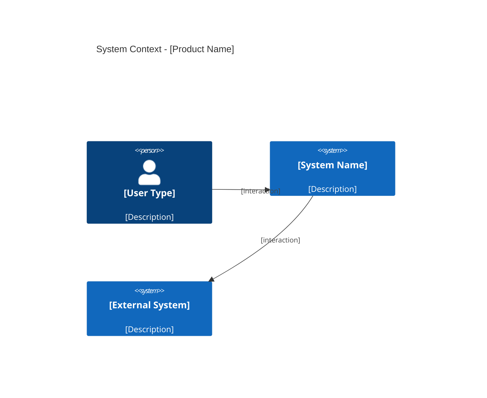

# PRD: [Product/Feature Name]

**Document Type**: REQUIRED   
**Document Status**: [Draft | In Review | Approved | Deprecated]    
**Version**: 1.0    
**Last Updated**: YYYY-MM-DD    
**Owner**: [Product Manager Name]   
**Stakeholders**: [Engineering Lead, Design Lead, Business Lead, AI Agent Protocol]

---

## ✅ PRD Review Checklist
> ตรวจสอบก่อน submit — ย้ายมาไว้ต้นเอกสารเพื่อให้เห็นก่อนเสมอ

### Phase 1: Discovery Requirements
- [ ] Vision Statement ชัดเจนใน 1-2 ประโยค
- [ ] Problem Statement มี research backing อ้างอิงได้
- [ ] Value Proposition ระบุครบทุก segment
- [ ] Personas มี pain points และ goals ชัดเจน
- [ ] Success Metrics วัดผลได้จริง มีค่า baseline
- [ ] Non-scope ระบุชัดเจนว่าไม่ทำอะไรใน v1 นี้
- [ ] Assumptions ถูก list ออกมาและแยกจาก Risks
- [ ] Constraints ครบทั้ง Timeline, Team, Technical

### Phase 2: Content Quality
- [ ] มีข้อมูลครบทั้ง 3 contexts (Business, User, Technical)
- [ ] Acceptance Criteria วัดผลได้จริง ไม่กำกวม
- [ ] Business Rules อยู่ในรูป Human-Readable ตาม Enterprise Grade
- [ ] AI สามารถ parse และ generate code ได้จากเอกสารนี้

### Phase 3: Traceability
- [ ] Requirements เชื่อมโยงไปยัง source documents
- [ ] Research Backing table ครบถ้วน
- [ ] Decision Log บันทึก decisions ที่สำคัญแล้ว
- [ ] Reference Documents ครบถ้วน

---

## 1. Executive Summary (For Stakeholders)

### 1.1 Vision Statement
[1-2 ประโยค อธิบายภาพรวมของผลิตภัณฑ์/ฟีเจอร์ และทิศทางที่ต้องการไป]

> **Example**: "สร้างประสบการณ์ checkout ที่รวดเร็วและไร้ความเสี่ยง ให้ลูกค้าซื้อของได้ภายใน 30 วินาที"

### 1.2 Problem Statement
[1-2 ประโยค ชัดเจน ไม่ใช้ technical terms พร้อมอ้างอิงแหล่งข้อมูล]

> **Example**: "ลูกค้า 40% ทิ้งตะกร้าไว้เพราะกรอกข้อมูลซ้ำซ้อน ทำให้สูญเสียรายได้ 2M บาท/เดือน (จากการสัมภาษณ์ผู้ใช้ 50 คน และข้อมูล Analytics Q4/2025)"

#### Research Backing
| Source Type | Source | Key Finding | Date |
|-------------|--------|-------------|------|
| User Interview | Interview-001 to Interview-050 | 40% ทิ้งตะกร้าเพราะกรอกข้อมูลซ้ำ | 2026-01 |
| Market Research | [Industry Report Name] | Competitor มี one-click checkout แล้ว | 2026-01 |
| Online Sentiment | Forum/Review Analysis | ผู้ใช้บ่นเรื่อง checkout ยาว | 2026-01 |
| Internal Data | Analytics Dashboard | Cart abandonment rate 40% | Q4/2025 |

### 1.3 Proposed Solution
[What ที่จะสร้าง — ไม่ใช่ How]

> **Example**: "One-click checkout ที่ใช้ข้อมูลที่มีอยู่แล้ว + AI คาดการณ์ที่อยู่จัดส่ง"

### 1.4 Value Proposition by Segment

| Segment | Pain Points | Value Proposition | Key Benefit |
|---------|-------------|-------------------|-------------|
| [Segment A] | [Pain point 1, 2] | [Value ที่มอบ] | [ประโยชน์หลัก] |
| [Segment B] | [Pain point 1, 2] | [Value ที่มอบ] | [ประโยชน์หลัก] |

### 1.5 Success Metrics

| Metric | Baseline | Target | Timeline | Measurement Method |
|--------|----------|--------|----------|--------------------|
| [Metric 1] | [Current value] | [Target] | [X months] | [Tool/Method] |
| [Metric 2] | [Current value] | [Target] | [X months] | [Tool/Method] |

> ⚠️ **Note**: ระวัง vanity metrics เช่น sign-up count หรือ page views — เลือก metrics ที่บอกได้ว่า product มีคุณค่าจริงๆ

### 1.6 Strategic Alignment
- **Company OKR**: [Link to OKR]
- **Product Roadmap**: [Quarter/Theme]
- **Technical Vision**: [Link to Architecture Strategy]

---

## 2. Scope (For All Stakeholders)

> Section นี้สำคัญพอๆ กับ functional requirements — ต้องระบุให้ชัดก่อนเริ่ม build

### 2.1 In Scope (v1)
> สิ่งที่จะทำใน version นี้

- [ ] [Feature/capability 1]
- [ ] [Feature/capability 2]
- [ ] [Feature/capability 3]

### 2.2 Non-Scope (v1)
> สิ่งที่ **ไม่ทำ** ใน version นี้ — ระบุเพื่อป้องกัน assumption ที่ต่างกัน

- [ ] [Feature ที่จงใจไม่ทำ เพราะ...]
- [ ] [Feature ที่เลื่อนไป v2 เพราะ...]
- [ ] [Integration ที่ยังไม่ทำ เพราะ...]

> **Example (Screening Platform)**:
> - ✅ In Scope: สร้างและจัดการ schedule รอบฉาย, หน้า listing สำหรับ viewer
> - ❌ Non-Scope: ระบบ payment, recommendation engine, mobile app

### 2.3 Assumptions
> สิ่งที่เชื่อว่าจริงแต่ยังไม่ได้ validate — แยกออกจาก Risks

| ID | Assumption | Confidence | Validation Method | Owner |
|----|------------|------------|-------------------|-------|
| A-001 | [สิ่งที่เชื่อว่าจริง] | High/Med/Low | [วิธี validate] | [ชื่อ] |
| A-002 | [สิ่งที่เชื่อว่าจริง] | High/Med/Low | [วิธี validate] | [ชื่อ] |

> **Example**: "A-001: Organizer จะยอม switch จาก IG ถ้า setup ใช้เวลาไม่เกิน 5 นาที | Confidence: Medium | Validation: Usability test"

### 2.4 Constraints
> ข้อจำกัดที่เปลี่ยนไม่ได้ — ยิ่งรู้เร็วยิ่งดี

| ID | Type | Description | Source | Impact |
|----|------|-------------|--------|--------|
| CON-001 | Budget | [งบประมาณ] | [ที่มา] | [ผลกระทบ] |
| CON-002 | Timeline | [deadline ที่ขยับไม่ได้] | [ที่มา] | [ผลกระทบ] |
| CON-003 | Technical | [technical constraint] | [ที่มา] | [ผลกระทบ] |
| CON-004 | Compliance | [กฎหมาย/นโยบาย] | [ที่มา] | [ผลกระทบ] |

---

## 3. User Context (For UX + Dev + AI)

### 3.1 Target Users

#### Primary Persona: [Name]
```yaml
demographics:
  age: "[range]"
  occupation: "[occupation]"
  tech_savviness: "High/Medium/Low"

behaviors:
  - "[behavior 1]"
  - "[behavior 2]"

pain_points:
  - "[pain point 1]"
  - "[pain point 2]"

goals:
  - "[goal 1]"
  - "[goal 2]"
```

#### Secondary Persona: [Name]
[Same structure — เพิ่มเฉพาะถ้ามี]

### 3.2 Segment Pain Points Comparison

| Pain Point | [Segment A] | [Segment B] | [Segment C] | Impact |
|------------|-------------|-------------|-------------|--------|
| [Pain 1] | ✅ มี | ❌ ไม่มี | ✅ มี | High |
| [Pain 2] | ❌ ไม่มี | ✅ มี | ✅ มี | Medium |

### 3.3 Use Cases by Persona

| Use Case ID | Use Case Name | Persona A | Persona B | Priority |
|-------------|---------------|-----------|-----------|----------|
| UC-001 | [Use Case 1] | ✅ | ✅ | P0 |
| UC-002 | [Use Case 2] | ✅ | ❌ | P1 |

### 3.4 User Stories

**Format: Job Story**
> When [situation], I want to [motivation], so I can [expected outcome]

| ID | Persona | Job Story | Priority | AC Ref |
|----|---------|-----------|----------|--------|
| JS-001 | [Persona] | When [situation], I want to [motivation], so I can [outcome] | P0 | AC-001 |
| JS-002 | [Persona] | When [situation], I want to [motivation], so I can [outcome] | P1 | AC-002 |

### 3.5 User Journey

> Link ไปยัง Figma/Miro แทนการวาดซ้ำใน PRD เพราะ journey เปลี่ยนบ่อย

- **Current State (As-Is)**: [Figma/Miro link]
- **Future State (To-Be)**: [Figma/Miro link]

**Pain Points ที่แก้ใน v1:**
| Pain Point | Solution |
|------------|----------|
| [Pain 1] | [Solution 1] |
| [Pain 2] | [Solution 2] |

---

## 4. Functional Requirements (For Dev + AI)

### 4.1 Feature Overview (จัดตาม Service Groups)

> **Note:** Feature ID จัดระเบียบตาม Service Prefix เพื่อไม่ให้กระทบเมื่อ Services เพิ่ม/ลด Features

#### [main-domain-service]

| Feature ID | Feature Name | คำอธิบาย | Dependencies | Complexity | Priority |
|------------|--------------|-----------|-------------|------------|----------|
| FR-[SVC]-001 | [Feature Name 1] | [คำอธิบาย feature] | [Dependency 1, Dependency 2] | High/Medium/Low | P0/P1/P2 |
| FR-[SVC]-002 | [Feature Name 2] | [คำอธิบาย feature] | None | Medium | P0 |
| FR-[SVC]-003 | [Feature Name 3] | [คำอธิบาย feature] | [Dependency 1] | Low | P1 |

#### [secondary-domain-service] (ถ้ามี)

| Feature ID | Feature Name | คำอธิบาย | Dependencies | Complexity | Priority |
|------------|--------------|-----------|-------------|------------|----------|
| FR-[SVC2]-001 | [Feature Name] | [คำอธิบาย] | [Dependencies] | Medium | P0 |

### 4.2 Use Cases

#### [main-domain-service]

---

| Element | Description |
|---------|-------------|
| **Use Case ID** | UC-[SVC]-001 |
| **Use Case Name** | [ชื่อ use case] |
| **Goal** | [เป้าหมาย use case] |
| **Actor** | [ประเภท actor: User, Admin, System, etc.] |
| **Feature ID** | FR-[SVC]-001 |
| **Preconditions** | [เงื่อนไขก่อนใช้งาน] |
| **Postconditions** | [ผลลัพธ์หลังใช้งาน] |
| **Main Flow** | 1. [Step 1] 2. [Step 2] 3. [Step 3] |
| **System Logic** | [Logic ของระบบ] |
| **Edge Cases** | - [Edge case 1] → [Expected behavior] - [Edge case 2] → [Expected behavior] |

---

| Element | Description |
|---------|-------------|
| **Use Case ID** | UC-[SVC]-002 |
| **Use Case Name** | [ชื่อ use case] |
| **Goal** | [เป้าหมาย] |
| **Actor** | [ประเภท] |
| **Feature ID** | FR-[SVC]-002 |
| **Preconditions** | [เงื่อนไข] |
| **Postconditions** | [ผลลัพธ์] |
| **Main Flow** | 1. [Step 1] 2. [Step 2] 3. [Step 3] |
| **System Logic** | [Logic] |
| **Edge Cases** | - [Edge case] → [Expected behavior] |

---

### 4.3 Detailed Requirements

#### FR-001: [Feature Name]
**Priority**: P0
**Owner**: [Team]

**Description**:
[อธิบาย feature โดยละเอียด - เพิ่มจาก use case ของ UC-001]

**Acceptance Criteria**:
- [ ] [Criteria 1 — วัดผลได้]
- [ ] [Criteria 2 — วัดผลได้]
- [ ] [Criteria 3 — ตรวจสอบ edge case]

**Technical Notes** (สำหรับ Dev + AI Agents):
- API Endpoint: [POST/GET/PUT] `/v1/[endpoint]`
- Request Body/Query: [example JSON]
- Response: [example JSON]
- [Technical requirement 1]
- [Technical requirement 2]

#### FR-002: [Feature Name]
[Same structure]

#### FR-003: [Feature Name]
[Same structure]

### 4.4 Business Rules

> กฎเกณฑ์ทางธุรกิจที่ต้องปฏิบัติตาม จัดทำเป็นภาษาที่อ่านเข้าใจได้ง่ายสำหรับทุก Stakeholder
> จัดแบ่งตาม Service เพื่อให้ AI Agents สามารถ parse และ implement ได้ถูกต้อง

---

#### 4.4.1 General Business Rules

> กฎที่ใช้ร่วมกันทั้งระบบ

| Rule ID | Rule Name | Description | Severity |
|---------|------------|-------------|----------|
| BR-001 | [Rule Name 1] | [Description] | Info/Warning/Blocking |
| BR-002 | [Rule Name 2] | [Description] | Info/Warning/Blocking |
| BR-003 | [Rule Name 3] | [Description] | Info/Warning/Blocking |

---

#### 4.4.2 [Service Name] Business Rules

> Business Rules สำหรับ [describe service purpose]

##### BR-[SVC]-001: [Rule Name]

| Element | Description |
|---------|-------------|
| **Rule ID** | BR-[SVC]-001 |
| **Rule Name** | [ชื่อกฎ] |
| **Description** | [อธิบายเงื่อนไข และสิ่งที่ระบบจะทำ] |
| **Condition** | [เงื่อนไขการเกิด rule] |
| **Action** | [สิ่งที่ระบบควรทำ] |
| **Severity** | Blocking/Warning/Info |

##### BR-[SVC]-002: [Rule Name]

| Element | Description |
|---------|-------------|
| **Rule ID** | BR-[SVC]-002 |
| **Rule Name** | [ชื่อกฎ] |
| **Description** | [อธิบายเงื่อนไข และสิ่งที่ระบบจะทำ] |
| **Condition** | [เงื่อนไขการเกิด rule] |
| **Action** | [สิ่งที่ระบบควรทำ] |
| **Severity** | Blocking/Warning/Info |

---

## 5. Non-Functional Requirements (For Dev + Architecture)

### 5.1 Performance
| Metric | Requirement | Measurement Tool |
|--------|-------------|------------------|
| Page Load | < 2s (3G) | Lighthouse |
| API Response | p95 < 200ms | APM |
| [Metric] | [Requirement] | [Tool] |

### 5.2 Scalability
- [Concurrent users requirement]
- [Traffic spike scenario]
- [Data volume requirement]

### 5.3 Security & Compliance
- [Authentication method]
- [Data encryption requirement]
- [Compliance standard เช่น PDPA, GDPR]
- [Rate limiting]

### 5.4 Reliability
- Uptime: [target]%
- Error rate: < [X]%
- Recovery: [RTO/RPO]

### 5.5 Accessibility
- [Standard เช่น WCAG 2.1 AA]
- [Specific requirements]

---

## 6. Acceptance Criteria (For QA + AI Testing)

### 6.1 Scenario-Based AC

**AC-001: [Scenario Name — Happy Path]**
```gherkin
Given [precondition]
And [precondition]
When [action]
Then [expected result]
And [expected result]
```

**AC-002: [Scenario Name — Edge Case]**
```gherkin
Given [precondition]
When [action]
Then [expected result]
```

### 6.2 Edge Cases
| Case | Expected Behavior |
|------|-------------------|
| [Edge case 1] | [Expected behavior] |
| [Edge case 2] | [Expected behavior] |
| [Edge case 3] | [Expected behavior] |

---

## 7. UI/UX Specifications

### 7.1 Design Assets
- **Figma (Dev Mode)**: [URL]
- **Design System / Component Library**: [URL]
- **Responsive Breakpoints**: Mobile 375px | Tablet 768px | Desktop 1440px

### 7.2 Key Interactions

| State | Trigger | Behavior | Duration |
|-------|---------|----------|----------|
| Loading | [trigger] | [animation/feedback] | [Xms] |
| Success | [trigger] | [animation/feedback] | [Xms] |
| Error | [trigger] | [animation/feedback] | [Xms] |

### 7.3 Copy & Content
```json
{
  "screens": {
    "[screen_name]": {
      "title": "[title text]",
      "subtitle": "[subtitle text]",
      "primary_cta": "[button text]",
      "secondary_cta": "[button text]",
      "error_message": "[error text]"
    }
  }
}
```

---

## 8. Data Requirements

### 8.1 Data Models

```typescript
// Simplified for PRD — Full schema อยู่ใน TDD
interface [EntityName] {
  id: UUID;
  // [fields]
  createdAt: Timestamp;
  updatedAt: Timestamp;
}
```

### 8.2 Analytics & Tracking

| Event | Properties | Purpose |
|-------|------------|---------|
| [event_name] | [properties] | [why we track this] |
| [event_name] | [properties] | [why we track this] |

---

## 9. Technical Considerations

### 9.1 Architecture Overview



> ⚠️ **Note**: Diagram นี้เป็น high-level overview — รายละเอียดทั้งหมดอยู่ใน TDD

### 9.2 Dependencies & Integrations
| System | Type | Risk Level | Fallback |
|--------|------|------------|----------|
| [System] | Internal/External | High/Med/Low | [Fallback plan] |

### 9.3 Risks
> Risks คือสิ่งที่รู้ว่าอาจเกิด (ต่างจาก Assumptions ใน Section 2.3 ที่เป็นสิ่งที่เชื่อว่าจริง)

| ID | Risk | Probability | Impact | Mitigation | Owner |
|----|------|-------------|--------|------------|-------|
| R-001 | [Risk description] | High/Med/Low | High/Med/Low | [Plan] | [Team] |
| R-002 | [Risk description] | High/Med/Low | High/Med/Low | [Plan] | [Team] |

---

## 10. Release Plan (For All Stakeholders)

### 10.1 Phases
| Phase | Scope | Timeline | Success Criteria |
|-------|-------|----------|------------------|
| Alpha | Internal testing | Week 1-2 | Zero critical bugs |
| Beta | X% users | Week 3-4 | [Metric] +X% |
| GA | 100% users | Week 5 | [Metric] +X% |

### 10.2 Rollback Criteria
- Error rate > [X]%
- [Key metric] ลดลงจาก baseline
- [Critical condition]

---

## 11. AI Collaboration Notes (For AI Agents)

> Section นี้เขียนเพื่อให้ AI coding agents ทำงานได้ consistent กับ codebase

### 11.1 Code Generation Standards
```yaml
standards:
  language: "[TypeScript/Python/etc]"
  framework: "[Framework + version]"
  testing: "[Testing framework]"
  styling: "[CSS approach]"
  state_management: "[Library]"

constraints:
  - "[Constraint 1 — เช่น ห้ามใช้ library X]"
  - "[Constraint 2 — เช่น ต้อง handle error แบบ type-safe]"
  - "[Constraint 3 — เช่น Server Components เป็นหลัก]"

naming_conventions:
  components: "PascalCase"
  functions: "camelCase"
  constants: "SCREAMING_SNAKE_CASE"
  files: "kebab-case"
```

### 11.2 Domain Glossary (Ubiquitous Language)
> คำศัพท์ที่ทุกคนในทีมและ AI agents ต้องใช้ตรงกัน

| Term | Definition | Example |
|------|------------|---------|
| [Term] | [Definition ที่ชัดเจน] | [Example ในระบบ] |
| [Term] | [Definition ที่ชัดเจน] | [Example ในระบบ] |

### 11.3 Context for AI Review
- ตรวจสอบ business rules ใน Section 4.3
- Ensure accessibility requirements ใน Section 5.5
- Validate against acceptance criteria ใน Section 6
- ห้าม generate code ที่ขัดกับ constraints ใน Section 11.1

### 11.4 Documentation to Update After Changes
- [ ] API Documentation (Swagger/OpenAPI)
- [ ] TDD (ถ้ามี architectural change)
- [ ] User Guide / Help Center
- [ ] Runbook
- [ ] ADR (ถ้ามี architectural decision ใหม่)

---

## 12. Decision Log

> บันทึก decisions ที่สำคัญระหว่างทาง — ช่วย onboard คนใหม่และ AI agents ที่เข้ามาทีหลัง

| Date | Decision | Options Considered | Rationale | Decision By |
|------|----------|--------------------|-----------|-------------|
| YYYY-MM-DD | [สิ่งที่ตัดสินใจ] | [Option A, Option B] | [เพราะอะไร] | [ชื่อ/Role] |
| YYYY-MM-DD | [สิ่งที่ตัดสินใจ] | [Option A, Option B] | [เพราะอะไร] | [ชื่อ/Role] |

---

## 13. Appendix (Optional — กรอกเมื่อพร้อม)

### 13.1 Reference Documents

#### Research & Articles
| Document | Type | Source | Key Insights |
|----------|------|--------|--------------|
| [Document] | PDF/Link | [Path/URL] | [Key insight] |

#### Competitor Intelligence
| Competitor | Relevant Feature | Our Differentiation |
|------------|------------------|---------------------|
| [Competitor] | [Feature] | [จุดที่เราต่างหรือดีกว่า] |

#### Technical Documents
- [Link to TDD]
- [Link to previous related PRDs]
- [Link to ADR log]

### 13.2 Initial Ideas Backlog
> Feature ที่คิดไว้แต่ยังไม่ได้ prioritize — อย่าให้หาย แต่อย่าเอาไปปนกับ scope

**P0 (Must Have):**
- [ ] [Feature]: [Description]

**P1 (Should Have):**
- [ ] [Feature]: [Description]

**P2 (Nice to Have / Future):**
- [ ] [Feature]: [Description]

### 13.3 Open Questions
> คำถามที่ยังไม่มีคำตอบ — track ไว้เพื่อไม่ให้ตกหล่น

| ID | Question | Priority | Status | Answer | Owner |
|----|----------|----------|--------|--------|-------|
| Q-001 | [คำถาม] | High | Pending | - | [ชื่อ] |
| Q-002 | [คำถาม] | Medium | Answered | [คำตอบ] | [ชื่อ] |

### 13.4 Change Log
| Version | Date | Changes | Author |
|---------|------|---------|--------|
| 0.1 | YYYY-MM-DD | Initial draft | [Name] |
| 1.0 | YYYY-MM-DD | Approved for development | [Name] |

---

**Status:** [Current Status]

**Next Steps:**
1. Review meeting กับ stakeholders (30 min)
2. Tech team estimate effort
3. Create tasks ใน project management tool
4. Schedule kick-off
5. Proceed to Phase 2: Design