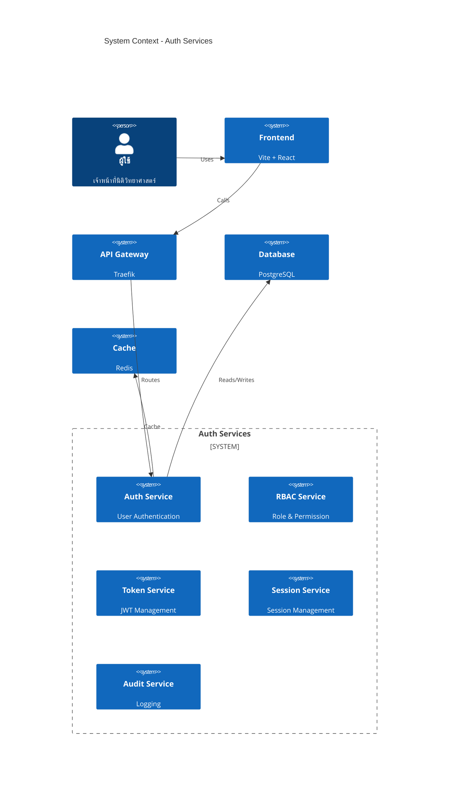

# PRD: Auth Services

**Document Type**: REQUIRED

**Document Status**: Draft

**Version**: 1.0

**Last Updated**: 2026-03-01

**Owner**: Product Team

**Stakeholders**: Engineering Lead, Design Lead, Security Architect, AI Agent Protocol

---

## ✅ PRD Review Checklist

> ตรวจสอบก่อน submit — ย้ายมาไว้ต้นเอกสารเพื่อให้เห็นก่อนเสมอ

### Phase 1: Discovery Requirements

- [x] Vision Statement ชัดเจนใน 1-2 ประโยค
- [x] Problem Statement มี research backing อ้างอิงได้
- [x] Value Proposition ระบุครบทุก segment
- [x] Personas มี pain points และ goals ชัดเจน
- [x] Success Metrics วัดผลได้จริง มีค่า baseline
- [x] Non-scope ระบุชัดเจนว่าไม่ทำอะไรใน v1 นี้
- [x] Assumptions ถูก list ออกมาและแยกจาก Risks
- [x] Constraints ครบทั้ง Timeline, Team, Technical

### Phase 2: Content Quality

- [x] มีข้อมูลครบทั้ง 3 contexts (Business, User, Technical)
- [x] Acceptance Criteria วัดผลได้จริง ไม่กำกวม
- [x] Business Rules อยู่ในรูป Human-Readable ตาม Enterprise Grade
- [x] AI สามารถ parse และ generate code ได้จากเอกสารนี้

### Phase 3: Traceability

- [x] Requirements เชื่อมโยงไปยัง source documents
- [x] Research Backing table ครบถ้วน
- [x] Decision Log บันทึก decisions ที่สำคัญแล้ว
- [x] Reference Documents ครบถ้วน

---

## 1. Executive Summary (For Stakeholders)

### 1.1 Vision Statement

> "สร้างระบบ Authentication และ Authorization ระดับ Enterprise สำหรับ Raven System ที่รองรับความปลอดภัยสูงด้วย AAL1 (ปัจจุบัน) และเตรียมพร้อมสำหรับ AAL2 (อนาคต) โดยใช้มาตรฐาน OAuth 2.0, JWT และ Argon2id สำหรับการจัดเก็บ Password อย่างปลอดภัย"

### 1.2 Problem Statement

ระบบ Raven ในปัจจุบันต้องการระบบ Authentication และ Authorization ที่มีความปลอดภัยสูงสำหรับเจ้าหน้าที่นิติวิทยาศาสตร์ โดยมีความต้องการดังนี้:

- การยืนยันตัวตนที่ปลอดภัยสำหรับผู้ใช้หลายระดับ (Field Officer, Domain Expert, Senior Officer)
- การจัดการสิทธิ์การเข้าถึง (RBAC) ที่แม่นยำ
- การป้องกันการโจมตีทางไซเบอร์ตามมาตรฐาน OWASP
- การบันทึก Audit Log สำหรับการตรวจสอบย้อนหลัง

> **Research Backing:**
> - OWASP Top 10 2021: Broken Access Control เป็นช่องโหว่อันดับ 1
> - NIST SP 800-63-3: แนวทางด้าน Digital Identity สำหรับระบบรัฐบาล

#### Research Backing

| Source Type | Source | Key Finding | Date |
|-------------|--------|-------------|------|
| Security Standard | OWASP Top 10:2021 | Broken Access Control เป็นช่องโหว่อันดับ 1 ของ Web Application | 2021 |
| Security Standard | NIST SP 800-63-3 | กำหนดมาตรฐาน AAL1/AAL2 สำหรับ Authentication | 2023 |
| Security Standard | OWASP Password Storage | แนะนำ Argon2id สำหรับ Password Hashing | 2023 |
| Security Standard | OWASP API Security Top 10 | API1:2023 Broken Object Level Authorization | 2023 |

### 1.3 Proposed Solution

ระบบ Auth Services ที่ประกอบด้วย:

- **Authentication Service**: จัดการการยืนยันตัวตนด้วย Password + JWT
- **Authorization Service**: จัดการ Role-Based Access Control (RBAC)
- **Token Service**: จัดการ JWT Access Token และ Refresh Token
- **Session Service**: จัดการ Session และ Session Timeout

### 1.4 Value Proposition by Segment

| Segment | Pain Points (Auth) | Value Proposition | Key Benefit |
|---------|-------------|-------------------|-------------|
| **Field Officer** | ต้องจำ password หลายตัว, login ซับซ้อน | Single-factor login ด้วย email/password | เข้าใช้งานได้รวดเร็ว |
| **Domain Expert** | ต้องการ authentication ที่ปลอดภัย | Secure authentication + Audit Trail | ข้อมูลปลอดภัยและตรวจสอบได้ |
| **Senior Officer** | ต้องการจัดการผู้ใช้และสิทธิ์ | User Management + RBAC | ควบคุมการเข้าถึงได้ละเอียด |
| **System** | ต้องการปฏิบัติตามมาตรฐานความปลอดภัย | OWASP Compliance + Audit Logging | ผ่านการตรวจสอบด้านความปลอดภัย |

### 1.5 Success Metrics

| Metric | Baseline | Target | Timeline | Measurement Method |
|--------|----------|--------|----------|--------------------|
| Login Success Rate | 95% | 99% | 3 เดือน | Auth Service Logs |
| Authentication Response Time | 500ms | <200ms | 3 เดือน | APM Tool |
| Security Incidents | 5/เดือน | 0/เดือน | 6 เดือน | Security Logs |
| User Satisfaction | 3.5/5 | 4.5/5 | 6 เดือน | User Survey |
| Password Hash Compliance | 0% | 100% | 3 เดือน | Security Audit |

> **Note:** เลือก metrics ที่บอกได้ว่า system มีคุณค่าจริงๆ — ไม่ใช่ vanity metrics

### 1.6 Strategic Alignment

- **Company OKR**: พัฒนาระบบความปลอดภัยระดับ Enterprise
- **Product Roadmap**: Q1 2026 — Auth Services v1
- **Technical Vision**: Microservices Architecture with API Gateway

---

## 2. Scope (For All Stakeholders)

> Section นี้สำคัญพอๆ กับ functional requirements — ต้องระบุให้ชัดก่อนเริ่ม build

### 2.1 In Scope (v1)

- [x] User Account Creation (โดย Senior Officer เท่านั้น)
- [x] User Login (เข้าสู่ระบบ)
- [x] User Logout (ออกจากระบบ)
- [x] Password Management (เปลี่ยน password, ลืม password)
- [x] Role-Based Access Control (RBAC)
- [x] JWT Token Management (Access Token, Refresh Token)
- [x] Session Management
- [x] Audit Logging
- [x] Rate Limiting
- [x] API Security (OWASP API Security Top 10)

### 2.2 Non-Scope (v1)

- [ ] User Registration (self-register) — Senior Officer เท่านั้นที่สร้าง account ให้ผู้ใช้
- [ ] Multi-Factor Authentication (MFA) — เตรียมพร้อมสำหรับอนาคต (AAL2)
- [ ] Social Login (Google, Facebook)
- [ ] Single Sign-On (SSO)
- [ ] Passwordless Authentication
- [ ] Biometric Authentication
- [ ] Federation with External IdP
- [ ] OAuth 2.0 Authorization Code Flow สำหรับ Third-party
- [ ] Cloud-specific deployments (Azure/AWS/GCP) — v1 รองรับ Self-hosted ก่อน

### 2.3 Assumptions

| ID | Assumption | Confidence | Validation Method | Owner |
|----|------------|------------|-------------------|-------|
| A-AUTH-001 | ผู้ใช้ทุกคนผ่านการคัดกรองจากหน่วยงานแล้ว | High | HR Verification | Admin |
| A-AUTH-002 | ระบบจะ deploy บน Docker ภายในองค์กร | High | DevOps Plan | DevOps |
| A-AUTH-003 | ผู้ใช้มีความรู้พื้นฐานการใช้งาน Web Application | High | User Training | PM |
| A-AUTH-004 | Network ภายในองค์กรมีความปลอดภัย | Medium | Network Audit | IT |
| A-AUTH-005 | ระบบต้องรองรับ Self-hosted ภายในองค์กร | High | portability-requirements.md | Architect |
| A-AUTH-006 | ระบบต้อง Portable ไปยัง Enterprise Cloud (Azure/AWS/GCP) | High | portability-requirements.md | Architect |
| A-AUTH-007 | ใช้ 12-Factor App principles สำหรับ Configuration | High | portability-requirements.md | DevOps |
| A-AUTH-008 | รองรับ Container Orchestration (Kubernetes) | Medium | portability-requirements.md | DevOps |

> **Portability Requirements:** ดูรายละเอียดเพิ่มเติมใน [portability-requirements.md](portability-requirements.md)   
> **12-Factor App principles:** ดูรายละเอียดเพิ่มเติมใน [The-Twelve-Factor-App.md](../../01-user-inputs/references/The-Twelve-Factor-App.md)

### 2.4 Constraints

| ID | Type | Description | Source | Impact |
|----|------|-------------|--------|--------|
| CON-AUTH-001 | Technical | ใช้ Argon2id สำหรับ Password Hashing | SecurityRequirements.md | กำหนด Algorithm |
| CON-AUTH-002 | Technical | รองรับ JWT สำหรับ Token | SecurityRequirements.md | กำหนด Token Format |
| CON-AUTH-003 | Technical | ปฏิบัติตาม OWASP Top 10 | SecurityRequirements.md | กำหนด Security Standards |
| CON-AUTH-004 | Compliance | ไม่เก็บ Password ในรูป Plaintext | SecurityRequirements.md | กำหนด Storage Method |
| CON-AUTH-005 | Deployment | รองรับ Self-hosted บน Docker | portability-requirements.md | กำหนด Deployment Strategy |
| CON-AUTH-006 | Deployment | รองรับ 12-Factor App | portability-requirements.md | กำหนด Configuration |
| CON-AUTH-007 | Deployment | ไม่ผูกกับ Cloud Provider เฉพาะ | portability-requirements.md | กำหนด Portability |

---

## 3. User Context

### 3.1 Target Users

#### PS-01: เจ้าหน้าที่ภาคสนาม (Field Officer)

**Demographics:**
* **Age:** "25-40"
* **Occupation:** "เจ้าหน้าที่นิติวิทยาศาสตร์"
* **Tech Savviness:** "Medium"

**Devices:**
1. **Mobile** — ใช้งานในพื้นที่เกิดเหตุ
2. **Tablet** — ใช้งานเพิ่มเติมในภาคสนาม
3. **Desktop** — ใช้งานเมื่อกลับสำนักงาน

**Behaviors (Auth-Related):**
* เข้าถึงระบบผ่าน Mobile/Tablet/Desktop
* ต้องการ login ที่รวดเร็วและง่าย
* ต้องการ logout เมื่อเสร็จงาน
* ต้องการเปลี่ยน password เมื่อต้องการ
* ต้องการ reset password เมื่อลืม

**Pain Points (Auth-Related):**
* ต้องจำ password หลายตัวสำหรับระบบต่างๆ
* การ login ที่ซับซ้อนทำให้เสียเวลา
* ไม่มีระบบจัดการสิทธิ์ที่ชัดเจน
* ต้องการ authentication ที่ปลอดภัย
* ต้องการ audit trail
* ต้องการ RBAC ที่ละเอียด

**Goals (Auth-Related):**
* เข้าถึงระบบได้รวดเร็วภายในไม่กี่วินาที
* มีสิทธิ์เข้าถึงข้อมูลตามบทบาท
* ออกจากระบบได้เมื่อเสร็จงาน

#### PS-02: ผู้เชี่ยวชาญด้านอาวุธปืน (Firearms Domain Expert)

**Demographics:**
* **Age:** "35-50"
* **Occupation:** "นักวิทยาศาสตร์"
* **Tech Savviness:** "High"

**Devices:**
1. **Desktop** — ใช้งานเมื่อกลับสำนักงาน
2. **Mobile** — ใช้งานในพื้นที่เกิดเหตุ
3. **Tablet** — ใช้งานเพิ่มเติมในภาคสนาม

**Behaviors (Auth-Related):**
* เข้าถึงระบบผ่าน Desktop/Mobile/Tablet
* ต้องการ authentication ที่ปลอดภัยสำหรับข้อมูล sensitive
* ต้องการ audit trail สำหรับการตรวจสอบ
* ต้องการจัดการสิทธิ์การเข้าถึงข้อมูล

**Pain Points (Auth-Related):**
* ต้องการ authentication ที่น่าเชื่อถือและปลอดภัย
* ต้องการ audit trail ที่ชัดเจนสำหรับการตรวจสอบ
* ต้องการ RBAC ที่ละเอียด

**Goals (Auth-Related):**
* เข้าถึงระบบได้อย่างปลอดภัย
* มีสิทธิ์เข้าถึงข้อมูลตามบทบาท
* การกระทำทุกอย่างถูกบันทึกใน audit log

#### PS-03: ผู้เชี่ยวชาญด้านยาเสพติด (Narcotics Domain Expert)

**Demographics:**
* **Age:** "35-50"
* **Occupation:** "นักวิทยาศาสตร์"
* **Tech Savviness:** "High"

**Devices:**
1. **Desktop** — ใช้งานเมื่อกลับสำนักงาน
2. **Mobile** — ใช้งานในพื้นที่เกิดเหตุ
3. **Tablet** — ใช้งานเพิ่มเติมในภาคสนาม

**Behaviors (Auth-Related):**
* เข้าถึงระบบผ่าน Desktop/Mobile/Tablet
* ต้องการ authentication ที่ปลอดภัยสำหรับข้อมูล sensitive
* ต้องการ audit trail สำหรับการตรวจสอบ
* ต้องการจัดการสิทธิ์การเข้าถึงข้อมูล

**Pain Points (Auth-Related):**
* ต้องการ authentication ที่น่าเชื่อถือและปลอดภัย
* ต้องการ audit trail ที่ชัดเจนสำหรับการตรวจสอบ
* ต้องการ RBAC ที่ละเอียด

**Goals (Auth-Related):**
* เข้าถึงระบบได้อย่างปลอดภัย
* มีสิทธิ์เข้าถึงข้อมูลตามบทบาท
* การกระทำทุกอย่างถูกบันทึกใน audit log

---

#### PS-04: ผู้บริหาร (Senior Officer)

**Demographics:**
* **Age:** "40-55"
* **Occupation:** "ผู้บังคับบัญชา"
* **Tech Savviness:** "Medium"

**Devices:**
1. **Desktop** — ใช้งานเมื่อกลับสำนักงาน
2. **Mobile** — ใช้งานในพื้นที่เกิดเหตุ
3. **Tablet** — ใช้งานเพิ่มเติมในภาคสนาม

**Behaviors (Auth-Related):**
* จัดการผู้ใช้และสิทธิ์ (Create, Update, Delete users)
* มอบหมาย roles ให้ผู้ใช้
* ดู audit logs เพื่อตรวจสอบการกระทำ
* อนุมัติ/ปฏิเสธคำขอเข้าถึง

**Pain Points (Auth-Related):**
* ต้องการจัดการผู้ใช้ได้ง่ายไม่ซับซ้อน
* ต้องการ authentication ที่ปลอดภัย
* ต้องการ audit trail สำหรับตรวจสอบย้อนหลัง
* ต้องการ RBAC ที่ละเอียด

**Goals (Auth-Related):**
* จัดการผู้ใช้และสิทธิ์ได้อย่างมีประสิทธิภาพ
* กำหนด roles และ permissions ได้ตามต้องการ
* ตรวจสอบการกระทำของผู้ใช้ได้ผ่าน audit log

---

### 3.2 Segment Pain Points Comparison

| Pain Point (Auth-Related) | Field Officer | Domain Expert | Senior Officer | Impact |
|---------------------------|---------------|--------------|----------------|--------|
| ต้องจำ password หลายตัว | ✅ มี | ✅ มี | ❌ ไม่มี | High |
| การ login ซับซ้อน/เสียเวลา | ✅ มี | ❌ ไม่มี | ❌ ไม่มี | High |
| ไม่มีระบบจัดการสิทธิ์ชัดเจน | ✅ มี | ✅ มี | ❌ ไม่มี | High |
| ต้องการ authentication ที่ปลอดภัย | ✅ มี | ✅ มี | ✅ มี | High |
| ต้องการ audit trail | ✅ มี | ✅ มี | ✅ มี | Medium |
| ต้องการ RBAC ที่ละเอียด | ✅ มี | ✅ มี | ✅ มี | High |
| ต้องการจัดการผู้ใช้ | ❌ ไม่มี | ❌ ไม่มี | ✅ มี | High |

### 3.3 Use Cases by Persona

> Note: Use Cases เฉพาะที่อยู่ใน Auth Services Boundary/Context เท่านั้น

| Use Case ID | Use Case Name | Field Officer | Domain Expert | Senior Officer | Priority |
|-------------|---------------|---------------|---------------|----------------|----------|
| UC-AUTH-001 | Login | ✅ | ✅ | ✅ | P0 |
| UC-AUTH-002 | Logout | ✅ | ✅ | ✅ | P0 |
| UC-AUTH-003 | Create User Account | ❌ | ❌ | ✅ | P0 |
| UC-AUTH-004 | Manage Users | ❌ | ❌ | ✅ | P0 |
| UC-AUTH-005 | Assign Roles | ❌ | ❌ | ✅ | P0 |
| UC-AUTH-006 | Change Password | ✅ | ✅ | ✅ | P1 |
| UC-AUTH-007 | Request Password Reset | ✅ | ✅ | ✅ | P1 |
| UC-AUTH-008 | View Audit Logs | ❌ | ❌ | ✅ | P1 |

### 3.4 User Stories

**Format: Job Story**
> When [สถานการณ์], I want to [แรงจูงใจ], so I can [ผลลัพธ์ที่คาดหวัง]

| ID | Persona | Job Story (Auth-Related) | Priority |
|----|---------|--------------------------|----------|
| JS-AUTH-001 | Field Officer | เมื่อต้องการใช้งานระบบในพื้นที่เกิดเหตุ ฉันอยาก login ด้วย username และ password อย่างรวดเร็ว เพื่อให้เริ่มบันทึกข้อมูลได้ทันที | P0 |
| JS-AUTH-002 | Field Officer | เมื่อลืม password ฉันอยาก reset password ได้ง่าย เพื่อให้กลับไปทำงานต่อได้โดยไม่ต้องรอ | P1 |
| JS-AUTH-003 | Domain Expert | เมื่อต้องทำงานกับข้อมูลที่ sensitive ฉันอยากให้ระบบมี authentication ที่ปลอดภัย เพื่อให้มั่นใจว่าข้อมูลถูกปกป้อง | P0 |
| JS-AUTH-004 | Domain Expert | เมื่อต้องการตรวจสอบการกระทำของตัวเอง ฉันอยากดู audit logs ได้ เพื่อพิสูจน์ได้ว่าทำอะไรไป | P1 |
| JS-AUTH-005 | Senior Officer | เมื่อต้องการจัดการการเข้าถึงของทีม ฉันอยากกำหนด roles และ permissions ให้ผู้ใช้ได้ เพื่อควบคุมได้ว่าใครเข้าถึงอะไรได้ | P0 |
| JS-AUTH-006 | Senior Officer | เมื่อต้องการสืบสวนเหตุการณ์ ฉันอยากดู audit logs ได้ เพื่อตรวจสอบย้อนหลังได้ว่าเกิดอะไรขึ้น | P1 |

### 3.5 User Journey

> Link ไปยัง Figma/Miro แทนการวาดซ้ำใน PRD เพราะ journey เปลี่ยนบ่อย

- **Current State (As-Is)**: ผู้ใช้ใช้งานระบบโดยไม่มีการจัดการสิทธิ์ที่ชัดเจน, ไม่มี audit trail
- **Future State (To-Be)**: ผู้ใช้เข้าถึงระบบตาม Role ด้วย JWT, มี Audit Trail ครบถ้วน

**Pain Points ที่แก้ใน v1 (Auth-Related):**

| Pain Point | Solution |
|------------|----------|
| ไม่มีระบบจัดการสิทธิ์ | ใช้ RBAC กำหนดสิทธิ์ตาม Role |
| Password ไม่ปลอดภัย | ใช้ Argon2id Hashing |
| ไม่มี Audit Trail | บันทึก Log ทุกการกระทำ |
| ไม่มี Rate Limiting | จำกัดจำนวน Login Attempts |

---

## 4. Functional Requirements (For Dev + AI)

### 4.1 Feature Overview (จัดตาม Service Groups)

> **Note:** Feature ID จัดระเบียบตาม Service Prefix เพื่อไม่ให้กระทบเมื่อ Services เพิ่ม/ลด Features

#### AUTH-Service (Authentication)

| Feature ID | Feature Name | คำอธิบาย | Dependencies | Complexity | Priority |
|------------|--------------|-----------|-------------|------------|----------|
| FR-AUTH-001 | Create User Account | สร้าง account ให้ผู้ใช้ (โดย Senior Officer) | None | Medium | P0 |
| FR-AUTH-002 | User Login | เข้าสู่ระบบด้วย username/password | None | Medium | P0 |
| FR-AUTH-003 | User Logout | ออกจากระบบ | FR-AUTH-002 | Low | P0 |
| FR-AUTH-004 | Password Change | เปลี่ยน password | FR-AUTH-002 | Low | P1 |
| FR-AUTH-005 | Password Reset | รีเซ็ต password กรณีลืม | None | Medium | P1 |
| FR-AUTH-006 | Password Policy Enforcement | บังคับใช้นโยบาย password | FR-AUTH-001, FR-AUTH-004 | Medium | P0 |
| FR-AUTH-007 | Rate Limiting | จำกัดจำนวน login attempts | None | Medium | P0 |

#### RBAC-Service (Authorization)

| Feature ID | Feature Name | คำอธิบาย | Dependencies | Complexity | Priority |
|------------|--------------|-----------|-------------|------------|----------|
| FR-RBAC-001 | Role Management | จัดการ roles (สร้าง, แก้ไข, ลบ) | None | Medium | P0 |
| FR-RBAC-002 | Permission Management | จัดการ permissions | FR-RBAC-001 | Medium | P0 |
| FR-RBAC-003 | User Role Assignment | กำหนด role ให้ผู้ใช้ | FR-RBAC-001 | Low | P0 |
| FR-RBAC-004 | Role-Based Access Check | ตรวจสอบสิทธิ์ก่อนเข้าถึง | FR-RBAC-003 | Medium | P0 |
| FR-RBAC-005 | Default Role Assignment | กำหนด default role ให้ผู้ใช้ใหม่ | FR-RBAC-001 | Low | P1 |

#### TOKEN-Service (Token Management)

| Feature ID | Feature Name | คำอธิบาย | Dependencies | Complexity | Priority |
|------------|--------------|-----------|-------------|------------|----------|
| FR-TOKEN-001 | JWT Access Token Generation | สร้าง JWT Access Token | FR-AUTH-002 | Medium | P0 |
| FR-TOKEN-002 | JWT Refresh Token Generation | สร้าง JWT Refresh Token | FR-TOKEN-001 | Medium | P0 |
| FR-TOKEN-003 | Token Validation | ตรวจสอบความถูกต้องของ Token | FR-TOKEN-001 | Medium | P0 |
| FR-TOKEN-004 | Token Revocation | ยกเลิก Token | FR-TOKEN-001 | Low | P1 |
| FR-TOKEN-005 | Token Refresh | ขอ Token ใหม่ด้วย Refresh Token | FR-TOKEN-002 | Medium | P0 |

#### SESSION-Service (Session Management)

| Feature ID | Feature Name | คำอธิบาย | Dependencies | Complexity | Priority |
|------------|--------------|-----------|-------------|------------|----------|
| FR-SESS-001 | Session Creation | สร้าง session เมื่อ login | FR-AUTH-002 | Low | P0 |
| FR-SESS-002 | Session Timeout | ยกเลิก session เมื่อหมดเวลา | FR-SESS-001 | Low | P0 |
| FR-SESS-003 | Session Invalidation | ยกเลิก session ทันที (logout) | FR-AUTH-003 | Low | P0 |
| FR-SESS-004 | Concurrent Session Control | จำกัดจำนวน session ต่อ user | FR-SESS-001 | Medium | P1 |

#### AUDIT-Service (Audit Logging)

| Feature ID | Feature Name | คำอธิบาย | Dependencies | Complexity | Priority |
|------------|--------------|-----------|-------------|------------|----------|
| FR-AUDIT-001 | Login Logging | บันทึก login สำเร็จ/ล้มเหลว | FR-AUTH-002 | Low | P0 |
| FR-AUDIT-002 | Action Logging | บันทึกการกระทำสำคัญ | All Features | Low | P0 |
| FR-AUDIT-003 | Log Query | ค้นหา logs | FR-AUDIT-001 | Medium | P1 |

---

### 4.2 Use Cases

#### AUTH-Service Use Cases

---

| Element | Description |
|---------|-------------|
| **Use Case ID** | UC-AUTH-001 |
| **Use Case Name** | User Login |
| **Goal** | ผู้ใช้สามารถเข้าสู่ระบบด้วย username และ password |
| **Actor** | ผู้ใช้ทุกประเภท (Field Officer, Domain Expert, Senior Officer) |
| **Feature ID** | FR-AUTH-002 |
| **Preconditions** | 1. ผู้ใช้มี account ในระบบแล้ว 2. ผู้ใช้ไม่ถูก lock |
| **Postconditions** | 1. ผู้ใช้ได้รับ JWT Access Token และ Refresh Token 2. ระบบสร้าง session |
| **Main Flow** | 1. ผู้ใช้กรอก username และ password 2. ระบบตรวจสอบ credentials 3. ระบบตรวจสอบ password hash ด้วย Argon2id 4. ระบบสร้าง JWT Access Token 5. ระบบสร้าง JWT Refresh Token 6. ระบบสร้าง session 7. ระบบบันทึก login success log |
| **System Logic** | - Validate username exists - Verify password hash with Argon2id - Generate JWT with HS256 - Store session in Redis/DB |
| **Edge Cases** | - Wrong password → Increment failed attempt counter → Lock account after 5 attempts - Account locked → Show "Account locked" message - Token expired → Prompt re-login |

---

| Element | Description |
|---------|-------------|
| **Use Case ID** | UC-AUTH-002 |
| **Use Case Name** | User Registration |
| **Goal** | สร้าง account ใหม่สำหรับผู้ใช้ |
| **Actor** | Senior Officer (ผู้สร้าง user ใหม่) หรือ ผู้ใช้ใหม่ (self-register) |
| **Feature ID** | FR-AUTH-001 |
| **Preconditions** | 1. Actor มีสิทธิ์สร้าง user (สำหรับ Senior Officer) 2. ข้อมูลที่ required ครบถ้วน |
| **Postconditions** | 1. สร้าง user record ใน database 2. Password ถูก hash ด้วย Argon2id 3. กำหนด default role |
| **Main Flow** | 1. รับข้อมูล user (username, email, password) 2. ตรวจสอบ password policy 3. Hash password ด้วย Argon2id 4. สร้าง user record 5. กำหนด default role 6. บันทึก log |
| **System Logic** | - Validate password meets policy (min 8 chars, special chars, numbers) - Generate unique salt for each user - Hash password with Argon2id (m=19MiB, t=2, p=1) |
| **Edge Cases** | - Username already exists → Show error - Password doesn't meet policy → Show validation error - Email already exists → Show error |

---

#### RBAC-Service Use Cases

---

| Element | Description |
|---------|-------------|
| **Use Case ID** | UC-RBAC-001 |
| **Use Case Name** | Assign Role to User |
| **Goal** | กำหนด role ให้ผู้ใช้ |
| **Actor** | Senior Officer |
| **Feature ID** | FR-RBAC-003 |
| **Preconditions** | 1. Actor มีสิทธิ์จัดการ roles 2. User มีอยู่ในระบบ 3. Role มีอยู่ในระบบ |
| **Postconditions** | 1. User ได้รับ role ที่กำหนด 2. สามารถเข้าถึง resource ตาม role |
| **Main Flow** | 1. เลือก user 2. เลือก role 3. ยืนยันการมอบหมาย 4. บันทึก log |
| **System Logic** | - Validate user exists - Validate role exists - Check actor has permission - Update user_role mapping |
| **Edge Cases** | - User already has role → Replace or reject - Invalid role → Show error - Actor no permission → Show error |

---

### 4.3 Detailed Requirements

#### FR-AUTH-001: User Registration

**Priority**: P0  
**Owner**: Auth Team

**Description**:
ระบบต้องสามารถลงทะเบียนผู้ใช้ใหม่โดยตรวจสอบความถูกต้องของข้อมูลและจัดเก็บ password อย่างปลอดภัยด้วย Argon2id

**Acceptance Criteria**:

- [ ] ระบบต้องตรวจสอบว่า username ไม่ซ้ำกัน
- [ ] ระบบต้องตรวจสอบว่า email ไม่ซ้ำกัน
- [ ] Password ต้องมีความยาวอย่างน้อย 8 ตัวอักษร
- [ ] Password ต้องมีตัวอักษรพิเศษ, ตัวเลข, ตัวพิมพ์ใหญ่และเล็ก
- [ ] Password ต้องถูก hash ด้วย Argon2id (m=19MiB, t=2, p=1)
- [ ] ระบบต้องสร้าง unique salt สำหรับทุก user
- [ ] ระบบต้องกำหนด default role ให้ user ใหม่
- [ ] ระบบต้องบันทึก log การ registration

**Technical Notes** (สำหรับ Dev + AI Agents):

- API Endpoint: `POST /v1/auth/register`
- Request Body:
  ```json
  {
    "username": "string (required, unique)",
    "email": "string (required, unique)",
    "password": "string (required, min 8 chars)",
    "firstName": "string (required)",
    "lastName": "string (required)"
  }
  ```
- Response:
  ```json
  {
    "userId": "uuid",
    "username": "string",
    "email": "string",
    "role": "string",
    "createdAt": "datetime"
  }
  ```
- Password Hash: ใช้ Argon2id ตาม PS-NFR1-9
- Database: User table มี password_hash และ salt fields

#### FR-AUTH-002: User Login

**Priority**: P0  
**Owner**: Auth Team

**Description**:
ระบบต้องสามารถยืนยันตัวตนผู้ใช้ด้วย username และ password และออก JWT Token

**Acceptance Criteria**:

- [ ] ระบบต้องตรวจสอบ username ว่ามีอยู่จริง
- [ ] ระบบต้องตรวจสอบ password ด้วย Argon2id
- [ ] ระบบต้องจำกัด login attempts ไม่เกิน 5 ครั้ง
- [ ] ระบบต้อง lock account 15 นาทีหลังจาก 5 ครั้งที่ผิด
- [ ] ระบบต้องออก JWT Access Token (expire 30 นาที)
- [ ] ระบบต้องออก JWT Refresh Token (expire 24 ชั่วโมง)
- [ ] ระบบต้องบันทึก login log (สำเร็จ/ล้มเหลว)
- [ ] ระบบต้องสร้าง session เมื่อ login สำเร็จ

**Technical Notes** (สำหรับ Dev + AI Agents):

- API Endpoint: `POST /v1/auth/login`
- Request Body:
  ```json
  {
    "username": "string (required)",
    "password": "string (required)"
  }
  ```
- Response:
  ```json
  {
    "accessToken": "string (JWT)",
    "refreshToken": "string (JWT)",
    "expiresIn": 1800,
    "tokenType": "Bearer"
  }
  ```
- Error Response (Invalid credentials):
  ```json
  {
    "error": "invalid_credentials",
    "message": "Username or password is incorrect",
    "remainingAttempts": 4
  }
  ```
- JWT Claims: iss, sub, aud, exp, iat, jti, roles

#### FR-RBAC-004: Role-Based Access Check

**Priority**: P0  
**Owner**: RBAC Team

**Description**:
ระบบต้องตรวจสอบสิทธิ์การเข้าถึงทุกครั้งก่อนอนุญาตให้เข้าถึง resource

**Acceptance Criteria**:

- [ ] ระบบต้องตรวจสอบสิทธิ์ทุกครั้งที่เข้าถึง protected resource
- [ ] ระบบต้องใช้หลัก Default Deny — ปฏิเสธการเข้าถึงโดยค่าเริ่มต้น
- [ ] ระบบต้องบังคับใช้ access control บน server-side เท่านั้น
- [ ] ระบบต้องป้องกัน IDOR (Insecure Direct Object Reference)
- [ ] ระบบต้องบันทึก log เมื่อ access denied

**Technical Notes** (สำหรับ Dev + AI Agents):

- Middleware: AccessControlMiddleware
- Check Logic:
  1. Extract JWT from Authorization header
  2. Validate JWT signature and expiration
  3. Extract roles from JWT claims
  4. Check if role has permission for requested resource
  5. Allow or Deny access
- Database: Role_Permission mapping table

#### FR-TOKEN-001: JWT Access Token Generation

**Priority**: P0  
**Owner**: Token Team

**Description**:
ระบบต้องสามารถสร้าง JWT Access Token ที่ปลอดภัยและเป็นไปตามมาตรฐาน

**Acceptance Criteria**:

- [ ] Token ต้องมี claims: iss, sub, aud, exp, iat, jti, roles
- [ ] Token ต้อง sign ด้วย HS256 หรือ RS256
- [ ] Token ต้องหมดอายุภายใน 30 นาที
- [ ] Token ต้องมี unique JTI สำหรับป้องกัน replay attack
- [ ] Token ต้องมี roles claims สำหรับ authorization

**Technical Notes** (สำหรับ Dev + AI Agents):

- JWT Structure:
  ```json
  {
    "header": {
      "alg": "HS256",
      "typ": "JWT"
    },
    "payload": {
      "iss": "https://auth.raven.com",
      "sub": "user-uuid",
      "aud": "https://api.raven.com",
      "exp": 1700000000,
      "iat": 1699999900,
      "jti": "unique-token-id",
      "roles": ["field_officer"]
    }
  }
  ```

---

### 4.4 Business Rules

> กฎเกณฑ์ทางธุรกิจที่ต้องปฏิบัติตาม จัดทำเป็นภาษาที่อ่านเข้าใจได้ง่ายสำหรับทุก Stakeholder
> จัดแบ่งตาม Service เพื่อให้ AI Agents สามารถ parse และ implement ได้ถูกต้อง

---

#### 4.4.1 General Business Rules

> กฎที่ใช้ร่วมกันทั้งระบบ

| Rule ID | Rule Name | Description | Severity |
|---------|------------|-------------|----------|
| BR-GEN-001 | Default Deny | ปฏิเสธการเข้าถึงทุกอย่างโดยค่าเริ่มต้น เว้นแต่ได้รับอนุญาตชัดเจน | Blocking |
| BR-GEN-002 | Server-side Enforcement | บังคับใช้ access control บน server-side เท่านั้น | Blocking |
| BR-GEN-003 | HTTPS Only | ทุก communication ต้องใช้ HTTPS | Blocking |
| BR-GEN-004 | Secure Password | Password ต้องถูก hash ด้วย Argon2id | Blocking |
| BR-GEN-005 | Audit Logging | บันทึก log ทุกการกระทำสำคัญ | Warning |

---

#### 4.4.2 AUTH-Service Business Rules

> Business Rules สำหรับระบบ Authentication

##### BR-AUTH-001: Password Policy

| Element | Description |
|---------|-------------|
| **Rule ID** | BR-AUTH-001 |
| **Rule Name** | Password Policy Enforcement |
| **Description** | Password ต้องมีความซับซ้อนตามที่กำหนด |
| **Condition** | เมื่อ user สร้างหรือเปลี่ยน password |
| **Action** | ตรวจสอบ password ตามเงื่อนไข: ความยาว >= 8, มีตัวพิมพ์ใหญ่, มีตัวพิมพ์เล็ก, มีตัวเลข, มี special character |
| **Severity** | Blocking |

##### BR-AUTH-002: Account Lockout

| Element | Description |
|---------|-------------|
| **Rule ID** | BR-AUTH-002 |
| **Rule Name** | Account Lockout After Failed Attempts |
| **Description** | Lock account หลังจาก login ผิด 5 ครั้ง |
| **Condition** | เมื่อ login failed attempts = 5 |
| **Action** | Lock account 15 นาที และแจ้งเตือน user |
| **Severity** | Blocking |

##### BR-AUTH-003: Password Hashing

| Element | Description |
|---------|-------------|
| **Rule ID** | BR-AUTH-003 |
| **Rule Name** | Secure Password Hashing |
| **Description** | Password ต้องถูก hash ด้วย Argon2id |
| **Condition** | เมื่อจัดเก็บ password ลง database |
| **Action** | Hash password ด้วย Argon2id (m=19MiB, t=2, p=1) พร้อม unique salt |
| **Severity** | Blocking |

---

#### 4.4.3 RBAC-Service Business Rules

> Business Rules สำหรับระบบ Authorization

##### BR-RBAC-001: Role Assignment

| Element | Description |
|---------|-------------|
| **Rule ID** | BR-RBAC-001 |
| **Rule Name** | Role Assignment Validation |
| **Description** | User ต้องมีอย่างน้อย 1 role เสมอ |
| **Condition** | เมื่อสร้าง user ใหม่ |
| **Action** | กำหนด default role ให้ user อัตโนัติ |
| **Severity** | Blocking |

##### BR-RBAC-002: Permission Check

| Element | Description |
|---------|-------------|
| **Rule ID** | BR-RBAC-002 |
| **Rule Name** | Permission Check on Every Request |
| **Description** | ตรวจสอบสิทธิ์ทุกครั้งก่อนเข้าถึง resource |
| **Condition** | เมื่อมี request ไปยัง protected endpoint |
| **Action** | ตรวจสอบว่า user role มี permission ที่ required |
| **Severity** | Blocking |

---

#### 4.4.4 TOKEN-Service Business Rules

> Business Rules สำหรับระบบ Token

##### BR-TOKEN-001: Token Expiration

| Element | Description |
|---------|-------------|
| **Rule ID** | BR-TOKEN-001 |
| **Rule Name** | Token Expiration Policy |
| **Description** | Access Token ต้องหมดอายุภายใน 30 นาที |
| **Condition** | เมื่อสร้าง JWT Access Token |
| **Action** | กำหนด exp = iat + 1800 (วินาที) |
| **Severity** | Blocking |

##### BR-TOKEN-002: Token Validation

| Element | Description |
|---------|-------------|
| **Rule ID** | BR-TOKEN-002 |
| **Rule Name** | Token Validation Requirements |
| **Description** | ต้อง validate signature, expiration, issuer, audience |
| **Condition** | เมื่อได้รับ request พร้อม JWT |
| **Action** | ตรวจสอบทุกด้านก่อนอนุญาต |
| **Severity** | Blocking |

---

## 5. Non-Functional Requirements (For Dev + Architecture)

### 5.1 Performance

| Metric | Requirement | Measurement Tool |
|--------|-------------|------------------|
| Page Load (Login) | < 2s | Lighthouse |
| API Response (Login) | p95 < 200ms | APM |
| API Response (Token Validation) | p95 < 50ms | APM |
| Token Generation | p95 < 100ms | APM |
| Concurrent Users | รองรับ 500+ users | Load Testing |

### 5.2 Scalability

- **Concurrent Users**: รองรับ 500+ concurrent users
- **Traffic Spike**: รองรับ 2x จาก normal traffic
- **Data Volume**: รองรับ 10,000+ users
- **Horizontal Scaling**: รองรับการ scale เพิ่ม instances

### 5.3 Security & Compliance

#### ข้อกำหนดด้านความปลอดภัย (จาก SecurityRequirements.md)

| Requirement ID | Requirement | Details |
|----------------|-------------|---------|
| **PS-NFR1** | Storage Mechanism | ต้องใช้ Hashing ไม่ใช่ Encryption |
| **PS-NFR2** | Hashing Algorithm | ต้องใช้ Argon2id เป็นหลัก |
| **PS-NFR3** | Argon2id Config | m=19MiB, t=2, p=1 |
| **PS-NFR5** | Unique Salt | Salt ต้อง unique ต่อ user |
| **PS-NFR6** | Configurable Work Factor | ต้องสามารถปรับเปลี่ยนได้ |
| **AAL1** | Single-factor Auth | ใช้ username/password |
| **AAL2-Ready** | MFA Ready | เตรียมรองรับ MFA สำหรับอนาคต |

#### OWASP Compliance

- [x] OWASP Top 10:2021 — ทุกหมวด
- [x] OWASP API Security Top 10:2023 — ทุกหมวด
- [x] OWASP Password Storage Cheat Sheet

#### Rate Limiting

| Endpoint | Limit |
|----------|-------|
| Login | 5 requests/15 minutes/IP |
| Register | 3 requests/hour/IP |
| Token Refresh | 10 requests/minute/User |

### 5.4 Reliability

- **Uptime**: 99.9%
- **Error Rate**: < 0.1%
- **Recovery**: RTO < 30 นาที, RPO < 5 นาที

### 5.5 Accessibility

- **Standard**: WCAG 2.1 AA
- **Requirements**: รองรับ screen reader, keyboard navigation

---

## 6. Acceptance Criteria (For QA + AI Testing)

### 6.1 Scenario-Based AC

**AC-001: User Login - Happy Path**
```gherkin
Given ผู้ใช้มี account ในระบบ
And ผู้ใช้ไม่ถูก lock
When ผู้ใช้กรอก username และ password ถูกต้อง
Then ระบบแสดงหน้า Dashboard
And ระบบส่ง JWT Access Token
And ระบบส่ง JWT Refresh Token
And ระบบบันทึก login success log
```

**AC-002: User Login - Invalid Credentials**
```gherkin
Given ผู้ใช้มี account ในระบบ
When ผู้ใช้กรอก password ไม่ถูกต้อง
Then ระบบแสดงข้อความ "Invalid credentials"
And ระบบบันทึก login failed log
And ระบบเพิ่ม failed attempt counter
```

**AC-003: Account Lockout**
```gherkin
Given ผู้ใช้กรอก password ผิด 5 ครั้ง
When ผู้ใช้พยายาม login อีกครั้ง
Then ระบบแสดงข้อความ "Account locked for 15 minutes"
And ผู้ใช้ไม่สามารถ login ได้จนกว่าเวลาจะหมด
```

**AC-004: Password Policy Validation**
```gรkerkin
Given ผู้ใช้ต้องการเปลี่ยน password
When ผู้ใช้กรอก password "123456"
Then ระบบแสดงข้อความ "Password must contain..."
And ระบบไม่อนุญาตให้เปลี่ยน password
```

**AC-005: Role-Based Access Control**
```gherkin
Given ผู้ใช้มี role เป็น Field Officer
When ผู้ใช้พยายามเข้าถึง /admin/users
Then ระบบแสดง "Access Denied"
And ระบบบันทึก access denied log
```

### 6.2 Edge Cases

| Case | Expected Behavior |
|------|-------------------|
| Token expired during request | Return 401, prompt re-login |
| Concurrent login from multiple devices | อนุญาต (configurable) |
| Password reset for locked account | Lock account first, then allow reset |
| Database connection failure | Return 503, show retry message |
| JWT signature manipulation | Reject token, log security event |

---

## 7. UI/UX Specifications

### 7.1 Design Assets

- **Figma (Dev Mode)**: [Link to Figma]
- **Design System / Component Library**: [Link to Design System]
- **Responsive Breakpoints**: Mobile 375px | Tablet 768px | Desktop 1440px

### 7.2 Key Interactions

| State | Trigger | Behavior | Duration |
|-------|---------|----------|----------|
| Loading | Login button clicked | Show spinner | 500ms |
| Success | Login success | Redirect to Dashboard | 300ms |
| Error | Invalid credentials | Show error message | Immediate |
| Locked | Account locked | Show lock message with timer | Immediate |

### 7.3 Copy & Content

```json
{
  "screens": {
    "login": {
      "title": "เข้าสู่ระบบ Raven",
      "subtitle": "กรุณาเข้าสู่ระบบด้วย username และ password",
      "username_placeholder": "Username",
      "password_placeholder": "Password",
      "primary_cta": "เข้าสู่ระบบ",
      "forgot_password": "ลืม password?",
      "error_invalid_credentials": "username หรือ password ไม่ถูกต้อง",
      "error_account_locked": "account ถูก lock กรุณาลองใหม่ในอีก {minutes} นาที"
    },
    "register": {
      "title": "ลงทะเบียนผู้ใช้ใหม่",
      "subtitle": "กรุณากรอกข้อมูลเพื่อลงทะเบียน",
      "primary_cta": "ลงทะเบียน",
      "error_username_exists": "username นี้มีผู้ใช้แล้ว",
      "error_password_weak": "password ต้องมีความยาวอย่างน้อย 8 ตัวอักษร"
    }
  }
}
```

---

## 8. Data Requirements

### 8.1 Data Models

```typescript
// User Entity
interface User {
  id: UUID;
  username: string; // unique
  email: string; // unique
  passwordHash: string; // Argon2id hash
  salt: string; // unique per user
  firstName: string;
  lastName: string;
  roleId: UUID;
  isActive: boolean;
  failedLoginAttempts: number;
  lockedUntil: DateTime | null;
  createdAt: DateTime;
  updatedAt: DateTime;
}

// Role Entity
interface Role {
  id: UUID;
  name: string; // unique: field_officer, domain_expert, senior_officer
  description: string;
  permissions: string[]; // list of permission codes
  createdAt: DateTime;
  updatedAt: DateTime;
}

// Permission Entity
interface Permission {
  id: UUID;
  code: string; // unique: login, view_dashboard, manage_users, etc.
  description: string;
  resource: string;
  action: string; // create, read, update, delete
}

// Session Entity
interface Session {
  id: UUID;
  userId: UUID;
  tokenId: string;
  ipAddress: string;
  userAgent: string;
  createdAt: DateTime;
  expiresAt: DateTime;
  isActive: boolean;
}

// Audit Log Entity
interface AuditLog {
  id: UUID;
  userId: UUID | null;
  action: string;
  resource: string;
  ipAddress: string;
  userAgent: string;
  details: JSON;
  createdAt: DateTime;
}
```

### 8.2 Analytics & Tracking

| Event | Properties | Purpose |
|-------|------------|---------|
| login_success | user_id, timestamp, ip | ติดตามการ login |
| login_failed | user_id, timestamp, ip, reason | ติดตามความพยายาม login |
| logout | user_id, timestamp | ติดตามการ logout |
| password_changed | user_id, timestamp | ติดตามการเปลี่ยน password |
| role_assigned | user_id, role_id, assigned_by | ติดตามการมอบหมาย role |
| access_denied | user_id, resource, timestamp | ติดตามการถูกปฏิเสธการเข้าถึง |

---

## 9. Technical Considerations

### 9.1 Architecture Overview



> **Note**: Diagram นี้เป็น high-level overview — รายละเอียดทั้งหมดอยู่ใน TDD

### 9.2 Dependencies & Integrations

| System | Type | Risk Level | Fallback |
|--------|------|------------|----------|
| PostgreSQL | Internal | Low | In-memory cache |
| Redis | Internal | Low | Database session |
| Frontend | Internal | Low | Direct API call |
| Other Services | Internal | Medium | Reject request |

### 9.3 Risks

| ID | Risk | Probability | Impact | Mitigation | Owner |
|----|------|-------------|--------|------------|-------|
| R-001 | Password hash attack | Low | High | ใช้ Argon2id, rate limiting | Security |
| R-002 | JWT token theft | Medium | High | Short expiry, secure storage | Dev |
| R-003 | Database breach | Low | High | Encryption at rest | DevOps |
| R-004 | DDoS attack | Medium | Medium | Rate limiting, CDN | DevOps |

---

## 10. Release Plan (For All Stakeholders)

### 10.1 Phases

| Phase | Scope | Timeline | Success Criteria |
|-------|-------|----------|------------------|
| Alpha | Internal testing, Core Auth | Week 1-2 | Zero critical bugs |
| Beta | External testing, All Features | Week 3-4 | Login success rate 99% |
| GA | 100% users | Week 5 | พร้อมใช้งานจริง |

### 10.2 Rollback Criteria

- Error rate > 1%
- Security vulnerabilities found
- Critical functionality broken
- User satisfaction < 3/5

---

## 11. AI Collaboration Notes (For AI Agents)

> Section นี้เขียนเพื่อให้ AI coding agents ทำงานได้ consistent กับ codebase

### 11.1 Code Generation Standards

| Standard | Description |
|----------|-------------|
| **Language** | Python (FastAPI) |
| **Password Hashing** | ใช้ library `argon2` ตาม PS-NFR1-9 |
| **JWT** | ใช้ library `PyJWT` |
| **Database** | PostgreSQL + SQLAlchemy |
| **API Design** | RESTful, JSON |
| **Error Handling** | HTTP Exception codes |

### 11.2 Security Requirements Mapping

| Security ID | Implementation |
|-------------|----------------|
| PS-NFR1 | ใช้ hashing ไม่ encryption |
| PS-NFR2 | ใช้ Argon2id |
| PS-NFR3 | m=19MiB, t=2, p=1 |
| PS-NFR5 | สร้าง unique salt ต่อ user |
| AAL1 | Username/password authentication |

### 11.3 API Response Standards

```json
{
  "success": true,
  "data": {},
  "message": "Success"
}

{
  "success": false,
  "error": {
    "code": "ERROR_CODE",
    "message": "Error message"
  }
}
```

---

## Reference Documents

| Document | Location |
|----------|----------|
| PRD Template | `docs/v1/phases/01-discovery/03-final-output/PRD-TEMPLATE.md` |
| Security Requirements | `docs/v1/phases/01-discovery/01-user-inputs/auth-services/security-requirement.md` |
| Argon2 Reference | `docs/v1/phases/01-discovery/01-user-inputs/auth-services/references/ARGON2.md` |
| NIST SP 800-63-3 | `docs/v1/phases/01-discovery/01-user-inputs/auth-services/references/NIST-SP-800-63-3.md` |
| OWASP Top 10 | `docs/v1/phases/01-discovery/01-user-inputs/auth-services/references/OWASP-TOP-10.md` |
| OWASP API Security Top 10 | `docs/v1/phases/01-discovery/01-user-inputs/auth-services/references/OWASP-API-SECURITY-TOP-10.md` |
| RFC 7519 (JWT) | `docs/v1/phases/01-discovery/01-user-inputs/auth-services/references/RFC7519.md` |
| RFC 6749 (OAuth 2.0) | `docs/v1/phases/01-discovery/01-user-inputs/auth-services/references/RFC6749.md` |