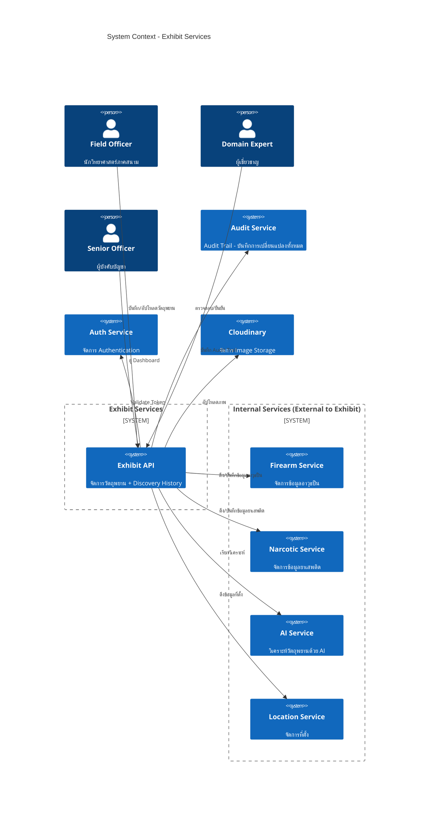

# PRD: Exhibit Services (จัดการวัตถุพยาน)

**Document Type**: REQUIRED   
**Document Status**: Draft    
**Version**: 1.0    
**Last Updated**: 2026-03-01    
**Owner**: [Product Manager Name]   
**Stakeholders**: [Engineering Lead, Design Lead, Business Lead, AI Agent Protocol]

---

## ✅ PRD Review Checklist
> ตรวจสอบก่อน submit — ย้ายมาไว้ต้นเอกสารเพื่อให้เห็นก่อนเสมอ

### Phase 1: Discovery Requirements
- [ ] Vision Statement ชัดเจนใน 1-2 ประโยค
- [ ] Problem Statement มี research backing อ้างอิงได้
- [ ] Value Proposition ระบุครบทุก segment
- [ ] Personas มี pain points และ goals ชัดเจน
- [ ] Success Metrics วัดผลได้จริง มีค่า baseline
- [ ] Non-scope ระบุชัดเจนว่าไม่ทำอะไรใน v1 นี้
- [ ] Assumptions ถูก list ออกมาและแยกจาก Risks
- [ ] Constraints ครบทั้ง Timeline, Team, Technical

### Phase 2: Content Quality
- [ ] มีข้อมูลครบทั้ง 3 contexts (Business, User, Technical)
- [ ] Acceptance Criteria วัดผลได้จริง ไม่กำกวม
- [ ] Business Rules อยู่ในรูป Human-Readable ตาม Enterprise Grade
- [ ] AI สามารถ parse และ generate code ได้จากเอกสารนี้

### Phase 3: Traceability
- [ ] Requirements เชื่อมโยงไปยัง source documents
- [ ] Research Backing table ครบถ้วน
- [ ] Decision Log บันทึก decisions ที่สำคัญแล้ว
- [ ] Reference Documents ครบถ้วน

---

## 1. Executive Summary (For Stakeholders)

### 1.1 Vision Statement
ระบบ Exhibit Services เป็น Domain Service หลักสำหรับจัดการวัตถุพยาน ทำหน้าที่รวมข้อมูลวัตถุพยาน, เรียกใช้ AI Service เพื่อวิเคราะห์, และเก็บประวัติการค้นพบ (Discovery History) เพื่อสร้าง Big Data สำหรับค้นหาความเชื่อมโยงในอนาคต โดยการเปลี่ยนแปลงทั้งหมดจะถูกบันทึกลง Audit Service

### 1.2 Problem Statement
กระบวนการจัดการวัตถุพยานในปัจจุบันยังไม่มีระบบที่เชื่อมโยงข้อมูลแบบ centralized ทำให้การค้นหาความเชื่อมโยงระหว่างวัตถุพยานในคดีต่าง ๆ ทำได้ยาก และการวิเคราะห์วัตถุพยานด้วย AI ยังไม่ถูกนำมาใช้อย่างเต็มประสิทธิภาพ

#### Research Backing
| Source Type | Source | Key Finding | Date |
|-------------|--------|-------------|------|
| User Interview | ideation.md | ต้องการระบบวิเคราะห์วัตถุพยานด้วย AI และสร้าง Big Data | 2026-01 |
| Internal Analysis | feature_list.md | มี feature สำหรับจัดการวัตถุพยาน (evidenceProfile, history, catalog) หลายรายการที่ต้องพัฒนา | 2026-02 |
| Business Requirement | ideation.md | แบ่งเป็น 2 Track: อาวุธปืน และ ยาเสพติด | 2026-01 |

### 1.3 Proposed Solution
ระบบ Exhibit Services ทำหน้าที่เป็น Domain Service หลักที่รวมการทำงาน โดยเรียกใช้ Services อื่นๆ ได้แก่ Firearm Service, Narcotic Service, AI Service และ Location Service เพื่อให้สามารถจัดการวัตถุพยานได้ครบวงจร

### 1.4 Value Proposition by Segment

| Segment | Pain Points | Value Proposition | Key Benefit |
|---------|-------------|-------------------|-------------|
| Field Officer | ต้องบันทึกข้อมูลวัตถุพยานด้วยตนเอง, ไม่มีเครื่องมือช่วยวิเคราะห์ | ระบบบันทึกและวิเคราะห์วัตถุพยานด้วย AI อัตโนมัติ | ลดเวลาการบันทึกข้อมูลและเพิ่มความแม่นยำในการวิเคราะห์ |
| Domain Expert | ต้องตรวจสอบผลวิเคราะห์ AI ด้วยตนเอง, ขาดข้อมูลประวัติย้อนหลัง | Dashboard แสดงสถิติและประวัติวัตถุพยาน, ระบบ Big Data ค้นหาความเชื่อมโยง | เพิ่มประสิทธิภาพการวิเคราะห์และค้นพบความเชื่อมโยงระหว่างคดี |
| Senior Officer | ขาดภาพรวมสถิติและข้อมูลเชิงลึก | Dashboard แสดงผลสถิติและ Insight | สามารถตัดสินใจได้รวดเร็วและมีข้อมูลรองรับ |

### 1.5 Success Metrics

| Metric | Baseline | Target | Timeline | Measurement Method |
|--------|----------|--------|----------|--------------------|
| จำนวนการบันทึกวัตถุพยาน/เดือน | 0 | 500+ | สัปดาห์นี้ | ระบบ Exhibit |
| ความแม่นยำการวิเคราะห์ AI (Firearms) | N/A | >90% | สัปดาห์นี้ | Validation Set |
| ความแม่นยำการวิเคราะห์ AI (Narcotics) | N/A | >90% | สัปดาห์นี้ | Validation Set |
| จำนวนการค้นหาความเชื่อมโยง | 0 | 50+ | สัปดาห์นี้ | ระบบ ExhibitDiscovery |
| จำนวนการเข้าถึง Dashboard | 0 | 200+ | สัปดาห์นี้ | Analytics |

### 1.6 Strategic Alignment
- **Company OKR**: [Link to OKR]
- **Product Roadmap**: [Quarter/Theme]
- **Technical Vision**: [Link to Architecture Strategy - Microservices with Database per Service]

---

## 2. Scope (For All Stakeholders)

> Section นี้สำคัญพอๆ กับ functional requirements — ต้องระบุให้ชัดก่อนเริ่ม build

### 2.1 In Scope (v1)

#### Exhibit Management (Core)
- [ ] ระบบบันทึกข้อมูลวัตถุพยาน (Exhibit Registration)
- [ ] ระบบจัดการข้อมูลอาวุธปืน (Firearm Management) - เรียกใช้ Firearm Service
- [ ] ระบบจัดการข้อมูลยาเสพติด (Narcotic Management) - เรียกใช้ Narcotic Service
- [ ] ระบบจัดการภาพวัตถุพยาน (Evidence Image Management)
- [ ] ระบบบันทึกประวัติการค้นพบวัตถุพยาน (Discovery History) - เก็บใน Exhibit Database
- [ ] Dashboard แสดงสถิติและ Insight
- [ ] ระบบค้นหาความเชื่อมโยงระหว่างวัตถุพยาน (Link Analysis)

#### AI Integration
- [ ] การวิเคราะห์อาวุธปืนด้วย AI (Firearms AI Analysis) - แยก Brand และ Model - เรียกใช้ AI Service
- [ ] การวิเคราะห์ยาเสพติดด้วย AI (Narcotics AI Analysis) - เรียกใช้ AI Service
- [ ] ระบบ Segment วัตถุพยานจากภาพ (Image Segmentation) - เรียกใช้ AI Service

#### Location Management
- [ ] ระบบจัดการข้อมูลที่ตั้ง (Province, District, Subdistrict) - เรียกใช้ Location Service

### 2.2 Non-Scope (v1)

- [ ] ระบบ Mobile App (Web App เท่านั้น)
- [ ] ระบบ OCR สำหรับอ่านเอกสาร
- [ ] ระบบ Export รายงานเป็น PDF (v2)
- [ ] ระบบ Notification (v2)
- [ ] ระบบวิเคราะห์วัตถุพยานประเภทอื่นๆ เช่น ลายนิ้วมือ, DNA (v2)
- [ ] ระบบ Cloud Deployment อัตโนมัติ (v2)
- [ ] ระบบ Real-time Collaboration

### 2.3 Assumptions

| ID | Assumption | Confidence | Validation Method | Owner |
|----|------------|------------|-------------------|-------|
| A-EXHIBIT-001 | ภาพวัตถุพยานที่อัปโหลดมีคุณภาพเพียงพอสำหรับ AI วิเคราะห์ | Medium | ทดสอบกับภาพจริงจากภาคสนาม | AI Team |
| A-EXHIBIT-002 | เจ้าหน้าที่นิติวิทยาศาสตร์มีทักษะการใช้งานระบบ Web App | High | การฝึกอบรม | Product Team |
| A-EXHIBIT-003 | AI Model สำหรับ Firearms มีความแม่นยำ >90% บน Dataset จริง | Low | ทดสอบกับ Validation Set | AI Team |
| A-EXHIBIT-004 | AI Model สำหรับ Narcotics มีความแม่นยำ >90% บน Dataset จริง | Low | ทดสอบกับ Validation Set | AI Team |

### 2.4 Constraints

| ID | Type | Description | Source | Impact |
|----|------|-------------|--------|--------|
| CON-EXHIBIT-001 | Technical | ระบบต้องรองรับการทำงานแบบ Self-hosted ภายในองค์กร | System Requirement | ต้องออกแบบ Docker-based deployment |
| CON-EXHIBIT-002 | Technical | ต้องรองรับการย้ายไป Cloud ในอนาคต (Portable) | System Requirement | ต้องออกแบบให้ไม่ผูกติดกับ Infrastructure เฉพาะ |
| CON-EXHIBIT-003 | Data | ต้องปฏิบัติตาม PDPA (พ.ร.บ.คุ้มครองข้อมูลส่วนบุคคล) | Legal | ต้องมีระบบจัดการ Consent และ Data Privacy |
| CON-EXHIBIT-004 | Security | ต้องใช้ Authentication จาก Auth Services | Architecture | ทุก API ต้องผ่าน JWT Token Validation |

---

## 3. User Context (For UX + Dev + AI)

### 3.1 Target Users

#### PS-01: เจ้าหน้าที่ภาคสนาม (Field Officer)

**Demographics:**
* **Age:** "25-45"
* **Occupation:** "นักวิทยาศาสตร์นิติวิทยาศาสตร์"
* **Tech Savviness:** "Medium"

**Devices:**
1. **Mobile** — ใช้งานในพื้นที่เกิดเหตุ
2. **Tablet** — ใช้งานเพิ่มเติมในภาคสนาม
3. **Desktop** — ใช้งานเมื่อกลับสำนักงาน

**Behaviors (Exhibit-Related):**
* ทำงานภาคสนามเป็นหลัก
* ต้องการใช้ AI Identify วัตถุพยาน
* ต้องบันทึกข้อมูลวัตถุพยานที่พบเข้าสู่ระบบ
* ใช้งานผ่าน Mobile/Tablet เป็นหลัก

**Pain Points (Exhibit-Related):**
* ต้องบันทึกข้อมูลด้วยมือหลังจากเก็บวัตถุพยาน
* ไม่มีเครื่องมือช่วยวิเคราะห์วัตถุพยานที่หน้างาน
* ต้องรอผู้เชี่ยวชาญในการระบุประเภทวัตถุพยาน

**Goals (Exhibit-Related):**
* บันทึกข้อมูลวัตถุพยานได้รวดเร็ว
* ได้ผลการวิเคราะห์เบื้องต้นจาก AI ที่หน้างาน
* ติดตามสถานะวัตถุพยานที่บันทึกไว้

---

#### PS-02: ผู้เชี่ยวชาญด้านอาวุธปืน (Firearms Domain Expert)

**Demographics:**
* **Age:** "35-55"
* **Occupation:** "ผู้เชี่ยวชาญด้านนิติวิทยาศาสตร์"
* **Tech Savviness:** "Medium"

**Devices:**
1. **Desktop** — ใช้งานเมื่อกลับสำนักงาน
2. **Mobile** — ใช้งานในพื้นที่เกิดเหตุ
3. **Tablet** — ใช้งานเพิ่มเติมในภาคสนาม

**Behaviors (Exhibit-Related):**
* ตรวจสอบและยืนยันผลการวิเคราะห์ AI ด้านอาวุธปืน
* ค้นหาข้อมูลประวัติวัตถุพยานย้อนหลัง
* วิเคราะห์ความเชื่อมโยงระหว่างคดี

**Pain Points (Exhibit-Related):**
* ต้องตรวจสอบผลวิเคราะห์ AI ด้วยตนเองทั้งหมด
* ขาดข้อมูลประวัติย้อนหลังที่ครบถ้วน
* ไม่มีเครื่องมือช่วยค้นหาความเชื่อมโลงระหว่างคดี

**Goals (Exhibit-Related):**
* ยืนยันหรือแก้ไขผลการวิเคราะห์ AI ได้อย่างรวดเร็ว
* เข้าถึงข้อมูลประวัติวัตถุพยานทั้งหมดได้
* ค้นพบความเชื่อมโยงระหว่างวัตถุพยานในคดีต่างๆ

---

#### PS-03: ผู้เชี่ยวชาญด้านยาเสพติด (Narcotics Domain Expert)

**Demographics:**
* **Age:** "35-55"
* **Occupation:** "ผู้เชี่ยวชาญด้านนิติวิทยาศาสตร์"
* **Tech Savviness:** "Medium"

**Devices:**
1. **Desktop** — ใช้งานเมื่อกลับสำนักงาน
2. **Mobile** — ใช้งานในพื้นที่เกิดเหตุ
3. **Tablet** — ใช้งานเพิ่มเติมในภาคสนาม

**Behaviors (Exhibit-Related):**
* ตรวจสอบและยืนยันผลการวิเคราะห์ AI ด้านยาเสพติด
* ค้นหาข้อมูลประวัติวัตถุพยานย้อนหลัง
* วิเคราะห์ความเชื่อมโยงระหว่างคดี

**Pain Points (Exhibit-Related):**
* ต้องตรวจสอบผลวิเคราะห์ AI ด้วยตนเองทั้งหมด
* ขาดข้อมูลประวัติย้อนหลังที่ครบถ้วน
* ไม่มีเครื่องมือช่วยค้นหาความเชื่อมโลงระหว่างคดี

**Goals (Exhibit-Related):**
* ยืนยันหรือแก้ไขผลการวิเคราะห์ AI ได้อย่างรวดเร็ว
* เข้าถึงข้อมูลประวัติวัตถุพยานทั้งหมดได้
* ค้นพบความเชื่อมโยงระหว่างวัตถุพยานในคดีต่างๆ

---

#### PS-04: ผู้บริหาร (Senior Officer)

**Demographics:**
* **Age:** "45-60"
* **Occupation:** "ผู้บังคับบัญชานิติวิทยาศาสตร์"
* **Tech Savviness:** "Low-Medium"

**Devices:**
1. **Desktop** — ใช้งานเมื่อกลับสำนักงาน
2. **Mobile** — ใช้งานในพื้นที่เกิดเหตุ
3. **Tablet** — ใช้งานเพิ่มเติมในภาคสนาม

**Behaviors (Exhibit-Related):**
* ต้องการเห็นภาพรวมสถิติและผลการดำเนินงาน
* ต้องการข้อมูลเชิงลึกสำหรับการตัดสินใจ
* ใช้งานผ่าน Desktop เป็นหลัก

**Pain Points (Exhibit-Related):**
* ขาดข้อมูลสถิติที่ครบถ้วนและถูกต้อง
* ต้องขอข้อมูลจากหลายแหล่ง
* ไม่มี Dashboard สำหรับติดตามงาน

**Goals (Exhibit-Related):**
* เห็นภาพรวมสถิติการทำงานของหน่วย
* ได้รับรายงานอัตโนมัติ
* ติดตามความคืบหน้าการดำเนินงานได้

---

### 3.2 Segment Pain Points Comparison

| Pain Point | Field Officer | Domain Expert | Senior Officer | Impact |
|------------|---------------|---------------|----------------|--------|
| ขาดเครื่องมือวิเคราะห์ AI | ✅ มี | ✅ มี | ❌ ไม่มี | High |
| ต้องบันทึกข้อมูลด้วยมือ | ✅ มี | ❌ ไม่มี | ❌ ไม่มี | High |
| ขาดข้อมูลประวัติย้อนหลัง | ❌ ไม่มี | ✅ มี | ✅ มี | High |
| ขาด Dashboard สถิติ | ❌ ไม่มี | ❌ ไม่มี | ✅ มี | High |
| ต้องตรวจสอบ AI ด้วยตนเอง | ❌ ไม่มี | ✅ มี | ❌ ไม่มี | Medium |

### 3.3 Use Cases by Persona

| Use Case ID | Use Case Name | Field Officer | Domain Expert | Senior Officer | Priority |
|-------------|---------------|---------------|---------------|----------------|----------|
| UC-EXHIBITION-001 | ถ่ายภาพและอัปโหลดวัตถุพยาน | ✅ | ✅ | ❌ | P0 |
| UC-EXHIBITION-002 | วิเคราะห์วัตถุพยานด้วย AI | ✅ | ✅ | ❌ | P0 |
| UC-EXHIBITION-003 | เลือก Candidate จากผลวิเคราะห์ AI | ✅ | ✅ | ❌ | P0 |
| UC-EXHIBITION-004 | บันทึกประวัติวัตถุพยาน | ✅ | ❌ | ❌ | P0 |
| UC-EXHIBITION-005 | ตรวจสอบและยืนยันผลวิเคราะห์ AI | ❌ | ✅ | ❌ | P0 |
| UC-EXHIBITION-006 | จัดการข้อมูลอาวุธปืน | ❌ | ✅ | ✅ | P0 |
| UC-EXHIBITION-007 | จัดการข้อมูลยาเสพติด | ❌ | ✅ | ✅ | P0 |
| UC-EXHIBITION-008 | ค้นหาประวัติวัตถุพยาน | ✅ | ✅ | ✅ | P1 |
| UC-EXHIBITION-009 | วิเคราะห์ความเชื่อมโยงระหว่างวัตถุพยาน | ✅ | ✅ | ✅ | P1 |
| UC-EXHIBITION-010 | ดู Dashboard สถิติ | ✅ | ✅ | ✅ | P1 |

### 3.4 User Stories

**Format: Job Story**
> When [situation], I want to [motivation], so I can [expected outcome]

| ID | Persona | Job Story | Priority | AC Ref |
|----|---------|-----------|----------|--------|
| JS-EXHIBITION-001 | Field Officer | เมื่อพบวัตถุพยานในหน้างาน ฉันต้องการถ่ายภาพและอัปโหลดเข้าระบบ ฉันจะได้ให้ AI วิเคราะห์ประเภท | P0 | AC-EXHIBITION-001 |
| JS-EXHIBITION-002 | Field Officer | เมื่อ AI วิเคราะห์เสร็จ ฉันต้องการเลือก Candidate ที่คิดว่าใช่จากผลลัพธ์ ฉันจะได้บันทึกข้อมูลที่ถูกต้อง | P0 | AC-EXHIBITION-003 |
| JS-EXHIBITION-003 | Field Officer | เมื่อเลือก Candidate ที่ถูกต้องแล้ว ฉันต้องการบันทึกประวัติวัตถุพยาน ฉันจะได้มีข้อมูลย้อนหลัง | P0 | AC-EXHIBITION-004 |
| JS-EXHIBITION-004 | Domain Expert | เมื่อ AI วิเคราะห์เสร็จ ฉันต้องการเลือก Candidate ที่ถูกต้องจากผลลัพธ์ ฉันจะได้บันทึกข้อมูลที่ถูกต้องลงระบบ | P0 | AC-EXHIBITION-003 |
| JS-EXHIBITION-005 | Domain Expert | เมื่อต้องการค้นหาความเชื่อมโยงระหว่างคดี ฉันต้องการค้นหาจากฐานข้อมูลประวัติ ฉันจะได้พบวัตถุพยานที่เกี่ยวข้อง | P1 | AC-EXHIBITION-008 |
| JS-EXHIBITION-006 | Senior Officer | เมื่อต้องการทราบภาพรวมการทำงาน ฉันต้องการดู Dashboard สถิติ ฉันจะได้ตัดสินใจได้รวดเร็ว | P1 | AC-EXHIBITION-010 |

### 3.5 User Journey

> Link ไปยัง Figma/Miro แทนการวาดซ้ำใน PRD เพราะ journey เปลี่ยนบ่อย

- **Current State (As-Is)**: [Figma/Miro link]
- **Future State (To-Be)**: [Figma/Miro link]

**Pain Points ที่แก้ใน v1:**
| Pain Point | Solution |
|------------|----------|
| บันทึกข้อมูลด้วยมือยาวนาน | ระบบอัปโหลดภาพ + AI วิเคราะห์อัตโนมัติ |
| ไม่มีข้อมูลประวัติย้อนหลัง | ระบบ History + ฐานข้อมูล centralized |
| ขาด Dashboard สถิติ | Dashboard สำหรับทุก Role |

---

## 4. Functional Requirements (For Dev + AI)

### 4.1 Feature Overview (จัดตาม Service Groups)

> **Note:** Exhibit Services ทำหน้าที่เป็น Domain Service หลักที่รวมการทำงานของ Sub-services ต่างๆ ได้แก่ Firearm Service, Narcotic Service, AI Integration Service และ Location Service

#### exhibit-service (จัดการวัตถุพยานหลัก)

| Feature ID | Feature Name | คำอธิบาย | Dependencies | Complexity | Priority |
|------------|--------------|-----------|-------------|------------|----------|
| FR-EXHIBITION-001 | ถ่ายภาพและอัปโหลดวัตถุพยาน | ระบบถ่ายภาพและอัปโหลดเข้าระบบเพื่อส่งให้ AI วิเคราะห์ | Cloudinary | Medium | P0 |
| FR-EXHIBITION-002 | วิเคราะห์วัตถุพยานด้วย AI | ระบบเรียกใช้ AI Service เพื่อวิเคราะห์ภาพและแสดง Candidate | AI Service API | High | P0 |
| FR-EXHIBITION-003 | เลือก Candidate จากผลวิเคราะห์ | ระบบแสดง Candidate จาก AI และให้ User เลือก หรือเลือก "ไม่รู้จัก" | FR-EXHIBITION-002 | Medium | P0 |
| FR-EXHIBITION-004 | บันทึกประวัติวัตถุพยาน | ระบบบันทึกข้อมูลวัตถุพยานหลังเลือก Candidate ถูกต้อง | FR-EXHIBITION-003, Location Service | High | P0 |
| FR-EXHIBITION-005 | ตรวจสอบและยืนยันผลวิเคราะห์ AI | ระบบให้ Domain Expert ตรวจสอบและยืนยันผล | FR-EXHIBITION-004 | Medium | P0 |
| FR-EXHIBITION-006 | จัดการข้อมูลอาวุธปืน | ดึงข้อมูลอาวุธปืนจาก Firearm Service | Firearm Service API | Medium | P0 |
| FR-EXHIBITION-007 | จัดการข้อมูลยาเสพติด | ดึงข้อมูลยาเสพติดจาก Narcotic Service | Narcotic Service API | Medium | P0 |
| FR-EXHIBITION-008 | ค้นหาประวัติวัตถุพยาน | ระบบค้นหาประวัติวัตถุพยานจากฐานข้อมูล | None | Medium | P1 |
| FR-EXHIBITION-009 | วิเคราะห์ความเชื่อมโยง | ระบบค้นหาความเชื่อมโยงระหว่างวัตถุพยาน | FR-EXHIBITION-008 | Medium | P1 |
| FR-EXHIBITION-010 | ดู Dashboard สถิติ | ระบบแสดง Dashboard สถิติตาม Role | None | Medium | P1 |

### 4.2 Use Cases

#### Use Case: ถ่ายภาพและอัปโหลดวัตถุพยาน

---

| Element | Description |
|---------|-------------|
| **Use Case ID** | UC-EXHIBITION-001 |
| **Use Case Name** | ถ่ายภาพและอัปโหลดวัตถุพยาน |
| **Goal** | ถ่ายภาพวัตถุพยานและอัปโหลดเข้าระบบเพื่อส่งให้ AI วิเคราะห์ |
| **Actor** | Field Officer, Domain Expert |
| **Feature ID** | FR-EXHIBITION-001 |
| **Preconditions** | - User ต้อง login และมีสิทธิ์ Field Officer หรือ Domain Expert |
| **Postconditions** | - ภาพถูกอัปโหลดสำเร็จ - ระบบส่งภาพให้ AI วิเคราะห์ |
| **Main Flow** | 1. User เลือก "ถ่ายภาพ/อัปโหลดวัตถุพยาน" 2. User ถ่ายภาพหรือเลือกภาพจาก Gallery 3. ระบบอัปโหลดภาพไปยัง Cloud Storage 4. ระบบส่งภาพให้ AI Service วิเคราะห์ 5. ระบบแสดงผล Candidate จาก AI |
| **System Logic** | - ตรวจสอบสิทธิ์ผู้ใช้จาก JWT Token - อัปโหลดภาพไปยัง Cloudinary - เรียก AI-Service เพื่อวิเคราะห์ - แสดงผล Candidate ที่ได้จาก AI |
| **Edge Cases** | - ภาพไม่ชัด → แจ้งเตือนให้อัปโหลดใหม่ - อัปโหลดไม่สำเร็จ → แจ้งให้ลองใหม่ |

---

#### Use Case: วิเคราะห์วัตถุพยานด้วย AI

---

| Element | Description |
|---------|-------------|
| **Use Case ID** | UC-EXHIBITION-002 |
| **Use Case Name** | วิเคราะห์วัตถุพยานด้วย AI |
| **Goal** | ให้ AI วิเคราะห์ภาพวัตถุพยานและแสดงผล Candidate |
| **Actor** | System (AI Service) |
| **Feature ID** | FR-EXHIBITION-002 |
| **Preconditions** | - มีภาพถูกอัปโหลดแล้ว |
| **Postconditions** | - ได้ผลการวิเคราะห์จาก AI พร้อม Candidate |
| **Main Flow** | 1. ระบบส่งภาพไปยัง AI Service 2. AI วิเคราะห์ภาพ (ตรวจจับ, แยกประเภท, ระบุยี่ห้อ/รุ่น หรือ ชนิดยา) 3. AI ส่งผลลัพธ์กลับมาเป็นรายการ Candidate พร้อม Confidence Score 4. ระบบแสดงผล Candidate ให้ User |
| **System Logic** | - ส่ง image_url ไปยัง AI Service - รับผลลัพธ์เป็น Candidate List - แสดงผลตามลำดับ Confidence |
| **Edge Cases** | - AI ไม่สามารถวิเคราะห์ได้ → แจ้ง "ไม่สามารถวิเคราะห์ได้" - ไม่พบ Candidate → แจ้งให้ User ป้อนข้อมูลเอง |

---

#### Use Case: เลือก Candidate จากผลวิเคราะห์ AI

---

| Element | Description |
|---------|-------------|
| **Use Case ID** | UC-EXHIBITION-003 |
| **Use Case Name** | เลือก Candidate จากผลวิเคราะห์ AI |
| **Goal** | ให้ User เลือก Candidate ที่คิดว่าใช่จากผลการวิเคราะห์ของ AI |
| **Actor** | Field Officer, Domain Expert |
| **Feature ID** | FR-EXHIBITION-003 |
| **Preconditions** | - User ต้อง login และมีสิทธิ์ - AI วิเคราะห์เสร็จแล้ว |
| **Postconditions** | - Candidate ที่เลือกถูกบันทึก - พร้อมสำหรับบันทึกประวัติ |
| **Main Flow** | 1. ระบบแสดงรายการ Candidate จาก AI พร้อมความมั่นใจ (Confidence Score) 2. User เลือก Candidate ที่คิดว่าใช่ หรือเลือก "ไม่รู้จัก" (Unknown) หากไม่มี Candidate ที่ตรง 3. User ยืนยันการเลือก 4. ระบบบันทึก Candidate ที่เลือก |
| **System Logic** | - แสดงรายการ Candidate เรียงตาม Confidence Score - รับการเลือกจาก User - บันทึก Candidate ที่เลือก |
| **Edge Cases** | - ไม่มี Candidate ที่ตรง → ให้ User เลือก "บันทึกเป็นวัตถุพยานที่ไม่รู้จัก" (เช่น Unknown Firearm, Unknown Narcotic) - User ไม่แน่ใจ → บันทึกเป็น "ไม่แน่ใจ" สำหรับ Domain Expert ตรวจสอบ |

---

#### Use Case: บันทึกประวัติวัตถุพยาน

---

| Element | Description |
|---------|-------------|
| **Use Case ID** | UC-EXHIBITION-004 |
| **Use Case Name** | บันทึกประวัติวัตถุพยาน |
| **Goal** | บันทึกข้อมูลวัตถุพยานลงระบบหลังเลือก Candidate ถูกต้อง |
| **Actor** | Field Officer |
| **Feature ID** | FR-EXHIBITION-004 |
| **Preconditions** | - User ต้อง login และมีสิทธิ์ Field Officer - ได้เลือก Candidate แล้ว |
| **Postconditions** | - วัตถุพยานถูกบันทึกในระบบ - สถานะ "Pending" รอ Domain Expert ยืนยัน |
| **Main Flow** | 1. User กรอกข้อมูลเพิ่มเติม (สถานที่พบ, วันที่, รายละเอียด) 2. User ยืนยันการบันทึก 3. ระบบบันทึกข้อมูลลง Exhibit Table และ Discovery Record 4. ระบบแสดงข้อความ "บันทึกสำเร็จ" |
| **System Logic** | - ตรวจสอบข้อมูลที่จำเป็น - บันทึกข้อมูลลง Exhibit Table - สร้าง Discovery Record - บันทึก Audit Trail |
| **Edge Cases** | - ข้อมูลไม่ครบ → แจ้งเตือนกรอกให้ครบ - บันทึกไม่สำเร็จ → แจ้ง Error |

---

#### Use Case: ตรวจสอบและยืนยันผลวิเคราะห์ AI

---

| Element | Description |
|---------|-------------|
| **Use Case ID** | UC-EXHIBITION-005 |
| **Use Case Name** | ตรวจสอบและยืนยันผลวิเคราะห์ AI |
| **Goal** | ให้ Domain Expert ตรวจสอบและยืนยันผลการวิเคราะห์ AI |
| **Actor** | Domain Expert |
| **Feature ID** | FR-EXHIBITION-005 |
| **Preconditions** | - User ต้อง login และมีสิทธิ์ Domain Expert - มีวัตถุพยานสถานะ "Pending" |
| **Postconditions** | - ผลการวิเคราะห์ได้รับการยืนยัน - สถานะเปลี่ยนเป็น "Confirmed" หรือ "Rejected" |
| **Main Flow** | 1. Domain Expert เข้าหน้า "รอตรวจสอบ" 2. ระบบแสดงรายการวัตถุพยานที่รอตรวจ 3. Domain Expert เลือกรายการ 4. ระบบแสดงภาพ ผล AI และข้อมูลที่ Field Officer บันทึก 5. Domain Expert ยืนยันหรือแก้ไขผล 6. ระบบบันทึกและอัปเดตสถานะ |
| **System Logic** | - ตรวจสอบสิทธิ์ผู้ใช้ - อัปเดตสถานะ Exhibit - บันทึกประวัติการยืนยัน - บันทึก Audit Trail |
| **Edge Cases** | - Domain Expert แก้ไขผล → บันทึกการแก้ไขลง History - ข้อมูลไม่เพียงพอ → Reject และแจ้ง Field Officer แก้ไข |

---

#### Use Case: ค้นหาประวัติวัตถุพยาน

---

| Element | Description |
|---------|-------------|
| **Use Case ID** | UC-EXHIBITION-008 |
| **Use Case Name** | ค้นหาประวัติวัตถุพยาน |
| **Goal** | ค้นหาประวัติวัตถุพยานจากฐานข้อมูล |
| **Actor** | Field Officer, Domain Expert, Senior Officer |
| **Feature ID** | FR-EXHIBITION-008 |
| **Preconditions** | - User ต้อง login |
| **Postconditions** | - แสดงรายการวัตถุพยานที่ตรงกับเงื่อนไข |
| **Main Flow** | 1. User เข้าหน้า "ค้นหาประวัติ" 2. User กรอกเงื่อนไขการค้นหา 3. ระบบค้นหาจากฐานข้อมูล 4. ระบบแสดงผลลัพธ์ |
| **System Logic** | - Query Exhibit Table และ Discovery Record - กรองตามเงื่อนไขที่กำหนด - แสดงผลตาม Role ของ User |
| **Edge Cases** | - ไม่พบข้อมูล → แสดง "ไม่พบข้อมูล" - พบมากเกินไป → แสดง Pagination |

---

#### Use Case: ค้นหาความเชื่อมโยงระหว่างวัตถุพยาน

---

| Element | Description |
|---------|-------------|
| **Use Case ID** | UC-EXHIBITION-009 |
| **Use Case Name** | ค้นหาความเชื่อมโยงระหว่างวัตถุพยาน |
| **Goal** | ค้นหาวัตถุพยานที่อาจมีความเชื่อมโยงกันจากฐานข้อมูลประวัติ |
| **Actor** | Field Officer, Domain Expert, Senior Officer |
| **Feature ID** | FR-EXHIBITION-009 |
| **Preconditions** | - User ต้อง login |
| **Postconditions** | - แสดงรายการวัตถุพยานที่มีความเชื่อมโยง |
| **Main Flow** | 1. User เลือก "ค้นหาความเชื่อมโยง" 2. ระบบแสดงตัวกรอง (ประเภท, ยี่ห้อ, รุ่น, ที่ตั้ง, ช่วงเวลา) 3. User กรอกเงื่อนไข 4. ระบบค้นหาจาก History 5. ระบบแสดงผลลัพธ์พร้อมความเชื่อมโยง |
| **System Logic** | - Query History Table ด้วยเงื่อนไขที่กำหนด - วิเคราะห์ความเชื่อมโยง (ยี่ห้อเดียวกัน, ที่ใกล้เคียงกัน, ช่วงเวลาใกล้กัน) - แสดงผลตามระดับความเชื่อมโยง |
| **Edge Cases** | - ไม่พบความเชื่อมโยง → แสดงข้อความ "ไม่พบความเชื่อมโยง" - พบมากกว่า 100 รายการ → แสดงแบบ Pagination |

---

#### Use Case: ดู Dashboard สถิติ

---

| Element | Description |
|---------|-------------|
| **Use Case ID** | UC-EXHIBITION-010 |
| **Use Case Name** | ดู Dashboard สถิติ |
| **Goal** | ดู Dashboard สถิติตาม Role ของ User |
| **Actor** | Field Officer, Domain Expert, Senior Officer |
| **Feature ID** | FR-EXHIBITION-010 |
| **Preconditions** | - User ต้อง login |
| **Postconditions** | - แสดง Dashboard ตามสิทธิ์ของ User |
| **Main Flow** | 1. User เข้าหน้า Dashboard 2. ระบบตรวจสอบ Role ของ User 3. ระบบแสดงข้อมูลสถิติตาม Role (Field Officer: ของตัวเอง, Domain Expert: ภาพรวมประเภทที่รับผิดชอบ, Senior Officer: ภาพรวมทั้งหมด) |
| **System Logic** | - ตรวจสอบ Role ของ User - Query ข้อมูลตามสิทธิ์ - แสดงกราฟและสถิติ |
| **Edge Cases** | - ไม่มีข้อมูล → แสดง "ยังไม่มีข้อมูล" |

---

### 4.3 Detailed Requirements

#### FR-EXHIBITION-001: ถ่ายภาพและอัปโหลดวัตถุพยาน
**Priority**: P0
**Owner**: Exhibit Team

**Description**:
ระบบถ่ายภาพและอัปโหลดเข้าระบบเพื่อส่งให้ AI วิเคราะห์:
- รองรับการถ่ายภาพจากกล้องโทรศัพท์
- รองรับการเลือกภาพจาก Gallery
- อัปโหลดภาพไปยัง Cloud Storage

**Acceptance Criteria**:
- [ ] สามารถถ่ายภาพจากกล้องได้
- [ ] สามารถเลือกภาพจาก Gallery ได้
- [ ] รองรับภาพหลายภาพต่อการอัปโหลดครั้งเดียว
- [ ] ตรวจสอบคุณภาพภาพก่อนอัปโหลด (ความชัด, แสง)
- [ ] อัปโหลดสำเร็จและส่งให้ AI วิเคราะห์อัตโนมัติ
- [ ] แสดง Progress ขณะอัปโหลด

**Technical Notes** (สำหรับ Dev + AI Agents):
- API Endpoint: POST `/v1/exhibits/upload`
- Request Body: multipart/form-data
```
images: File[] (required, max 5 files, max 10MB each)
exhibit_type: "firearm|narcotic" (optional, for AI hint)
```
- Response:
```json
{
  "upload_id": "uuid",
  "image_urls": ["https://..."],
  "status": "uploaded",
  "ai_analysis_status": "processing"
}
```
- Dependencies: Cloudinary, Auth Service

---

#### FR-EXHIBITION-002: วิเคราะห์วัตถุพยานด้วย AI
**Priority**: P0
**Owner**: AI Integration Team

**Description**:
ระบบเรียกใช้ AI Service เพื่อวิเคราะห์ภาพและแสดง Candidate:
- ส่งภาพไปยัง AI Service
- AI วิเคราะห์และส่งผล Candidate กลับมา
- แสดงผล Candidate พร้อม Confidence Score

**Acceptance Criteria**:
- [ ] สามารถส่งภาพไปวิเคราะห์ได้
- [ ] AI ตรวจจับวัตถุในภาพได้ (Object Detection)
- [ ] AI ระบุประเภทวัตถุพยานได้ (Classification)
- [ ] สำหรับ Firearm: ระบุ Brand และ Model ได้
- [ ] สำหรับ Narcotic: ระบุ Type และ Form ได้
- [ ] ได้ผลลัพธ์พร้อม Confidence Score สำหรับแต่ละ Candidate
- [ ] แสดงผลภายใน 30 วินาที
- [ ] หาก AI ไม่สามารถวิเคราะห์ได้ แจ้งเตือนอย่างชัดเจน

**Technical Notes** (สำหรับ Dev + AI Agents):
- API Endpoint: POST `/v1/exhibits/{upload_id}/analyze`
- Request Body:
```json
{
  "image_urls": ["string"],
  "exhibit_type": "firearm|narcotic"
}
```
- Response:
```json
{
  "analysis_id": "uuid",
  "candidates": [
    {
      "rank": 1,
      "type": "firearm",
      "brand": "Glock",
      "model": "G19",
      "confidence": 0.95,
      "bbox": {"x": 100, "y": 100, "width": 200, "height": 150}
    }
  ],
  "unknown_option": {
    "type": "firearm",
    "label": "Unknown Firearm",
    "description": "อาวุธปืนที่ไม่สามารถระบุยี่ห้อ/รุ่นได้"
  }
}
```
- Dependencies: AI Service API

---

#### FR-EXHIBITION-003: เลือก Candidate จากผลวิเคราะห์
**Priority**: P0
**Owner**: Exhibit Team

**Description**:
ระบบแสดง Candidate จาก AI และให้ User เลือก หรือเลือก "ไม่รู้จัก":
- แสดงรายการ Candidate เรียงตาม Confidence Score
- แสดงภาพตัวอย่างประกอบ (ถ้ามี)
- ให้ User เลือก Candidate ที่ถูกต้อง หรือ "ไม่รู้จัก"

**Acceptance Criteria**:
- [ ] แสดงรายการ Candidate เรียงตาม Confidence Score (มากไปน้อย)
- [ ] แสดงข้อมูลครบถ้วน (Brand, Model, Type, Confidence)
- [ ] มีตัวเลือก "ไม่รู้จัก" (Unknown Firearm/Unknown Narcotic) สำหรับกรณีไม่มี Candidate ตรง
- [ ] User สามารถเลือก Candidate และยืนยันได้
- [ ] ระบบบันทึก Candidate ที่เลือกไว้
- [ ] หาก User ไม่แน่ใจ สามารถบันทึกเป็น "ไม่แน่ใจ" สำหรับ Domain Expert ตรวจสอบ

**Technical Notes** (สำหรับ Dev + AI Agents):
- API Endpoint: POST `/v1/exhibits/{upload_id}/select-candidate`
- Request Body:
```json
{
  "selected_candidate": {
    "rank": 1,
    "type": "firearm",
    "brand": "Glock",
    "model": "G19",
    "confidence": 0.95
  },
  "is_unknown": false,
  "notes": "string"
}
```
- Response:
```json
{
  "selection_id": "uuid",
  "status": "selected",
  "next_step": "fill_details"
}
```
- Dependencies: FR-EXHIBITION-002

---

#### FR-EXHIBITION-004: บันทึกประวัติวัตถุพยาน
**Priority**: P0
**Owner**: Exhibit Team

**Description**:
ระบบบันทึกข้อมูลวัตถุพยานหลังเลือก Candidate ถูกต้อง:
- กรอกข้อมูลเพิ่มเติม (สถานที่พบ, วันที่, รายละเอียด)
- ระบุตำแหน่งที่ตั้ง (GPS หรือ Manual)
- บันทึกลง Exhibit Table และ Discovery Record

**Acceptance Criteria**:
- [ ] สามารถกรอกข้อมูลสถานที่พบได้ (Province, District, Subdistrict)
- [ ] สามารถระบุพิกัด GPS ได้ (Auto หรือ Manual)
- [ ] สามารถกรอกวันที่และเวลาที่พบได้
- [ ] สามารถกรอกรายละเอียดเพิ่มเติมได้
- [ ] บันทึกข้อมูลลง Exhibit Table
- [ ] สร้าง Discovery Record อัตโนมัติ
- [ ] สถานะเริ่มต้นเป็น "Pending" รอ Domain Expert ยืนยัน
- [ ] บันทึก Audit Trail

**Technical Notes** (สำหรับ Dev + AI Agents):
- API Endpoint: POST `/v1/exhibits`
- Request Body:
```json
{
  "selection_id": "uuid",
  "location": {
    "province_id": "uuid",
    "district_id": "uuid",
    "subdistrict_id": "uuid",
    "latitude": 13.7563,
    "longitude": 100.5018
  },
  "discovered_at": "2026-03-01T10:00:00Z",
  "discovered_by": "uuid",
  "description": "พบที่บ้านผู้ต้องหา",
  "case_reference": "string"
}
```
- Response:
```json
{
  "exhibit_id": "uuid",
  "status": "pending",
  "message": "บันทึกสำเร็จ รอ Domain Expert ยืนยัน"
}
```
- Dependencies: FR-EXHIBITION-003, Location Service

---

#### FR-EXHIBITION-005: ตรวจสอบและยืนยันผลวิเคราะห์ AI
**Priority**: P0
**Owner**: Exhibit Team

**Description**:
ระบบให้ Domain Expert ตรวจสอบและยืนยันผล:
- แสดงรายการวัตถุพยานที่รอตรวจสอบ (สถานะ Pending)
- แสดงภาพ ผล AI และข้อมูลที่ Field Officer บันทึก
- Domain Expert ยืนยันหรือแก้ไขผล

**Acceptance Criteria**:
- [ ] แสดงรายการวัตถุพยานที่รอตรวจสอบ (สถานะ Pending)
- [ ] แสดงภาพวัตถุพยานที่ชัดเจน
- [ ] แสดงผลการวิเคราะห์จาก AI (Candidate ที่เลือก)
- [ ] แสดงข้อมูลที่ Field Officer บันทึก
- [ ] Domain Expert สามารถยืนยันผลได้
- [ ] Domain Expert สามารถแก้ไขผลได้ (เปลี่ยน Brand/Model/Type)
- [ ] Domain Expert สามารถ Reject และแจ้งให้ Field Officer แก้ไขได้
- [ ] อัปเดตสถานะเป็น "Confirmed" หรือ "Rejected"
- [ ] บันทึกประวัติการยืนยัน/แก้ไข

**Technical Notes** (สำหรับ Dev + AI Agents):
- API Endpoint: PUT `/v1/exhibits/{exhibit_id}/verify`
- Request Body:
```json
{
  "action": "confirm|reject|modify",
  "verified_data": {
    "type": "firearm",
    "brand": "Glock",
    "model": "G19"
  },
  "notes": "ยืนยันถูกต้อง",
  "reason": "string"
}
```
- Response:
```json
{
  "exhibit_id": "uuid",
  "status": "confirmed",
  "verified_by": "uuid",
  "verified_at": "2026-03-01T12:00:00Z"
}
```
- Dependencies: FR-EXHIBITION-004

---

#### FR-EXHIBITION-006: จัดการข้อมูลอาวุธปืน
**Priority**: P0
**Owner**: Firearm Service (via Exhibit Service)

**Description**:
ดึงข้อมูลอาวุธปืนจาก Firearm Service สำหรับแสดงและบันทึก:
- ดึงรายการ Brands
- ดึงรายการ Models ตาม Brand
- ดึงข้อมูล Specifications

**Acceptance Criteria**:
- [ ] สามารถดึงรายการ Brands ทั้งหมดได้
- [ ] สามารถดึงรายการ Models ตาม Brand ได้
- [ ] สามารถดึงข้อมูล Specifications ของ Model ได้
- [ ] ข้อมูลอัปเดต Real-time จาก Firearm Service
- [ ] รองรับ Caching เพื่อลดการเรียก API ซ้ำ

**Technical Notes** (สำหรับ Dev + AI Agents):
- API Endpoint (Internal): GET `/v1/firearms/brands`
- API Endpoint (Internal): GET `/v1/firearms/brands/{brand_id}/models`
- API Endpoint (Internal): GET `/v1/firearms/models/{model_id}`
- Response Example:
```json
{
  "brand_id": "uuid",
  "brand_name": "Glock",
  "models": [
    {
      "model_id": "uuid",
      "model_name": "G19",
      "caliber": "9mm",
      "type": "pistol"
    }
  ]
}
```
- Dependencies: Firearm Service API

---

#### FR-EXHIBITION-007: จัดการข้อมูลยาเสพติด
**Priority**: P0
**Owner**: Narcotic Service (via Exhibit Service)

**Description**:
ดึงข้อมูลยาเสพติดจาก Narcotic Service สำหรับแสดงและบันทึก:
- ดึงรายการประเภทยาเสพติด
- ดึงรายการ Forms (pill, powder, liquid, etc.)
- ดึงข้อมูลลักษณะเฉพาะ

**Acceptance Criteria**:
- [ ] สามารถดึงรายการประเภทยาเสพติดทั้งหมดได้
- [ ] สามารถดึงรายการ Forms ตามประเภทได้
- [ ] สามารถดึงข้อมูลลักษณะเฉพาะได้
- [ ] ข้อมูลอัปเดต Real-time จาก Narcotic Service
- [ ] รองรับ Caching เพื่อลดการเรียก API ซ้ำ

**Technical Notes** (สำหรับ Dev + AI Agents):
- API Endpoint (Internal): GET `/v1/narcotics/types`
- API Endpoint (Internal): GET `/v1/narcotics/types/{type_id}/forms`
- Response Example:
```json
{
  "type_id": "uuid",
  "type_name": "Methamphetamine",
  "forms": [
    {
      "form_id": "uuid",
      "form_name": "pill",
      "description": "ยาบ้า"
    }
  ]
}
```
- Dependencies: Narcotic Service API

---

#### FR-EXHIBITION-008: ค้นหาประวัติวัตถุพยาน
**Priority**: P1
**Owner**: Exhibit Team

**Description**:
ระบบค้นหาประวัติวัตถุพยานจากฐานข้อมูล:
- ค้นหาตามประเภท, ยี่ห้อ, รุ่น
- ค้นหาตามที่ตั้ง (Province, District)
- ค้นหาตามช่วงเวลา
- แสดงผลตามสิทธิ์ของ Role

**Acceptance Criteria**:
- [ ] สามารถค้นหาตามประเภทวัตถุพยานได้
- [ ] สามารถค้นหาตามยี่ห้อ/รุ่นได้
- [ ] สามารถค้นหาตามที่ตั้ง (Province/District) ได้
- [ ] สามารถค้นหาตามช่วงเวลาได้
- [ ] สามารถค้นหาแบบผสมหลายเงื่อนไขได้
- [ ] แสดงผลตามสิทธิ์ของ Role (Field Officer: เฉพาะของตัวเอง, Domain Expert/Senior: ทั้งหมด)
- [ ] รองรับ Pagination
- [ ] รองรับ Sorting ตามวันที่

**Technical Notes** (สำหรับ Dev + AI Agents):
- API Endpoint: GET `/v1/exhibits/search`
- Query Parameters:
```
?type=firearm|narcotic
&brand=string
&model=string
&province_id=uuid
&district_id=uuid
&start_date=2026-01-01
&end_date=2026-12-31
&page=1
&limit=20
&sort=discovered_at.desc
```
- Response:
```json
{
  "total": 100,
  "page": 1,
  "limit": 20,
  "results": [
    {
      "exhibit_id": "uuid",
      "type": "firearm",
      "brand": "Glock",
      "model": "G19",
      "discovered_at": "2026-03-01T10:00:00Z",
      "location": "Bangkok"
    }
  ]
}
```
- Dependencies: None

---

#### FR-EXHIBITION-009: วิเคราะห์ความเชื่อมโยง
**Priority**: P1
**Owner**: Exhibit Team

**Description**:
ระบบค้นหาความเชื่อมโยงระหว่างวัตถุพยาน:
- วิเคราะห์จากยี่ห้อ/รุ่นเดียวกัน
- วิเคราะห์จากที่ตั้งใกล้เคียงกัน
- วิเคราะห์จากช่วงเวลาใกล้กัน
- แสดงผลความเชื่อมโยงเป็นกราฟ/แผนที่

**Acceptance Criteria**:
- [ ] สามารถค้นหาความเชื่อมโยงจากยี่ห้อ/รุ่นเดียวกันได้
- [ ] สามารถค้นหาความเชื่อมโยงจากที่ตั้งใกล้เคียงกันได้ (ระยะทางกำหนดได้)
- [ ] สามารถค้นหาความเชื่อมโยงจากช่วงเวลาใกล้กันได้
- [ ] แสดงระดับความเชื่อมโยง (High/Medium/Low)
- [ ] แสดงผลเป็นรายการพร้อมรายละเอียด
- [ ] แสดงผลบนแผนที่ (Map View)
- [ ] รองรับ Filter ตามเงื่อนไข

**Technical Notes** (สำหรับ Dev + AI Agents):
- API Endpoint: GET `/v1/exhibits/link-analysis`
- Query Parameters:
```
?exhibit_id=uuid
&link_type=brand|location|time|all
&distance_km=10
&time_window_days=30
&min_confidence=0.8
```
- Response:
```json
{
  "source_exhibit": {...},
  "linked_exhibits": [
    {
      "exhibit_id": "uuid",
      "link_type": "brand",
      "link_strength": "high",
      "match_details": {
        "brand": "Glock",
        "model": "G19"
      },
      "distance_km": 5.2,
      "time_difference_days": 7
    }
  ]
}
```
- Dependencies: FR-EXHIBITION-008

---

#### FR-EXHIBITION-010: ดู Dashboard สถิติ
**Priority**: P1
**Owner**: Exhibit Team

**Description**:
ระบบแสดง Dashboard สถิติตาม Role:
- Field Officer: สถิติของตัวเอง
- Domain Expert: สถิติภาพรวมประเภทที่รับผิดชอบ
- Senior Officer: สถิติภาพรวมทั้งหมด

**Acceptance Criteria**:
- [ ] แสดงจำนวนวัตถุพยานที่บันทึก (แยกตามประเภท)
- [ ] แสดงจำนวนวัตถุพยานตามสถานะ (Pending/Confirmed/Rejected)
- [ ] แสดงกราฟแนวโน้มรายเดือน/รายปี
- [ ] แสดงสถิติตามพื้นที่ (Province/District)
- [ ] แสดงข้อมูลตามสิทธิ์ของ Role
- [ ] รองรับ Filter ตามช่วงเวลา
- [ ] รองรับ Export รายงาน (CSV/Excel) - v2

**Technical Notes** (สำหรับ Dev + AI Agents):
- API Endpoint: GET `/v1/exhibits/dashboard`
- Query Parameters:
```
?start_date=2026-01-01
&end_date=2026-12-31
&group_by=month|province|type
```
- Response:
```json
{
  "summary": {
    "total_exhibits": 500,
    "by_type": {
      "firearm": 300,
      "narcotic": 200
    },
    "by_status": {
      "pending": 50,
      "confirmed": 440,
      "rejected": 10
    }
  },
  "trends": [
    {"month": "2026-01", "count": 50},
    {"month": "2026-02", "count": 75}
  ],
  "by_location": [
    {"province": "Bangkok", "count": 200}
  ]
}
```
- Dependencies: None

---

### 4.4 Business Rules

> กฎเกณฑ์ทางธุรกิจที่ต้องปฏิบัติตาม จัดทำเป็นภาษาที่อ่านเข้าใจได้ง่ายสำหรับทุก Stakeholder
> จัดแบ่งตาม Service เพื่อให้ AI Agents สามารถ parse และ implement ได้ถูกต้อง

---

#### 4.4.1 General Business Rules

> กฎที่ใช้ร่วมกันทั้งระบบ

| Rule ID | Rule Name | Description | Severity |
|---------|------------|-------------|----------|
| BR-EXHIBITION-GEN-001 | การตรวจสอบสิทธิ์ | ทุกการเข้าถึง API ต้องมี JWT Token ที่ถูกต้องจาก Auth Service | Blocking |
| BR-EXHIBITION-GEN-002 | Role-based Access | การใช้งานแต่ละ Feature ต้องตรงกับ Role ของผู้ใช้ (Field Officer/Domain Expert/Senior Officer) | Blocking |
| BR-EXHIBITION-GEN-003 | Audit Trail | ทุกการสร้าง แก้ไข ลบ ต้องบันทึกลง Audit Service (Centralized) | Blocking |
| BR-EXHIBITION-GEN-004 | Data Privacy | ข้อมูลส่วนบุคคลต้องได้รับการเข้ารหัส (Encryption at Rest) | Blocking |
| BR-EXHIBITION-GEN-005 | Soft Delete | การลบข้อมูลต้องเป็น Soft Delete เท่านั้น (ไม่ลบถาวร) | Warning |

---

#### 4.4.2 Exhibit Service Business Rules

> Business Rules สำหรับการจัดการวัตถุพยาน

##### BR-EXHIBITION-001: การสร้างวัตถุพยานใหม่

| Element | Description |
|---------|-------------|
| **Rule ID** | BR-EXHIBITION-001 |
| **Rule Name** | การสร้างวัตถุพยานใหม่ |
| **Description** | เมื่อมีการสร้างวัตถุพยานใหม่ ระบบจะสร้างรายการ Discovery Record อัตโนมัติและส่งผลการวิเคราะห์ไปยัง AI Service |
| **Condition** | POST /v1/exhibits สำเร็จ |
| **Action** | 1. สร้าง Exhibit Record 2. สร้าง Discovery Record 3. เรียก AI Service (หากมีภาพ) 4. อัปเดตสถานะ |
| **Severity** | Blocking |

##### BR-EXHIBITION-002: การยืนยันผลวิเคราะห์

| Element | Description |
|---------|-------------|
| **Rule ID** | BR-EXHIBITION-002 |
| **Rule Name** | การยืนยันผลวิเคราะห์ AI |
| **Description** | เมื่อ Domain Expert ยืนยันหรือแก้ไขผลการวิเคราะห์ AI ระบบจะบันทึกการเปลี่ยนแปลงลง Discovery Record |
| **Condition** | Domain Expert ยืนยัน/แก้ไขผลการวิเคราะห์ |
| **Action** | 1. อัปเดต Exhibit Record 2. สร้าง Discovery Record (ระบุว่าเป็นการยืนยัน/แก้ไข) 3. อัปเดตสถานะเป็น Confirmed/Rejected |
| **Severity** | Blocking |

##### BR-EXHIBITION-003: การแก้ไขข้อมูลวัตถุพยาน

| Element | Description |
|---------|-------------|
| **Rule ID** | BR-EXHIBITION-003 |
| **Rule Name** | การแก้ไขข้อมูลวัตถุพยาน |
| **Description** | การแก้ไขข้อมูลวัตถุพยานสามารถทำได้โดย Domain Expert หรือ Senior Officer เท่านั้น และต้องบันทึกประวัติการแก้ไข |
| **Condition** | PUT /v1/exhibits/{id} |
| **Action** | 1. ตรวจสอบสิทธิ์ (ต้องเป็น Domain Expert ขึ้นไป) 2. บันทึกข้อมูลเก่าลง History 3. อัปเดตข้อมูลใหม่ |
| **Severity** | Blocking |

##### BR-EXHIBITION-004: การเรียกใช้ AI Service

| Element | Description |
|---------|-------------|
| **Rule ID** | BR-EXHIBITION-004 |
| **Rule Name** | การเรียกใช้ AI Service สำหรับวิเคราะห์ |
| **Description** | เมื่อมีการอัปโหลดภาพวัตถุพยาน ระบบจะส่งไปยัง AI Service เพื่อวิเคราะห์ โดยแยกตามประเภทวัตถุพยาน |
| **Condition** | มีการอัปโหลดภาพและ exhibit_type เป็น firearm หรือ narcotic |
| **Action** | 1. ส่ง image_url ไปยัง AI Service 2. รอผลลัพธ์ 3. บันทึกผลการวิเคราะห์ลง Exhibit Record |
| **Severity** | Warning |

---

## 5. Non-Functional Requirements (For Dev + Architecture)

### 5.1 Performance
| Metric | Requirement | Measurement Tool |
|--------|-------------|------------------|
| Page Load | < 3s (3G) | Lighthouse |
| API Response (Exhibit CRUD) | p95 < 200ms | APM |
| API Response (AI Inference) | p95 < 30s | APM |
| Image Upload | < 10s (per image, max 10MB) | APM |

### 5.2 Scalability
- รองรับ Concurrent Users: 100+ ผู้ใช้พร้อมกัน
- Traffic Spike Scenario: รองรับการเพิ่มขึ้น 3 เท่าในช่วงเหตุการณ์พิเศษ
- Data Volume: รองรับข้อมูลวัตถุพยาน 100,000+ รายการ

### 5.3 Security & Compliance
- Authentication: JWT Token จาก Auth Service (ตาม SecurityRequirements.md)
- Data Encryption: AES-256 สำหรับข้อมูล sensitive
- Compliance: PDPA (พ.ร.บ.คุ้มครองข้อมูลส่วนบุคคล)
- Rate Limiting: 100 requests/minute per user

### 5.4 Reliability
- Uptime: 99.5%
- Error rate: < 1%
- Recovery< 4: RTO  hours, RPO < 1 hour

### 5.5 Accessibility
- รองรับ Responsive Design: Mobile, Tablet, Desktop
- รองรับ Screen Reader (WCAG 2.1 AA)

---

## 6. Acceptance Criteria (For QA + AI Testing)

### 6.1 Scenario-Based AC

**AC-EXHIBITION-001: บันทึกวัตถุพยานใหม่สำเร็จ**
```gherkin
Given ผู้ใช้ login เป็น Field Officer
And อยู่หน้าจอ "เพิ่มวัตถุพยานใหม่"
When กรอกข้อมูลครบถ้วนและกด "บันทึก"
Then ระบบแสดงข้อความ "บันทึกสำเร็จ"
And วัตถุพยานถูกสร้างในระบบ
And สถานะเป็น "Pending"
```

**AC-EXHIBITION-002: อัปโหลดภาพและวิเคราะห์ด้วย AI**
```gherkin
Given ผู้ใช้ login เป็น Field Officer
And อยู่หน้าจอ "เพิ่มวัตถุพยานใหม่"
When อัปโหลดภาพอาวุธปืน
Then ระบบแสดงผลการวิเคราะห์จาก AI
And แสดงยี่ห้อและรุ่นที่ค้นพบพร้อมความมั่นใจ
```

**AC-EXHIBITION-003: Domain Expert ยืนยันผลการวิเคราะห์**
```gherkin
Given ผู้ใช้ login เป็น Domain Expert
And อยู่หน้า "รอตรวจสอบ"
When เลือกวัตถุพยานและกด "ยืนยัน"
Then ระบบแสดงข้อความ "ยืนยันสำเร็จ"
And สถานะเปลี่ยนเป็น "Confirmed"
And บันทึกลง History
```

**AC-EXHIBITION-004: ค้นหาความเชื่อมโยงระหว่างวัตถุพยาน**
```gherkin
Given ผู้ใช้ login เป็น Domain Expert
And อยู่หน้า "ค้นหาความเชื่อมโยง"
When กรอกเงื่อนไข "ยี่ห้อ = Glock"
Then ระแสดงรายการวัตถุพยานที่มียี่ห้อ Glock ทั้งหมด
```

**AC-EXHIBITION-005: Senior Officer ดู Dashboard สถิติ**
```gherkin
Given ผู้ใช้ login เป็น Senior Officer
When เข้าหน้า Dashboard
Then ระแสดงสถิติจำนวนวัตถุพยานแต่ละประเภท
And แสดงกราฟแนวโน้มการพบวัตถุพยานรายเดือน
```

### 6.2 Edge Cases
| Case | Expected Behavior |
|------|-------------------|
| อัปโหลดภาพขนาดใหญ่เกิน 10MB | แจ้งเตือน "ขนาดไฟล์เกิน 10MB" |
| AI ไม่สามารถวิเคราะห์ได้ | แสดงผล "ไม่สามารถวิเคราะห์ได้ กรุณาตรวจสอบด้วยตนเอง" |
| ไม่พบความเชื่อมโยง | แสดงข้อความ "ไม่พบความเชื่อมโยง" |
| ลบ Brand ที่มี Model | แจ้งเตือน "ไม่สามารถลบได้ มีรุ่นสังกัด" |
| JWT Token หมดอายุ | Redirect ไปหน้า Login |

---

## 7. UI/UX Specifications

### 7.1 Design Assets
- **Figma (Dev Mode)**: [URL]
- **Design System / Component Library**: [URL]
- **Responsive Breakpoints**: Mobile 375px | Tablet 768px | Desktop 1440px

### 7.2 Key Interactions

| State | Trigger | Behavior | Duration |
|-------|---------|----------|----------|
| Loading | กดบันทึก/ค้นหา | แสดง Spinner | - |
| Success | บันทึกสำเร็จ | แสดง Toast "สำเร็จ" | 3s |
| Error | เกิดข้อผิดพลาด | แสดง Toast "ผิดพลาด" + ข้อความ | 5s |
| Confirm | Domain Expert ยืนยัน | แสดง Modal ยืนยัน | - |

### 7.3 Copy & Content
```json
{
  "screens": {
    "add_exhibit": {
      "title": "เพิ่มวัตถุพยานใหม่",
      "subtitle": "กรอกข้อมูลวัตถุพยานที่พบ",
      "primary_cta": "บันทึก",
      "secondary_cta": "ยกเลิก",
      "error_message": "กรุณากรอกข้อมูลให้ครบถ้วน"
    },
    "pending_review": {
      "title": "รอตรวจสอบ",
      "subtitle": "รายการวัตถุพยานที่รอการยืนยัน",
      "confirm_btn": "ยืนยัน",
      "reject_btn": "ปฏิเสธ"
    },
    "dashboard": {
      "title": "Dashboard",
      "subtitle": "ภาพรวมสถิติวัตถุพยาน"
    }
  }
}
```

---

## 8. Data Requirements

### 8.1 Data Models

> **Note:** Data Models ต่อไปนี้อิงจาก Existing Codebase และ Microservices Architecture โดย Exhibit Service เป็น Domain Service ที่เชื่อมโยงกับ Firearm Service และ Narcotic Service

```typescript
// Exhibit - วัตถุพยาน (Catalog/Profile)
// เป็นโปรไฟล์ของวัตถุพยาน ไม่ใช่การพบครั้งเดียว
// 1 Exhibit มีหลาย Discovery (History) ได้
interface Exhibit {
  id: UUID;
  category: string;        // e.g., "firearm", "narcotic"
  subcategory: string;     // e.g., "pistol", "methamphetamine"
  created_at: Timestamp;
  updated_at: Timestamp;
  deleted_at: Timestamp | null;
  
  // Relationships (Query จาก Services อื่น)
  // firearms: Firearm[]   // จาก Firearm Service
  // narcotics: Narcotic[] // จาก Narcotic Service
}

// ExhibitDiscovery - ประวัติการค้นพบวัตถุพยาน
// บันทึกเหตุการณ์ที่พบวัตถุพยานแต่ละครั้ง
interface ExhibitDiscovery {
  id: UUID;
  exhibit_id: UUID;        // FK ไป Exhibit
  discovered_at: Timestamp;
  discovered_date: Date;   // วันที่พบ
  discovered_time: Time;   // เวลาที่พบ
  discovered_by: UUID;     // User ID ผู้พบ
  
  // Location (จาก Location Service)
  subdistrict_id: UUID;    // FK ไป Location Service
  location: Point;         // PostGIS Geometry (lat, lng)
  
  // AI Analysis Result
  ai_confidence: number;   // Confidence score จาก AI (0-100)
  ai_result: JSON;         // ผลการวิเคราะห์จาก AI Service
  
  // Verification Status
  status: 'pending' | 'confirmed' | 'rejected' | 'corrected';
  verified_by: UUID | null;       // Domain Expert ที่ยืนยัน
  verified_at: Timestamp | null;  // เวลาที่ยืนยัน
  verification_note: string | null;
  
  // Discovery Details
  photo_url: string;       // URL ภาพที่ถ่ายในหน้างาน
  quantity: number | null; // จำนวน (ถ้ามี)
  notes: string;           // บันทึกเพิ่มเติม
  
  // Metadata
  created_at: Timestamp;
  modified_at: Timestamp;
  modified_by: UUID | null;
}

// ExhibitImage - ภาพตัวอย่างของวัตถุพยาน (จาก Firearm/Narcotic Service)
// เก็บภาพ Reference สำหรับเปรียบเทียบ
interface ExhibitImage {
  id: UUID;
  exhibit_id: UUID;        // FK ไป Exhibit
  image_url: string;       // URL ภาพ
  image_type: 'original' | 'segmented' | 'annotated';
  description: string | null;
  priority: number;        // ลำดับความสำคัญสำหรับแสดง
  created_at: Timestamp;
}

// AIAnalysisRequest - คำขอวิเคราะห์ AI
// บันทึกการเรียก AI Service เพื่อตรวจสอบย้อนหลัง
interface AIAnalysisRequest {
  id: UUID;
  discovery_id: UUID;      // FK ไป Discovery
  image_url: string;       // URL ภาพที่ส่งให้ AI
  exhibit_type: 'firearm' | 'narcotic';
  status: 'processing' | 'completed' | 'failed';
  result: JSON | null;     // ผลลัพธ์จาก AI Service
  confidence: number | null;
  requested_at: Timestamp;
  completed_at: Timestamp | null;
  error_message: string | null;
}
```

**Data Model Relationships:**

```
Exhibit (1) ----< Discovery (N)
  |                     |
  |                     +-- Location (Location Service)
  |                     +-- User (Auth Service)
  |
  +-- Firearms (Firearm Service)
  +-- Narcotics (Narcotic Service)
```

**Key Design Principles:**
1. **Exhibit** = Catalog/Profile (ไม่มี Location/Status)
2. **Discovery** = Discovery Event (มี Location/Status/AI Result)
3. **Exhibit Service** เป็น Domain Service หลัก แต่ข้อมูล Firearm/Narcotic อยู่ใน Services แยก
4. **Location** ถูกจัดการโดย Location Service (reference ผ่าน subdistrict_id)

### 8.2 Analytics & Tracking

| Event | Properties | Purpose |
|-------|------------|---------|
| exhibit_created | exhibit_id, type, user_id | ติดตามจำนวนการสร้างวัตถุพยาน |
| ai_analysis_completed | exhibit_id, type, brand, model, confidence | ติดตามประสิทธิภาพ AI |
| exhibit_confirmed | exhibit_id, user_id | ติดตามจำนวนการยืนยัน |
| link_found | exhibit_id, linked_exhibit_ids | ติดตามการค้นพบความเชื่อมโยง |

---

## 9. Technical Considerations

### 9.1 Architecture Overview



> **Note:** Exhibit Services ทำหน้าที่เป็น Domain Service หลักที่รวมการทำงานกับ Services อื่นๆ ได้แก่ Firearm Service, Narcotic Service, AI Service และ Location Service
>
> **หมายเหตุ:**
> - **Discovery History** (ประวัติการค้นพบวัตถุพยาน) → เก็บใน Exhibit Database เพื่อ Big Data และ Link Analysis
> - **Audit Trail** (ประวัติการเปลี่ยนแปลง) → บันทึกลง Audit Service (Centralized)

> ⚠️ **Note**: Diagram นี้เป็น high-level overview — รายละเอียดทั้งหมดอยู่ใน TDD

### 9.2 Dependencies & Integrations
| System | Type | Risk Level | Fallback |
|--------|------|------------|----------|
| Auth Service | Internal | High | No Access |
| AI Service | Internal | Medium | Manual Review |
| Firearm Service | Internal | Medium | Manual Entry |
| Narcotic Service | Internal | Medium | Manual Entry |
| Location Service | Internal | Low | Manual Entry |
| Audit Service | Internal | Low | Log to local file |
| Cloudinary | External | Medium | Local Storage |

### 9.3 Risks

| ID | Risk | Probability | Impact | Mitigation | Owner |
|----|------|-------------|--------|------------|-------|
| R-EXHIBIT-001 | AI Model ไม่แม่นยำเพียงพอ | Medium | High | ให้ Domain Expert ตรวจสอบทุกผลก่อนยืนยัน | AI Team |
| R-EXHIBIT-002 | ภาพจากภาคสนามคุณภาพไม่ดี | High | Medium | สร้างคู่มือการถ่ายภาพและระบบแจ้งเตือน | Product Team |
| R-EXHIBIT-003 | Database ขนาดใหญ่ทำให้ช้า | Low | Medium | ใช้ Indexing และ Pagination | Dev Team |

---

## 10. Release Plan (For All Stakeholders)

### 10.1 Phases
| Phase | Scope | Timeline | Success Criteria |
|-------|-------|----------|------------------|
| Alpha | Internal testing (Exhibit + Firearm) | สัปดาห์นี้ (จ-พุธ) | Zero critical bugs |
| Beta | ทดสอบ AI Integration | สัปดาห์นี้ (พฤ-ศุกร์) | AI Accuracy >80% + Zero critical bugs |
| GA | เปิดใช้งานทุก Feature | สัปดาห์นี้ (ศุกร์) | All P0 AC Pass |

### 10.2 Rollback Criteria
- Error rate > 5%
- AI Accuracy < 70%
- Critical security issue found

---

## 11. AI Collaboration Notes (For AI Agents)

> Section นี้เขียนเพื่อให้ AI coding agents ทำงานได้ consistent กับ codebase

### 11.1 Code Generation Standards
- ใช้ FastAPI สำหรับ API
- ใช้ Pydantic สำหรับ Schema Validation
- ใช้ SQLAlchemy สำหรับ ORM
- ใช้ Alembic สำหรับ Database Migration

### 11.2 API Design Patterns
- RESTful API ตามมาตรฐาน
- ใช้ HTTP Methods ตามปกติ (GET/POST/PUT/DELETE)
- ใช้ Status Codes: 200 (OK), 201 (Created), 400 (Bad Request), 401 (Unauthorized), 404 (Not Found), 500 (Internal Error)

### 11.3 Database Design
- ใช้ UUID เป็น Primary Key
- ใช้ Soft Delete (deleted_at column)
- ใช้ Timestamp (created_at, updated_at) ทุก table
- ใช้ Index สำหรับ columns ที่ค้นบ่อย

### 11.4 Error Handling
- ใช้ Exception Handling สำหรับทุก API
- ใช้ Logging สำหรับทุกการทำงาน
- ใช้ Structured Error Response

---

## 12. Reference Documents

| Document | Description | Link |
|----------|-------------|------|
| Auth Services PRD | ข้อกำหนด Auth Services | [Link](./auth-service/PRD.md) |
| Security Requirements | ข้อกำหนดความปลอดภัย | [Link](./auth-service/security-requirement.md) |
| TDD | Technical Design Document | [Link](../02-system-design/03-final-output/TDD.md) |
| ADR-Microservices | Architecture Decision Record | [Link](../02-system-design/01-human-decisions/architecture-decisions/adr-001-ravens-microservices.md) |
| Ideation | แหล่งข้อมูลจากผู้ใช้ | [Link](../../01-user-inputs/ideation.md) |
| Feature List | รายการ Feature ปัจจุบัน | [Link](../../../feature_list.md) |

> **Note:** Services อื่นๆ ที่ Exhibit Services เรียกใช้ (Firearm Service, Narcotic Service, Location Service, AI Service, Audit Service) จะมี PRD แยกต่างหาก