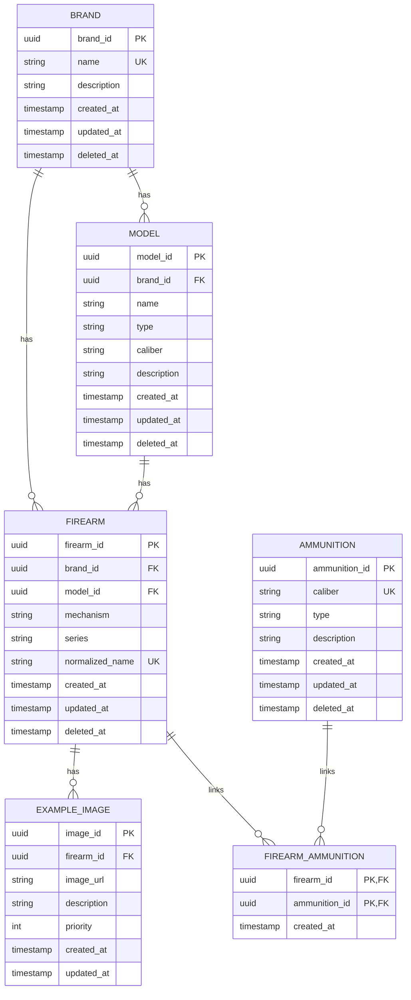
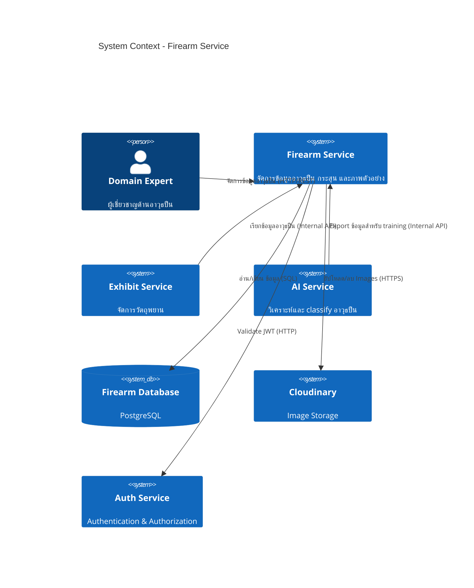

# PRD: Firearm Service

**Document Type**: REQUIRED     
**Document Status**: APPROVED      
**Version**: 1.0        
**Last Updated**: 2026-03-01                
**Owner**: Product Team     
**Stakeholders**: Engineering Lead, Design Lead, AI Team Lead, Exhibit Service Team, AI Agent Protocol

---

## ✅ PRD Review Checklist

> ตรวจสอบก่อน submit — ย้ายมาไว้ต้นเอกสารเพื่อให้เห็นก่อนเสมอ

### Phase 1: Discovery Requirements
- [x] Vision Statement ชัดเจนใน 1-2 ประโยค
- [x] Problem Statement มี research backing อ้างอิงได้
- [x] Value Proposition ระบุครบทุก segment
- [x] Personas มี pain points และ goals ชัดเจน
- [x] Success Metrics วัดผลได้จริง มีค่า baseline
- [x] Non-scope ระบุชัดเจนว่าไม่ทำอะไรใน v1 นี้
- [x] Assumptions ถูก list ออกมาและแยกจาก Risks
- [x] Constraints ครบทั้ง Timeline, Team, Technical

### Phase 2: Content Quality
- [x] มีข้อมูลครบทั้ง 3 contexts (Business, User, Technical)
- [x] Acceptance Criteria วัดผลได้จริง ไม่กำกวม
- [x] Business Rules อยู่ในรูป Human-Readable ตาม Enterprise Grade
- [x] AI สามารถ parse และ generate code ได้จากเอกสารนี้

### Phase 3: Traceability
- [x] Requirements เชื่อมโยงไปยัง source documents
- [x] Research Backing table ครบถ้วน
- [x] Decision Log บันทึก decisions ที่สำคัญแล้ว
- [x] Reference Documents ครบถ้วน

---

## 1. Executive Summary (For Stakeholders)

### 1.1 Vision Statement

Firearm Service เป็น Domain Service สำหรับจัดการข้อมูลอาวุธปืน กระสุน และภาพตัวอย่าง โดยทำหน้าที่เป็นแหล่งข้อมูลหลัก (Source of Truth) สำหรับข้อมูลอาวุธปืนในระบบ Raven และส่งข้อมูลไปยัง AI Service เพื่อ train model ให้มีความแม่นยำสูงขึ้น

### 1.2 Problem Statement

ในงานนิติวิทยาศาสตร์ การตรวจพบอาวุธปืนในที่เกิดเหตุเป็นเรื่องสำคัญ แต่เจ้าหน้าที่กำลังเผชิญกับปัญหา:

**ปัญหาการระบุอาวุธปืน:**
- เจ้าหน้าที่ภาคสนามไม่สามารถระบุยี่ห้อและรุ่นของอาวุธปืนได้อย่างแม่นยำ เนื่องจากขาดฐานข้อมูลอ้างอิงที่ครบถ้วน
- การพิจารณาอาวุธปืนต้องอาศัยประสบการณ์ส่วนบุคคล ทำให้ผลลัพธ์ไม่เป็นมาตรฐาน (คนละคนอาจให้ชื่อเรียกต่างกัน)
- ไม่มีระบบช่วยเปรียบเทียบภาพอาวุธปืนที่พบกับตัวอย่างมาตรฐาน

**ปัญหาการเชื่อมโยงหลักฐาน:**
- ไม่สามารถค้นหาว่าอาวุธปืนที่พบเคยปรากฏในคดีอื่นหรือไม่
- ข้อมูลกระสุนไม่ถูกบันทึกเชื่อมโยงกับอาวุธปืนที่ใช้ยิง ทำให้ติดตามแหล่งที่มายาก
- การหาความเชื่อมโยงระหว่างคดีต้องใช้เวลานานและพึ่งพาความจำ

#### Research Backing

| Source Type | Source | Key Finding | Date |
|-------------|--------|-------------|------|

### 1.3 Proposed Solution

Firearm Service ที่ประกอบด้วย:
- **Brand Management**: จัดการข้อมูลยี่ห้ออาวุธปืน
- **Model Management**: จัดการข้อมูลรุ่นอาวุธปืนตามยี่ห้อ
- **Firearm Management**: จัดการข้อมูลอาวุธปืนครบวงจร
- **Ammunition Management**: จัดการข้อมูลกระสุนและเชื่อมโยงกับอาวุธปืน
- **Example Image Management**: จัดการภาพตัวอย่างสำหรับแต่ละอาวุธปืน
- **AI Training Data Export**: ส่งข้อมูลไปยัง AI Service เพื่อ train model

### 1.4 Value Proposition by Segment

| Segment | Pain Points | Value Proposition | Key Benefit |
|---------|-------------|-------------------|-------------|
| **Field Officer** | ไม่สามารถค้นหาข้อมูลอาวุธปืนได้อย่างรวดเร็ว | API ค้นหา Brand และ Model ที่รวดเร็ว | ลดเวลาการบันทึกข้อมูล |
| **Domain Expert** | ข้อมูลอาวุธปืนไม่ครบถ้วน ไม่มีภาพตัวอย่าง | Database อาวุธปืนครบถ้วนพร้อมภาพประกอบ | ตรวจสอบและยืนยันได้อย่างแม่นยำ |
| **AI Team** | ขาดข้อมูลสำหรับ train model | API สำหรับ export training data | เพิ่มความแม่นยำของ AI Model |
| **Exhibit Service** | ต้องจัดการข้อมูลอาวุธปืนเอง | เรียกใช้ Firearm Service ผ่าน Internal API | ลด duplication ของข้อมูล |

### 1.5 Success Metrics

| Metric | Baseline | Target | Timeline | Measurement Method |
|--------|----------|--------|----------|--------------------|
| API Response Time (Brand/Model Search) | N/A | <100ms | 3 เดือน | APM Tool |
| Database Coverage (Brands) | 0 | 10+ | 3 เดือน | Database Count |
| Database Coverage (Models) | 0 | 50+ | 3 เดือน | Database Count |
| AI Training Data Availability | 0% | 100% | 3 เดือน | Data Export API |
| Internal API Uptime | N/A | 99.9% | 3 เดือน | Monitoring |

### 1.6 Strategic Alignment

- **Company OKR**: พัฒนาระบบ Microservices Architecture ที่ scalable
- **Product Roadmap**: Q1 2026 — Firearm Service v1
- **Technical Vision**: Database per Service pattern with Internal API Communication

---

## 2. Scope (For All Stakeholders)

> Section นี้สำคัญพอๆ กับ functional requirements — ต้องระบุให้ชัดก่อนเริ่ม build

### 2.1 In Scope (v1)

#### Firearm Data Management
- [ ] ระบบจัดการข้อมูลยี่ห้ออาวุธปืน (Brand Management)
- [ ] ระบบจัดการข้อมูลรุ่นอาวุธปืน (Model Management)
- [ ] ระบบจัดการข้อมูลอาวุธปืน (Firearm Management)
- [ ] ระบบจัดการข้อมูลกระสุน (Ammunition Management)
- [ ] ระบบจัดการภาพตัวอย่างอาวุธปืน (Example Image Management)
- [ ] ระบบเชื่อมโยงอาวุธปืนกับกระสุน (Firearm-Ammunition Linking)

#### API for Exhibit Service
- [ ] Internal API สำหรับค้นหา Brands
- [ ] Internal API สำหรับค้นหา Models ตาม Brand
- [ ] Internal API สำหรับดึงข้อมูล Firearm โดย normalized_name
- [ ] Internal API สำหรับดึงข้อมูล Firearm พร้อม Example Images

#### AI Service Integration
- [ ] API สำหรับส่งข้อมูลไปยัง AI Service เพื่อ train model
- [ ] รองรับการ sync ข้อมูลกับ AI Service

### 2.2 Non-Scope (v1)

- [ ] Real-time collaboration บนข้อมูลอาวุธปืน
- [ ] Version control สำหรับข้อมูลอาวุธปืน
- [ ] External API สำหรับ public access
- [ ] Integration กับ external firearm databases (e.g., Interpol, ATF)
- [ ] Mobile app specific features
- [ ] Bulk import จาก Excel/CSV (v2)
- [ ] Advanced search ด้วย filters หลายระดับ (v2)
- [ ] Caching layer ด้วย Redis (v2)

### 2.3 Assumptions

| ID | Assumption | Confidence | Validation Method | Owner |
|----|------------|------------|-------------------|-------|
| A-FIREARM-001 | ข้อมูลอาวุธปืนและกระสุนจะถูกจัดการโดย Domain Expert เท่านั้น | High | User Role Definition | Product Team |
| A-FIREARM-002 | AI Service สามารถรับข้อมูลผ่าน API ได้ | High | AI Service API Spec | AI Team |
| A-FIREARM-003 | Exhibit Service จะเป็น client หลักของ Firearm Service | High | Architecture Design | Architect |
| A-FIREARM-004 | ข้อมูล Brand และ Model ไม่เปลี่ยนแปลงบ่อย | Medium | Domain Expert Interview | Product Team |

### 2.4 Constraints

| ID | Type | Description | Source | Impact |
|----|------|-------------|--------|--------|
| CON-FIREARM-001 | Technical | ใช้ PostgreSQL เป็นฐานข้อมูล | Architecture Decision | Database Schema Design |
| CON-FIREARM-002 | Technical | ใช้ FastAPI สำหรับ API | Tech Stack | Framework Choice |
| CON-FIREARM-003 | Security | ทุก API ต้องผ่าน JWT Validation | Security Requirements | Auth Integration |
| CON-FIREARM-004 | Integration | ต้องรองรับการเรียกจาก Exhibit Service | Exhibit Service PRD | API Design |
| CON-FIREARM-005 | Data | ต้องส่งข้อมูลให้ AI Service ผ่าน Internal Network | AI Service Requirement | Network Configuration |

---

## 3. User Context (For UX + Dev + AI)

### 3.1 Target Users

#### PS-FIREARM-01: ผู้เชี่ยวชาญด้านอาวุธปืน (Firearms Domain Expert)

**Demographics:**
* **Age:** "35-55"
* **Occupation:** "ผู้เชี่ยวชาญด้านนิติวิทยาศาสตร์"
* **Tech Savviness:** "Medium"

**Devices:**
1. **Desktop** — ใช้งานเมื่อกลับสำนักงาน
2. **Mobile** — ใช้งานในพื้นที่เกิดเหตุ

**Behaviors (Firearm-Related):**
* จัดการข้อมูลอาวุธปืนในระบบ (เพิ่ม แก้ไข ลบ)
* อัปโหลดภาพตัวอย่างอาวุธปืน
* ตรวจสอบข้อมูลอาวุธปืนที่ Field Officer บันทึก
* ค้นหาข้อมูลอาวุธปืนเพื่ออ้างอิง

**Pain Points (Firearm-Related):**
* ไม่มีระบบจัดการข้อมูลอาวุธปินที่เป็นมาตรฐาน
* ข้อมูลอาวุธปืนกระจัดกระจาย
* ไม่สามารถค้นหาข้อมูลได้อย่างรวดเร็ว

**Goals (Firearm-Related):**
* มีฐานข้อมูลอาวุธปืนที่ครบถ้วนและถูกต้อง
* สามารถค้นหาข้อมูลอาวุธปืนได้อย่างรวดเร็ว
* อัปโหลดภาพตัวอย่างสำหรับอ้างอิง

---

#### PS-FIREARM-02: ระบบ Exhibit Service (System Actor)

**Type:** Internal Service

**Behaviors:**
* เรียกใช้ Firearm Service เพื่อดึงข้อมูล Brands และ Models
* ดึงข้อมูล Firearm โดยใช้ normalized_name
* ดึงข้อมูล Firearm พร้อม Example Images

**Goals:**
* ได้ข้อมูลอาวุธปืนที่ถูกต้องและครบถ้วน
* ลด duplication ของข้อมูลอาวุธปืน

---

#### PS-FIREARM-03: ระบบ AI Service (System Actor)

**Type:** Internal Service

**Behaviors:**
* รับข้อมูลอาวุธปืนจาก Firearm Service เพื่อ train model
* ส่งผลการ classify Brand และ Model กลับไป

**Goals:**
* ได้ข้อมูลสำหรับ train model ที่มีความแม่นยำสูง

---

### 3.2 Segment Pain Points Comparison

| Pain Point | Domain Expert | Exhibit Service | AI Service | Impact |
|------------|---------------|-----------------|------------|--------|
| ไม่มีฐานข้อมูลอาวุธปืนมาตรฐาน | ✅ มี | ❌ ไม่มี | ❌ ไม่มี | High |
| ข้อมูลกระจัดกระจาย | ✅ มี | ✅ มี | ✅ มี | High |
| ไม่สามารถค้นหาได้รวดเร็ว | ✅ มี | ✅ มี | ❌ ไม่มี | Medium |
| ขาดข้อมูลสำหรับ train model | ❌ ไม่มี | ❌ ไม่มี | ✅ มี | High |

### 3.3 Use Cases by Persona

| Use Case ID | Use Case Name | Domain Expert | Exhibit Service | AI Service | Priority |
|-------------|---------------|---------------|-----------------|------------|----------|
| UC-FIREARM-001 | จัดการข้อมูล Brand | ✅ | ❌ | ❌ | P0 |
| UC-FIREARM-002 | จัดการข้อมูล Model | ✅ | ❌ | ❌ | P0 |
| UC-FIREARM-003 | จัดการข้อมูล Firearm | ✅ | ❌ | ❌ | P0 |
| UC-FIREARM-004 | จัดการข้อมูล Ammunition | ✅ | ❌ | ❌ | P0 |
| UC-FIREARM-005 | จัดการ Example Images | ✅ | ❌ | ❌ | P0 |
| UC-FIREARM-006 | ค้นหา Brands | ✅ | ✅ | ❌ | P0 |
| UC-FIREARM-007 | ค้นหา Models ตาม Brand | ✅ | ✅ | ❌ | P0 |
| UC-FIREARM-008 | ดึงข้อมูล Firearm โดย normalized_name | ❌ | ✅ | ❌ | P0 |
| UC-FIREARM-009 | Export ข้อมูลสำหรับ AI Training | ❌ | ❌ | ✅ | P1 |

### 3.4 User Stories

**Format: Job Story**
> When [situation], I want to [motivation], so I can [expected outcome]

| ID | Persona | Job Story | Priority | AC Ref |
|----|---------|-----------|----------|--------|
| JS-FIREARM-001 | Domain Expert | เมื่อต้องการเพิ่มข้อมูลยี่ห้ออาวุธปืนใหม่ ฉันต้องการสร้าง Brand ในระบบ ฉันจะได้มีฐานข้อมูลที่ครบถ้วน | P0 | AC-FIREARM-001 |
| JS-FIREARM-002 | Domain Expert | เมื่อต้องการเพิ่มข้อมูลรุ่นอาวุธปืน ฉันต้องการสร้าง Model ภายใต้ Brand ที่มีอยู่ ฉันจะได้จัดหมวดหมู่ได้ถูกต้อง | P0 | AC-FIREARM-002 |
| JS-FIREARM-003 | Domain Expert | เมื่อต้องการเพิ่มข้อมูลอาวุธปืนครบวงจร ฉันต้องการสร้าง Firearm พร้อมเชื่อมโยงกระสุน ฉันจะได้มีข้อมูลที่สมบูรณ์ | P0 | AC-FIREARM-003 |
| JS-FIREARM-004 | Domain Expert | เมื่อต้องการอัปโหลดภาพตัวอย่าง ฉันต้องการเพิ่ม Example Image ให้ Firearm ฉันจะได้มีภาพอ้างอิง | P0 | AC-FIREARM-005 |
| JS-FIREARM-005 | Exhibit Service | เมื่อ Field Officer กรอกข้อมูลอาวุธปืน ฉันต้องการค้นหา Brands และ Models ได้ ฉันจะได้แสดงตัวเลือกให้ User | P0 | AC-FIREARM-006 |
| JS-FIREARM-006 | Exhibit Service | เมื่อ AI วิเคราะห์เสร็จ ฉันต้องการดึงข้อมูล Firearm โดยใช้ normalized_name ฉันจะได้บันทึกข้อมูลที่ถูกต้อง | P0 | AC-FIREARM-008 |
| JS-FIREARM-007 | AI Service | เมื่อต้องการ train model ใหม่ ฉันต้องการ export ข้อมูล Firearm และ Images ฉันจะได้ train model ที่แม่นยำ | P1 | AC-FIREARM-009 |

---

## 4. Functional Requirements (For Dev + AI)

### 4.1 Feature Overview (จัดตาม Service Groups)

#### Firearm Management Service

| Feature ID | Feature Name | คำอธิบาย | Dependencies | Complexity | Priority |
|------------|--------------|-----------|-------------|------------|----------|
| FR-FIREARM-001 | Brand Management | จัดการข้อมูลยี่ห้ออาวุธปืน | None | Medium | P0 |
| FR-FIREARM-002 | Model Management | จัดการข้อมูลรุ่นอาวุธปินตามยี่ห้อ | FR-FIREARM-001 | Medium | P0 |
| FR-FIREARM-003 | Firearm Management | จัดการข้อมูลอาวุธปืนครบวงจร | FR-FIREARM-002 | High | P0 |
| FR-FIREARM-004 | Ammunition Management | จัดการข้อมูลกระสุน | None | Medium | P0 |
| FR-FIREARM-005 | Firearm-Ammunition Link | เชื่อมโยงอาวุธปืนกับกระสุน | FR-FIREARM-003, FR-FIREARM-004 | Medium | P0 |
| FR-FIREARM-006 | Example Image Management | จัดการภาพตัวอย่างอาวุธปืน | FR-FIREARM-003 | Low | P0 |
| FR-FIREARM-007 | AI Training Data Export | ส่งข้อมูลไปยัง AI Service | FR-FIREARM-006 | High | P1 |

---

### 4.2 Use Cases

#### UC-FIREARM-001: จัดการข้อมูล Brand

| Element | Description |
|---------|-------------|
| **Use Case ID** | UC-FIREARM-001 |
| **Use Case Name** | Brand Management |
| **Goal** | จัดการข้อมูลยี่ห้ออาวุธปืน |
| **Actor** | Domain Expert |
| **Feature ID** | FR-FIREARM-001 |
| **Preconditions** | User มีสิทธิ์ Domain Expert |
| **Postconditions** | ข้อมูล Brand ถูกสร้าง/แก้ไข/ลบ |
| **Main Flow** | 1. User เลือกจัดการ Brands<br>2. User สร้าง/แก้ไข/ลบ Brand<br>3. ระบบบันทึกข้อมูล<br>4. ระบบส่งผลลัพธ์กลับ |
| **System Logic** | - ตรวจสอบชื่อ Brand ไม่ซ้ำ<br>- บันทึก Audit Trail |
| **Edge Cases** | - ชื่อ Brand ซ้ำ → แจ้งเตือน<br>- Brand มี Models อยู่ → ไม่ให้ลบ |

---

#### UC-FIREARM-002: จัดการข้อมูล Model

| Element | Description |
|---------|-------------|
| **Use Case ID** | UC-FIREARM-002 |
| **Use Case Name** | Model Management |
| **Goal** | จัดการข้อมูลรุ่นอาวุธปินตามยี่ห้อ |
| **Actor** | Domain Expert |
| **Feature ID** | FR-FIREARM-002 |
| **Preconditions** | Brand ต้องมีอยู่ในระบบ |
| **Postconditions** | ข้อมูล Model ถูกสร้าง/แก้ไข/ลบ |
| **Main Flow** | 1. User เลือก Brand<br>2. User จัดการ Models ภายใต้ Brand<br>3. ระบบบันทึกข้อมูล |
| **System Logic** | - ตรวจสอบชื่อ Model ไม่ซ้ำภายใต้ Brand เดียวกัน<br>- บันทึก Audit Trail |
| **Edge Cases** | - ชื่อ Model ซ้ำ → แจ้งเตือน<br>- Model มี Firearms อยู่ → ไม่ให้ลบ |

---

#### UC-FIREARM-003: จัดการข้อมูล Firearm

| Element | Description |
|---------|-------------|
| **Use Case ID** | UC-FIREARM-003 |
| **Use Case Name** | Firearm Management |
| **Goal** | จัดการข้อมูลอาวุธปืนครบวงจร |
| **Actor** | Domain Expert |
| **Feature ID** | FR-FIREARM-003 |
| **Preconditions** | Brand และ Model ต้องมีอยู่ในระบบ |
| **Postconditions** | ข้อมูล Firearm ถูกสร้าง/แก้ไข/ลบ |
| **Main Flow** | 1. User เลือก Brand และ Model<br>2. User กรอกข้อมูล Firearm (mechanism, series)<br>3. ระบบ generate normalized_name<br>4. ระบบบันทึกข้อมูล |
| **System Logic** | - Auto-generate normalized_name จาก brand + series + model<br>- ตรวจสอบ normalized_name ไม่ซ้ำ |
| **Edge Cases** | - normalized_name ซ้ำ → แจ้งเตือน<br>- ข้อมูลไม่ครบ → validate error |

---

#### UC-FIREARM-004: จัดการข้อมูล Ammunition

| Element | Description |
|---------|-------------|
| **Use Case ID** | UC-FIREARM-004 |
| **Use Case Name** | Ammunition Management |
| **Goal** | จัดการข้อมูลกระสุน |
| **Actor** | Domain Expert |
| **Feature ID** | FR-FIREARM-004 |
| **Preconditions** | User มีสิทธิ์ Domain Expert |
| **Postconditions** | ข้อมูล Ammunition ถูกสร้าง/แก้ไข/ลบ |
| **Main Flow** | 1. User เลือกจัดการ Ammunitions<br>2. User กรอกข้อมูล (caliber, type, description)<br>3. ระบบบันทึกข้อมูล |
| **System Logic** | - ตรวจสอบ caliber ไม่ซ้ำ<br>- บันทึก Audit Trail |
| **Edge Cases** | - caliber ซ้ำ → แจ้งเตือน |

---

#### UC-FIREARM-005: จัดการ Example Images

| Element | Description |
|---------|-------------|
| **Use Case ID** | UC-FIREARM-005 |
| **Use Case Name** | Example Image Management |
| **Goal** | จัดการภาพตัวอย่างอาวุธปืน |
| **Actor** | Domain Expert |
| **Feature ID** | FR-FIREARM-006 |
| **Preconditions** | Firearm ต้องมีอยู่ในระบบ |
| **Postconditions** | Example Image ถูกเพิ่ม/ลบ/จัดเรียง |
| **Main Flow** | 1. User เลือก Firearm<br>2. User อัปโหลด/ลบ/จัดเรียง Images<br>3. ระบบบันทึกข้อมูล |
| **System Logic** | - รองรับ multiple images<br>- มี priority สำหรับการจัดเรียง<br>- เก็บ image_url จาก Cloudinary |
| **Edge Cases** | - ไฟล์ไม่ใช่รูปภาพ → reject<br>- ขนาดไฟล์ใหญ่เกินไป → compress |

---

#### UC-FIREARM-006: ค้นหา Brands (Internal API)

| Element | Description |
|---------|-------------|
| **Use Case ID** | UC-FIREARM-006 |
| **Use Case Name** | Search Brands API |
| **Goal** | ค้นหาและดึงรายการ Brands |
| **Actor** | Exhibit Service, Domain Expert |
| **Feature ID** | FR-FIREARM-001 |
| **Preconditions** | Service-to-Service Auth ผ่าน JWT |
| **Postconditions** | ได้รายการ Brands |
| **Main Flow** | 1. Client ส่ง request<br>2. ระบบตรวจสอบ JWT<br>3. ระบบ query ข้อมูล<br>4. ระบบส่งผลลัพธ์กลับ |
| **System Logic** | - รองรับ pagination<br>- รองรับ search ด้วยชื่อ Brand |
| **Edge Cases** | - JWT ไม่ถูกต้อง → 401<br>- ไม่มีข้อมูล → return empty |

---

#### UC-FIREARM-007: ค้นหา Models ตาม Brand (Internal API)

| Element | Description |
|---------|-------------|
| **Use Case ID** | UC-FIREARM-007 |
| **Use Case Name** | Search Models by Brand API |
| **Goal** | ดึงรายการ Models ตาม Brand |
| **Actor** | Exhibit Service, Domain Expert |
| **Feature ID** | FR-FIREARM-002 |
| **Preconditions** | Service-to-Service Auth ผ่าน JWT |
| **Postconditions** | ได้รายการ Models |
| **Main Flow** | 1. Client ส่ง request พร้อม brand_id<br>2. ระบบตรวจสอบ JWT<br>3. ระบบ query ข้อมูล<br>4. ระบบส่งผลลัพธ์กลับ |
| **System Logic** | - Filter ตาม brand_id<br>- รองรับ pagination |
| **Edge Cases** | - Brand ไม่มีอยู่ → 404<br>- ไม่มี Models → return empty |

---

#### UC-FIREARM-008: ดึงข้อมูล Firearm โดย normalized_name (Internal API)

| Element | Description |
|---------|-------------|
| **Use Case ID** | UC-FIREARM-008 |
| **Use Case Name** | Get Firearm by Normalized Name API |
| **Goal** | ดึงข้อมูล Firearm โดยใช้ normalized_name |
| **Actor** | Exhibit Service |
| **Feature ID** | FR-FIREARM-003 |
| **Preconditions** | Service-to-Service Auth ผ่าน JWT |
| **Postconditions** | ได้ข้อมูล Firearm พร้อม Example Images |
| **Main Flow** | 1. Client ส่ง normalized_name<br>2. ระบบ normalize input<br>3. ระบบ query ข้อมูล<br>4. ระบบส่งผลลัพธ์กลับ |
| **System Logic** | - Normalize input (lowercase, alphanumeric)<br>- Include example_images ใน response<br>- Include ammunition info |
| **Edge Cases** | - normalized_name ไม่พบ → 404<br>- input ว่าง → 400 |

---

#### UC-FIREARM-009: Export ข้อมูลสำหรับ AI Training

| Element | Description |
|---------|-------------|
| **Use Case ID** | UC-FIREARM-009 |
| **Use Case Name** | Export Training Data for AI |
| **Goal** | ส่งข้อมูล Firearm และ Images ไปยัง AI Service |
| **Actor** | AI Service |
| **Feature ID** | FR-FIREARM-007 |
| **Preconditions** | Service-to-Service Auth ผ่าน Internal Network |
| **Postconditions** | ข้อมูลถูกส่งไปยัง AI Service |
| **Main Flow** | 1. AI Service ส่ง request<br>2. ระบบตรวจสอบสิทธิ์<br>3. ระบบ query ข้อมูล Firearm พร้อม Images<br>4. ระบบส่งข้อมูลกลับ |
| **System Logic** | - Export ทุก Firearm ที่มี Example Images<br>- รวมข้อมูล Brand, Model, Mechanism<br>- Batch processing สำหรับข้อมูลจำนวนมาก |
| **Edge Cases** | - ไม่มีข้อมูล → return empty<br>- Network error → retry |

---

### 4.3 Detailed Requirements

#### FR-FIREARM-001: Brand Management
**Priority**: P0
**Owner**: Firearm Service Team

**Description**:
ระบบจัดการข้อมูลยี่ห้ออาวุธปิน รองรับการสร้าง แก้ไข ลบ และค้นหา Brands

**Acceptance Criteria**:
- [ ] สามารถสร้าง Brand ใหม่ได้ (name, description)
- [ ] ตรวจสอบชื่อ Brand ไม่ซ้ำ (case-insensitive)
- [ ] สามารถแก้ไขข้อมูล Brand ได้
- [ ] สามารถลบ Brand ได้ (soft delete) ถ้าไม่มี Models อยู่
- [ ] สามารถค้นหา Brands ได้ด้วยชื่อ
- [ ] รองรับ pagination

**Technical Notes** (สำหรับ Dev + AI Agents):
- API Endpoints:
  - `POST /v1/firearms/brands` - Create
  - `GET /v1/firearms/brands` - List (with search & pagination)
  - `GET /v1/firearms/brands/{brand_id}` - Get by ID
  - `PUT /v1/firearms/brands/{brand_id}` - Update
  - `DELETE /v1/firearms/brands/{brand_id}` - Delete
- Request/Response:
```json
// POST /v1/firearms/brands
{
  "name": "Glock",
  "description": "Austrian firearms manufacturer"
}

// Response
{
  "brand_id": "uuid",
  "name": "Glock",
  "description": "Austrian firearms manufacturer",
  "created_at": "2026-03-01T10:00:00Z",
  "updated_at": "2026-03-01T10:00:00Z"
}
```

---

#### FR-FIREARM-002: Model Management
**Priority**: P0
**Owner**: Firearm Service Team

**Description**:
ระบบจัดการข้อมูลรุ่นอาวุธปืนตามยี่ห้อ รองรับการสร้าง แก้ไข ลบ และค้นหา Models

**Acceptance Criteria**:
- [ ] สามารถสร้าง Model ใหม่ได้ภายใต้ Brand
- [ ] ตรวจสอบชื่อ Model ไม่ซ้ำภายใต้ Brand เดียวกัน
- [ ] สามารถแก้ไขข้อมูล Model ได้
- [ ] สามารถลบ Model ได้ (soft delete) ถ้าไม่มี Firearms อยู่
- [ ] สามารถดึงรายการ Models ตาม Brand ได้
- [ ] รองรับ pagination

**Technical Notes**:
- API Endpoints:
  - `POST /v1/firearms/brands/{brand_id}/models` - Create
  - `GET /v1/firearms/brands/{brand_id}/models` - List by Brand
  - `GET /v1/firearms/models/{model_id}` - Get by ID
  - `PUT /v1/firearms/models/{model_id}` - Update
  - `DELETE /v1/firearms/models/{model_id}` - Delete
- Request/Response:
```json
// POST /v1/firearms/brands/{brand_id}/models
{
  "name": "G19",
  "type": "pistol",
  "caliber": "9mm",
  "description": "Compact 9mm pistol"
}
```

---

#### FR-FIREARM-003: Firearm Management
**Priority**: P0
**Owner**: Firearm Service Team

**Description**:
ระบบจัดการข้อมูลอาวุธปืนครบวงจร รวมถึง mechanism, brand, model, series และ normalized_name

**Acceptance Criteria**:
- [ ] สามารถสร้าง Firearm ใหม่ได้
- [ ] Auto-generate normalized_name จาก brand + series + model
- [ ] ตรวจสอบ normalized_name ไม่ซ้ำ
- [ ] สามารถแก้ไขข้อมูล Firearm ได้
- [ ] สามารถลบ Firearm ได้ (soft delete)
- [ ] สามารถดึงข้อมูล Firearm โดย normalized_name ได้
- [ ] ดึงข้อมูล Firearm พร้อม Example Images และ Ammunitions

**Technical Notes**:
- API Endpoints:
  - `POST /v1/firearms` - Create
  - `GET /v1/firearms` - List (with search & pagination)
  - `GET /v1/firearms/{firearm_id}` - Get by ID
  - `GET /v1/firearms/by-normalized/{normalized_name}` - Get by normalized name
  - `PUT /v1/firearms/{firearm_id}` - Update
  - `DELETE /v1/firearms/{firearm_id}` - Delete
- normalized_name generation:
```python
def generate_normalized_name(brand: str, series: Optional[str], model: Optional[str]) -> str:
    combined = f"{brand}{series or ''}{model or ''}"
    return "".join(ch.lower() for ch in combined if ch.isalnum())
```
- Request/Response:
```json
// POST /v1/firearms
{
  "mechanism": "semi-auto",
  "brand_id": "uuid",
  "model_id": "uuid",
  "series": "Gen5"
}

// Response
{
  "firearm_id": "uuid",
  "mechanism": "semi-auto",
  "brand": {
    "brand_id": "uuid",
    "name": "Glock"
  },
  "model": {
    "model_id": "uuid",
    "name": "G19"
  },
  "series": "Gen5",
  "normalized_name": "glockgen5g19",
  "created_at": "2026-03-01T10:00:00Z",
  "updated_at": "2026-03-01T10:00:00Z"
}
```

---

#### FR-FIREARM-004: Ammunition Management
**Priority**: P0
**Owner**: Firearm Service Team

**Description**:
ระบบจัดการข้อมูลกระสุน รวมถึง caliber, type, description

**Acceptance Criteria**:
- [ ] สามารถสร้าง Ammunition ใหม่ได้
- [ ] ตรวจสอบ caliber ไม่ซ้ำ (case-insensitive)
- [ ] สามารถแก้ไขข้อมูล Ammunition ได้
- [ ] สามารถลบ Ammunition ได้ (soft delete) ถ้าไม่มีการเชื่อมโยง
- [ ] สามารถค้นหา Ammunitions ได้

**Technical Notes**:
- API Endpoints:
  - `POST /v1/firearms/ammunitions` - Create
  - `GET /v1/firearms/ammunitions` - List
  - `GET /v1/firearms/ammunitions/{ammunition_id}` - Get by ID
  - `PUT /v1/firearms/ammunitions/{ammunition_id}` - Update
  - `DELETE /v1/firearms/ammunitions/{ammunition_id}` - Delete

---

#### FR-FIREARM-005: Firearm-Ammunition Linking
**Priority**: P0
**Owner**: Firearm Service Team

**Description**:
ระบบเชื่อมโยงอาวุธปืนกับกระสุน (Many-to-Many relationship)

**Acceptance Criteria**:
- [ ] สามารถเชื่อมโยง Ammunition เข้ากับ Firearm ได้
- [ ] สามารถลบการเชื่อมโยงได้
- [ ] ดึงข้อมูล Firearm พร้อมรายการ Ammunitions ที่เชื่อมโยง
- [ ] ดึงข้อมูล Ammunition พร้อมรายการ Firearms ที่เชื่อมโยง

**Technical Notes**:
- API Endpoints:
  - `POST /v1/firearms/{firearm_id}/ammunitions/{ammunition_id}` - Link
  - `DELETE /v1/firearms/{firearm_id}/ammunitions/{ammunition_id}` - Unlink
  - `GET /v1/firearms/{firearm_id}/ammunitions` - List by Firearm

---

#### FR-FIREARM-006: Example Image Management
**Priority**: P0
**Owner**: Firearm Service Team

**Description**:
ระบบจัดการภาพตัวอย่างอาวุธปืน รองรับการอัปโหลด ลบ และจัดเรียง

**Acceptance Criteria**:
- [ ] สามารถเพิ่ม Example Image ให้ Firearm ได้
- [ ] รองรับ multiple images ต่อ Firearm
- [ ] มี priority สำหรับการจัดเรียง (0 = default, สูง = แสดงก่อน)
- [ ] สามารถลบ Example Image ได้
- [ ] สามารถแก้ไข priority และ description ได้
- [ ] ดึงข้อมูล Firearm พร้อม Example Images เรียงตาม priority

**Technical Notes**:
- API Endpoints:
  - `POST /v1/firearms/{firearm_id}/images` - Add Image
  - `GET /v1/firearms/{firearm_id}/images` - List Images
  - `PUT /v1/firearms/images/{image_id}` - Update Image (priority, description)
  - `DELETE /v1/firearms/images/{image_id}` - Delete Image
- Image จะถูกอัปโหลดไปยัง Cloudinary ก่อน แล้วเก็บ URL ใน database
- Request/Response:
```json
// POST /v1/firearms/{firearm_id}/images
{
  "image_url": "https://res.cloudinary.com/.../image.jpg",
  "description": "Side view of Glock G19",
  "priority": 1
}
```

---

#### FR-FIREARM-007: AI Training Data Export
**Priority**: P1
**Owner**: Firearm Service Team + AI Team

**Description**:
API สำหรับส่งข้อมูล Firearm และ Example Images ไปยัง AI Service เพื่อ train model

**Acceptance Criteria**:
- [ ] AI Service สามารถเรียก API เพื่อ export ข้อมูลได้
- [ ] Export รวมข้อมูล Firearm, Brand, Model, Mechanism
- [ ] Export รวม URL ของ Example Images
- [ ] รองรับ batch processing
- [ ] รองรับ filtering ตาม Brand หรือ Model

**Technical Notes**:
- API Endpoints:
  - `GET /v1/firearms/export/training-data` - Export for AI Training
- Query Parameters:
  - `brand_id` (optional) - Filter by Brand
  - `model_id` (optional) - Filter by Model
  - `limit` (optional) - Limit number of records (default: 1000)
  - `offset` (optional) - Offset for pagination
- Response:
```json
{
  "total": 150,
  "offset": 0,
  "limit": 100,
  "data": [
    {
      "firearm_id": "uuid",
      "normalized_name": "glockgen5g19",
      "brand": "Glock",
      "model": "G19",
      "series": "Gen5",
      "mechanism": "semi-auto",
      "images": [
        {
          "image_url": "https://...",
          "priority": 1
        }
      ]
    }
  ]
}
```

---

### 4.4 Business Rules

#### 4.4.1 General Business Rules

| Rule ID | Rule Name | Description | Severity |
|---------|-----------|-------------|----------|
| BR-FIREARM-001 | Unique Brand Name | ชื่อ Brand ต้องไม่ซ้ำ (case-insensitive) | Blocking |
| BR-FIREARM-002 | Unique Model per Brand | ชื่อ Model ต้องไม่ซ้ำภายใต้ Brand เดียวกัน | Blocking |
| BR-FIREARM-003 | Unique Normalized Name | normalized_name ของ Firearm ต้องไม่ซ้ำ | Blocking |
| BR-FIREARM-004 | Unique Caliber | caliber ของ Ammunition ต้องไม่ซ้ำ (case-insensitive) | Blocking |

#### 4.4.2 Firearm Service Business Rules

##### BR-FIREARM-005: Normalized Name Generation

| Element | Description |
|---------|-------------|
| **Rule ID** | BR-FIREARM-005 |
| **Rule Name** | Auto Generate Normalized Name |
| **Description** | ระบบจะ auto-generate normalized_name จาก brand + series + model โดยอัตโนมัติ |
| **Condition** | เมื่อสร้างหรือแก้ไข Firearm |
| **Action** | 1. รวมข้อความ brand + series + model<br>2. แปลงเป็นตัวพิมพ์เล็ก<br>3. เก็บเฉพาะตัวอักษรและตัวเลข (alphanumeric)<br>4. บันทึกลง normalized_name |
| **Severity** | Blocking |

##### BR-FIREARM-006: Brand Deletion Restriction

| Element | Description |
|---------|-------------|
| **Rule ID** | BR-FIREARM-006 |
| **Rule Name** | Prevent Brand Deletion with Models |
| **Description** | ไม่สามารถลบ Brand ที่มี Models อยู่ได้ |
| **Condition** | เมื่อพยายามลบ Brand |
| **Action** | ตรวจสอบว่า Brand มี Models หรือไม่<br>- ถ้ามี → แจ้ง error "Cannot delete brand with existing models"<br>- ถ้าไม่มี → ลบได้ |
| **Severity** | Blocking |

##### BR-FIREARM-007: Model Deletion Restriction

| Element | Description |
|---------|-------------|
| **Rule ID** | BR-FIREARM-007 |
| **Rule Name** | Prevent Model Deletion with Firearms |
| **Description** | ไม่สามารถลบ Model ที่มี Firearms อยู่ได้ |
| **Condition** | เมื่อพยายามลบ Model |
| **Action** | ตรวจสอบว่า Model มี Firearms หรือไม่<br>- ถ้ามี → แจ้ง error "Cannot delete model with existing firearms"<br>- ถ้าไม่มี → ลบได้ |
| **Severity** | Blocking |

##### BR-FIREARM-008: Ammunition Deletion Restriction

| Element | Description |
|---------|-------------|
| **Rule ID** | BR-FIREARM-008 |
| **Rule Name** | Prevent Ammunition Deletion with Links |
| **Description** | ไม่สามารถลบ Ammunition ที่มีการเชื่อมโยงกับ Firearms ได้ |
| **Condition** | เมื่อพยายามลบ Ammunition |
| **Action** | ตรวจสอบว่า Ammunition มีการเชื่อมโยงกับ Firearms หรือไม่<br>- ถ้ามี → แจ้ง error "Cannot delete ammunition linked to firearms"<br>- ถ้าไม่มี → ลบได้ |
| **Severity** | Blocking |

---

## 5. Non-Functional Requirements (For Dev + Architecture)

### 5.1 Performance

| Metric | Requirement | Measurement Tool |
|--------|-------------|------------------|
| API Response Time (Brand/Model Search) | p95 < 100ms | APM |
| API Response Time (Firearm by normalized_name) | p95 < 150ms | APM |
| Database Query Time | p95 < 50ms | Database Logs |
| Export Training Data (1000 records) | < 5s | APM |

### 5.2 Scalability
- รองรับ 1000+ Brands
- รองรับ 10000+ Models
- รองรับ 50000+ Firearms
- รองรับ 100+ concurrent requests

### 5.3 Security & Compliance
- ทุก API ต้องผ่าน JWT Token Validation
- Service-to-Service Communication ต้องผ่าน Internal Network
- ไม่ expose sensitive data ใน error messages
- รองรับ Rate Limiting (100 requests/minute per client)

### 5.4 Reliability
- Uptime: 99.9%
- Error rate: < 0.1%
- Data consistency: 100%

### 5.5 Data Retention
- Soft delete สำหรับทุก entities
- เก็บ Audit Log 30 วัน

---

## 6. Acceptance Criteria (For QA + AI Testing)

### 6.1 Scenario-Based AC

**AC-FIREARM-001: สร้าง Brand ใหม่สำเร็จ**
```gherkin
Given User มีสิทธิ์ Domain Expert
And ยังไม่มี Brand ชื่อ "Glock" ในระบบ
When User สร้าง Brand ใหม่ด้วย name "Glock"
Then ระบบสร้าง Brand สำเร็จ
And ระบบ return Brand ID
And ระบบบันทึก Audit Log
```

**AC-FIREARM-002: สร้าง Brand ซ้ำต้องถูก reject**
```gherkin
Given มี Brand ชื่อ "Glock" อยู่ในระบบแล้ว
When User สร้าง Brand ใหม่ด้วย name "glock" (case different)
Then ระบบแจ้ง error "Brand name already exists"
And HTTP status code 409
```

**AC-FIREARM-003: สร้าง Firearm พร้อม auto-generate normalized_name**
```gherkin
Given Brand "Glock" และ Model "G19" มีอยู่ในระบบ
When User สร้าง Firearm ด้วย:
  | mechanism | semi-auto |
  | brand_id  | {glock_id} |
  | model_id  | {g19_id}   |
  | series    | Gen5       |
Then ระบบสร้าง Firearm สำเร็จ
And normalized_name = "glockgen5g19"
```

**AC-FIREARM-004: ค้นหา Firearm โดย normalized_name**
```gherkin
Given มี Firearm ที่มี normalized_name = "glockgen5g19"
When Exhibit Service เรียก API GET /v1/firearms/by-normalized/glockgen5g19
Then ระบบ return ข้อมูล Firearm ที่ถูกต้อง
And รวม Example Images ใน response
```

**AC-FIREARM-005: Export Training Data สำหรับ AI Service**
```gherkin
Given มี Firearms อย่างน้อย 10 รายการที่มี Example Images
When AI Service เรียก API GET /v1/firearms/export/training-data
Then ระบบ return ข้อมูล Firearms พร้อม images
And รวม brand, model, mechanism ใน response
```

### 6.2 Edge Cases

| Case | Expected Behavior |
|------|-------------------|
| ลบ Brand ที่มี Models | แจ้ง error, ไม่ให้ลบ |
| ลบ Model ที่มี Firearms | แจ้ง error, ไม่ให้ลบ |
| สร้าง Firearm โดยไม่ระบุ brand_id | Validate error 400 |
| ค้นหา normalized_name ที่ไม่มีอยู่ | Return 404 |
| Input normalized_name ว่าง | Return 400 |
| Export training data โดยไม่มีข้อมูล | Return empty array |

---

## 7. UI/UX Specifications

### 7.1 Design Assets
- **Figma**: [Link to Firearm Management UI]
- **Design System**: Raven Design System v1

### 7.2 Admin Interface Requirements

สำหรับ Domain Expert จัดการข้อมูล Firearm:

| Screen | Key Elements |
|--------|--------------|
| Brand List | Table แสดง Brands, Search, Add, Edit, Delete |
| Model List | Table แสดง Models ตาม Brand, Search, Add, Edit, Delete |
| Firearm List | Table แสดง Firearms, Filters, Search, Add, Edit, Delete |
| Firearm Detail | Form แสดง/แก้ไข Firearm, Image Gallery |
| Image Upload | Dropzone สำหรับอัปโหลด images, Preview, Priority setting |

---

## 8. Data Requirements

### 8.1 Data Models

```typescript
// Brand Model
interface Brand {
  brand_id: UUID;
  name: string;              // unique, case-insensitive
  description?: string;
  created_at: Timestamp;
  updated_at: Timestamp;
  deleted_at?: Timestamp;    // soft delete
}

// Model Model
interface FirearmModel {
  model_id: UUID;
  brand_id: UUID;            // FK to Brand
  name: string;
  type?: string;             // e.g., "pistol", "rifle"
  description?: string;
  created_at: Timestamp;
  updated_at: Timestamp;
  deleted_at?: Timestamp;
}

// Firearm Model
interface Firearm {
  firearm_id: UUID;
  brand_id: UUID;            // FK to Brand
  model_id: UUID;            // FK to FirearmModel
  mechanism: string;         // e.g., "semi-auto", "revolver"
  series?: string;
  normalized_name: string;   // unique, auto-generated
  created_at: Timestamp;
  updated_at: Timestamp;
  deleted_at?: Timestamp;
}

// Ammunition Model
interface Ammunition {
  ammunition_id: UUID;
  caliber: string;           // unique, case-insensitive
  type?: string;
  description?: string;
  created_at: Timestamp;
  updated_at: Timestamp;
  deleted_at?: Timestamp;
}

// FirearmAmmunition (Many-to-Many Link)
interface FirearmAmmunition {
  firearm_id: UUID;          // PK, FK to Firearm
  ammunition_id: UUID;       // PK, FK to Ammunition
  created_at: Timestamp;
}

// ExampleImage Model
interface ExampleImage {
  image_id: UUID;
  firearm_id: UUID;          // FK to Firearm
  image_url: string;
  description?: string;
  priority: number;          // default: 0
  created_at: Timestamp;
  updated_at: Timestamp;
}
```

### 8.2 Database Schema (ER Diagram)



---

## 9. Technical Considerations

### 9.1 Architecture Overview



### 9.2 Dependencies & Integrations

| System | Type | Risk Level | Fallback |
|--------|------|------------|----------|
| Auth Service | Internal | Low | Cache JWT public key locally |
| Exhibit Service | Internal (Client) | Low | N/A - Firearm Service is provider |
| AI Service | Internal (Client) | Low | N/A - Firearm Service is provider |
| Cloudinary | External | Medium | Retry with exponential backoff |
| PostgreSQL | Internal | High | Read replica for GET requests |

### 9.3 API Gateway & Routing

Firearm Service จะ expose APIs ผ่าน API Gateway:

| Route | Destination | Auth Required |
|-------|-------------|---------------|
| `/v1/firearms/*` | Firearm Service | Yes (JWT) |
| `/internal/v1/firearms/*` | Firearm Service | Yes (Service Token) |

### 9.4 Service Communication

| Communication | Protocol | Pattern |
|---------------|----------|---------|
| Exhibit Service → Firearm Service | HTTP/REST | Sync Request-Response |
| AI Service → Firearm Service | HTTP/REST | Sync Request-Response |
| Firearm Service → Auth Service | HTTP/REST | Sync Token Validation |
| Firearm Service → Cloudinary | HTTPS | Sync Upload/Delete |

### 9.5 Risks

| ID | Risk | Probability | Impact | Mitigation | Owner |
|----|------|-------------|--------|------------|-------|
| R-FIREARM-001 | Cloudinary service outage | Low | Medium | Implement image upload queue + retry | DevOps |
| R-FIREARM-002 | Database performance degradation | Medium | High | Add read replicas, optimize queries | Backend Team |
| R-FIREARM-003 | Service-to-Service auth failure | Low | High | Cache JWT keys, implement circuit breaker | Security Team |
| R-FIREARM-004 | Data inconsistency between services | Medium | High | Event-driven sync (v2), validation on read | Backend Team |

---

## 10. Release Plan (For All Stakeholders)

### 10.1 Phases

| Phase | Scope | Timeline | Success Criteria |
|-------|-------|----------|------------------|
| Alpha | Core CRUD APIs (Brand, Model, Firearm) | Week 1-2 | All P0 APIs working, unit tests pass |
| Beta | Ammunition + Example Images + Internal APIs | Week 3-4 | Integration tests pass, Exhibit Service can consume |
| GA | AI Training Export + Performance optimization | Week 5 | Load tests pass, monitoring in place |

### 10.2 Rollback Criteria
- Error rate > 1%
- API response time > 500ms (p95)
- Database connection errors > 10/minute

---

## 11. AI Collaboration Notes (For AI Agents)

### 11.1 Code Generation Standards

#### Project Structure
```
firearm-service/
├── app/
│   ├── __init__.py
│   ├── main.py                 # FastAPI app entry
│   ├── config/
│   │   ├── __init__.py
│   │   ├── db_config.py        # Database connection
│   │   └── auth_config.py      # JWT validation
│   ├── models/                 # SQLAlchemy models
│   │   ├── __init__.py
│   │   ├── base.py
│   │   ├── brand_model.py
│   │   ├── model_model.py
│   │   ├── firearm_model.py
│   │   ├── ammunition_model.py
│   │   ├── firearm_ammunition_model.py
│   │   └── example_image_model.py
│   ├── schemas/                # Pydantic schemas
│   │   ├── __init__.py
│   │   ├── brand_schema.py
│   │   ├── model_schema.py
│   │   ├── firearm_schema.py
│   │   ├── ammunition_schema.py
│   │   └── example_image_schema.py
│   ├── controllers/            # Business logic
│   │   ├── __init__.py
│   │   ├── brand_controller.py
│   │   ├── model_controller.py
│   │   ├── firearm_controller.py
│   │   ├── ammunition_controller.py
│   │   └── example_image_controller.py
│   ├── routes/                 # API routes
│   │   ├── __init__.py
│   │   ├── brand.py
│   │   ├── model.py
│   │   ├── firearm.py
│   │   ├── ammunition.py
│   │   └── example_image.py
│   ├── services/               # External service clients
│   │   ├── __init__.py
│   │   └── cloudinary_service.py
│   └── utils/                  # Utilities
│       ├── __init__.py
│       └── normalization.py    # normalized_name generation
├── tests/
├── requirements.txt
├── Dockerfile
└── docker-compose.yml
```

#### Technology Stack
- **Framework**: FastAPI (async)
- **Database**: PostgreSQL 15+
- **ORM**: SQLAlchemy 2.0+ (async)
- **Migration**: Alembic
- **Validation**: Pydantic v2
- **Image Storage**: Cloudinary
- **Auth**: JWT validation (Auth Service)

#### Naming Conventions
- **Models**: `{Entity}Model` (e.g., `BrandModel`)
- **Schemas**: `{Entity}{Action}` (e.g., `BrandCreate`, `BrandRead`)
- **Controllers**: `{Entity}Controller`
- **Routes**: plural lowercase (e.g., `/v1/firearms/brands`)

### 11.2 AI Agent Instructions

When generating code for Firearm Service:

1. **Use Async/Await** - All database operations must be async using SQLAlchemy async session
2. **Follow existing patterns** - Look at `backend-api/app/models/firearm_model.py` for model structure
3. **Implement soft delete** - Add `deleted_at` field to all entities, use filters in queries
4. **Normalize names correctly** - Use alphanumeric only, lowercase (see normalization logic in `firearm_controller.py`)
5. **Validate JWT** - All endpoints must validate JWT token via Auth Service
6. **Service-to-Service auth** - Internal APIs need additional service token validation
7. **Include related data** - When returning Firearm, include Brand, Model, and Example Images
8. **Audit logging** - Log all create/update/delete operations

### 11.3 Key Algorithms

#### Normalized Name Generation
```python
def generate_normalized_name(brand: str, series: Optional[str], model: Optional[str]) -> str:
    """Generate normalized name from brand, series, and model.
    
    Rules:
    1. Combine brand + series + model
    2. Convert to lowercase
    3. Keep only alphanumeric characters
    4. Must be unique across all firearms
    """
    combined = f"{brand}{series or ''}{model or ''}"
    return "".join(ch.lower() for ch in combined if ch.isalnum())
```

#### Service Token Validation
```python
async def validate_service_token(token: str) -> bool:
    """Validate token for service-to-service communication.
    
    Priority:
    1. Validate JWT signature
    2. Check 'service' claim exists
    3. Check allowed services list
    """
    # Implementation
```

---

## 12. Reference Documents

### Internal References
- [Exhibit Service PRD](../exhibit-service/PRD.md)
- [Auth Service PRD](../auth-service/PRD.md)
- [Portability Requirements](../../portability-requirements.md)
- [PRD Template](../../PRD-TEMPLATE.md)

### Code References
- `backend-api/app/models/firearm_model.py` - Existing Firearm model
- `backend-api/app/models/ammunition_model.py` - Existing Ammunition model
- `backend-api/app/models/firearm_ammunition_model.py` - Link table
- `backend-api/app/models/firearm_example_image_model.py` - Example images
- `backend-api/app/controllers/firearm_controller.py` - Controller pattern
- `ai-service-api/app/services/model_brand_service.py` - Brand classification
- `ai-service-api/app/services/model_firearm_model_service.py` - Model classification

---

## 13. Decision Log

| Date | Decision | Rationale | Impact |
|------|----------|-----------|--------|
| 2026-03-01 | แยก Firearm เป็น Microservice | ลด coupling กับ Exhibit Service, รองรับ scaling แยก | Architecture |
| 2026-03-01 | ใช้ normalized_name เป็น unique key | รองรับการค้นหาที่ Exhibit Service ใช้ | Database Design |
| 2026-03-01 | Soft delete ทุก entities | รักษาประวัติข้อมูล, รองรับ rollback | Data Strategy |
| 2026-03-01 | แยก Brand และ Model เป็น entities ต่างหาก | รองรับการจัดหมวดหมู่, ลด duplication | Data Model |

---

**End of Document**